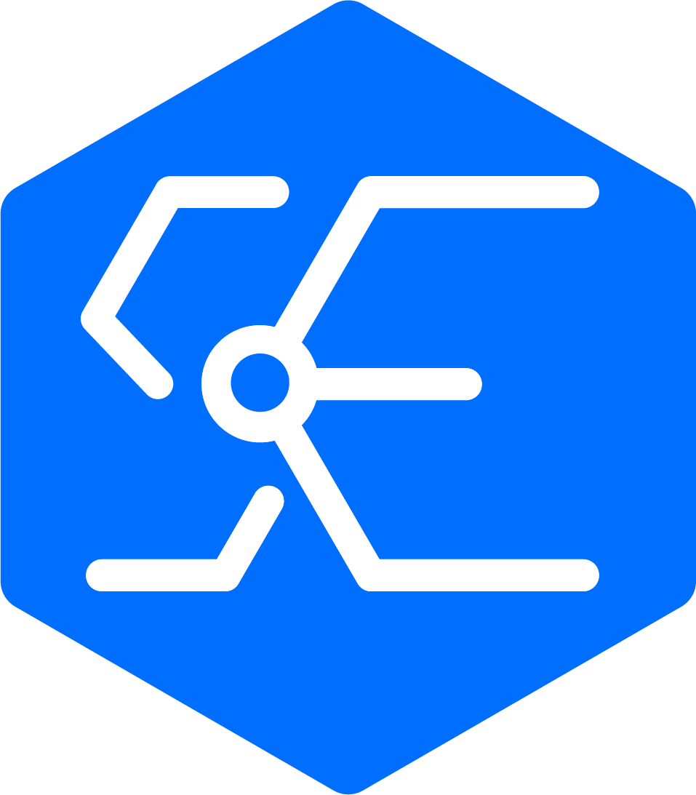
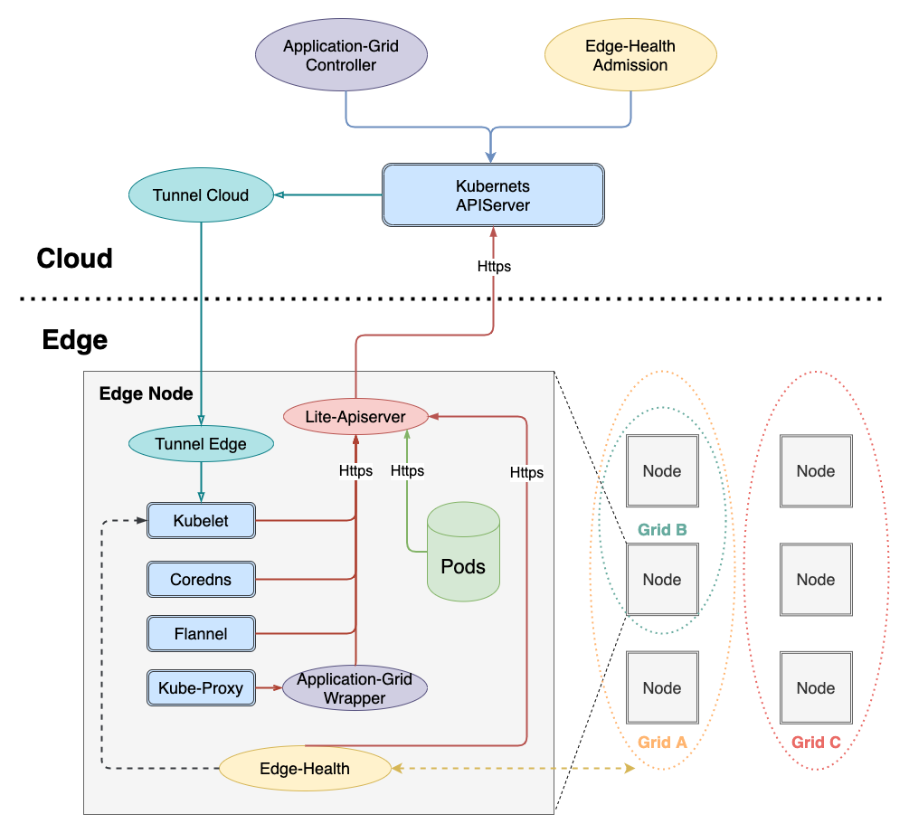

English | [简体中文](./README_CN.md)

# SuperEdge

[](https://github.com/superedge/superedge/releases)
[](https://goreportcard.com/report/github.com/superedge/superedge)
[](https://www.apache.org/licenses/LICENSE-2.0.html)

<div align="left">
  
</div>

## What is SuperEdge?

SuperEdge is an open source **container management system for edge computing** to manage compute resources and container applications in multiple edge regions. These resources and applications, in the current approach, are managed as one single **Kubernetes** cluster. A native Kubernetes cluster can be easily converted to a SuperEdge cluster.

SuperEdge has the following characteristics:

* **Kubernetes-native**: SuperEdge extends the powerful container orchestration and scheduling capabilities of Kubernetes to the edge. It makes nonintrusive enhancements to Kubernetes and is fully compatible with all Kubernetes APIs and resources. Kubernetes users can leverage SuperEdge easily for edge environments with minimal learning.
* **Edge autonomy**: SuperEdge provides L3 edge autonomy. When the network connection between the edge and the cloud is unstable, or the edge node is offline, the node can still work independently. This eliminates the negative impact of unreliable network.
* **Distributed node health monitoring**: SuperEdge provides edge-side health monitoring capabilities. SuperEdge can continue to monitor the processes on the edge side and collect health information for faster and more accurate problem discovery and reporting. In addition, its distributed design can provide multi-region monitoring and management.
* **Built-in edge orchestration capability**: SuperEdge supports automatic deployment of multi-regional microservices.
  Edge-side services are closed-looped, and it effectively reduces the operational overhead and improves the fault
  tolerance and availability of the system.
* **Network tunneling**: SuperEdge ensures that Kubernetes nodes can operate under different network situations. It
  supports network tunnelling using TCP, HTTP, HTTPS and SSH.

SuperEdge was initiated by the following companies: Tencent, Intel, VMware, Huya, Cambricon, Captialonline and Meituan.


## Architecture

<div align="center">
  
</div>

### Cloud components:

* [**tunnel-cloud**](docs/components/tunnel.md): Maintains a persistent network connection to `tunnel-edge` services. Supports TCP/HTTP/HTTPS network proxies.
* [**application-grid controller**](docs/components/serviceGroup.md): A Kubernetes CRD controller as part of ServiceGroup. It manages DeploymentGrids, StatefulSetGrids and ServiceGrids CRDs and control applications and network traffic on edge worker nodes.
* [**edge-health admission**](docs/components/edge-health.md): Assists Kubernetes controllers by providing real-time health check status from `edge-health` services distributed on all edge worker nodes.

### Edge components:

* [**lite-apiserver**](docs/components/lite-apiserver.md): Lightweight kube-apiserver for edge autonomy. It caches and proxies edge components' requests and critical events to cloud kube-apiserver.
* [**edge-health**](docs/components/edge-health.md): Monitors the health status of edge nodes in the same edge region.
* [**tunnel-edge**](docs/components/tunnel.md): Maintains persistent connection to `tunnel-cloud` to retrieve API requests to the controllers on the edge.
* [**application-grid wrapper**](docs/components/serviceGroup.md): Managed by `application-grid controller` to provide independent internal network space for services within the same ServiceGrid.

## Quickstart Guide
Please refer to the sub-project [**edgeadm**](https://github.com/superedge/edgeadm). If you want to bring up a SuperEdge cluster from scrath, check this manual [One-click install of edge Kubernetes cluster](https://github.com/superedge/edgeadm/blob/main/docs/installation/install_edge_kubernetes.md).

-   Download the installation package
> Your can choose CPU arch [amd64, arm64], kubernetes version [1.22.6, 1.20.6, 1.18.2];

```shell
arch=amd64 version=v0.7.0 kubernetesVersion=1.20.6 && rm -rf edgeadm-linux-* && wget https://superedge-1253687700.cos.ap-guangzhou.myqcloud.com/$version/$arch/edgeadm-linux-$arch-$version-k8s-$kubernetesVersion.tgz && tar -xzvf edgeadm-linux-* && cd edgeadm-linux-$arch-$version-k8s-$kubernetesVersion && ./edgeadm
```

-   Install edge Kubernetes master node
```shell
./edgeadm init --kubernetes-version=1.20.6 --image-repository superedge.tencentcloudcr.com/superedge --service-cidr=10.96.0.0/12 --pod-network-cidr=192.168.0.0/16 --install-pkg-path ./kube-linux-*.tar.gz --apiserver-cert-extra-sans=<Master Public IP> --apiserver-advertise-address=<Master Intranet IP> --enable-edge=true
```

-   Join edge node
```bash
./edgeadm join <Master Public/Intranet IP Or Domain>:Port --token xxxx --discovery-token-ca-cert-hash sha256:xxxxxxxxxx --install-pkg-path <edgeadm kube-* install package address path> --enable-edge=true
```

Other installation, deployment, and administration, see our [**Tutorial**](https://github.com/superedge/edgeadm/blob/main/docs/tutorial.md).

## More details
- [tutorial_CN](./docs/tutorial_CN.md)

## Contact

For any question or support, feel free to contact us via:
- Join [#SuperEdge Slack channel](https://cloud-native.slack.com/archives/C02M1G0MWQ2) (Need to join [CNCF Slack](https://slack.cncf.io/) first)
- Join [SuperEdge Discussion Forum](https://groups.google.com/g/superedge)
- [Meeting agenda and notes](https://docs.qq.com/doc/DSFVJbHVFUnVKdFlE)
- Join WeChat Group Discussion

<div align="center">
  
</div>

## Contributing

Welcome to [contribute](./CONTRIBUTING.md) and improve SuperEdge

## Troubleshooting and Feedback

If you encounter any failure in the process of using SuperEdge, you can use [Contact](./README.md#:~:text=Slack,Group) Contact us, or give us feedback via [Troubleshooting and Feedback](./SECURITY.md).

## License

[**Apache License 2.0**](./LICENSE)
