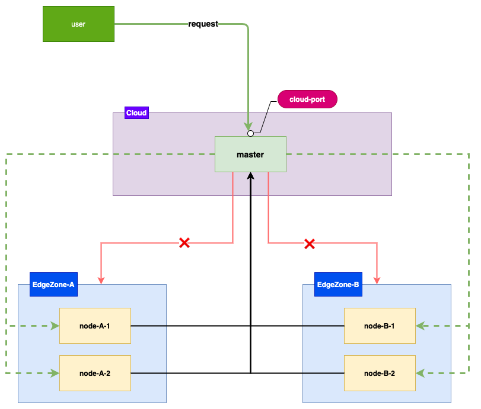

# Edge node Ops

In the scenario of edge clusters, edge nodes are distributed in different areas, and there is a one-way network between
the edge nodes and the cloud (edge nodes and access to the cloud, the cloud cannot directly access the edge nodes),
providing a unified entry for cloud SSH login can simplify the node Ops work. In response to this need, an SSH module
was added to the tunnel component of the SuperEdge project to achieve unified operation of nodes in the cloud.

## Demand analysis


The nodes of the edge nodes are distributed in different areas. The edge nodes can access the cloud master node, but the
master node cannot access the nodes in the edge area. The user needs to log in to the node through SSH to access the
port of the master node to perform Ops work.

## SSH login node

### Preconditions

Install [corkscrew](https://github.com/bryanpkc/corkscrew), Mac install directly with brew

```
brew install corkscrew
```

Or install **netcat** (centos)

```
yum install -y netcat
```

### Login node

To log in to the edge node node-A-1 through SSH, you can use the following command:

```
ssh -o ProxyCommand="corkscrew masterIP  cloud-port node-A-1  22"  root@127.0.0.1
```

Or

```
ssh -o ProxyCommand="nc -X connect -x masterIp:cloud-port  node-A-1 22" root@127.0.0.1
```

* materIP: the external network ip of the node where the master node is located
* cloud-port: NodePort port, the server port of the corresponding SSH module

Get cloud-port

```shell
kubectl -n edge-system get svc tunnel-cloud -o=jsonpath='{range .spec.ports[*]}{.name}{"\t"}{.nodePort}{"\n"}{end}' | grep ssh | awk '{print $2}'
```