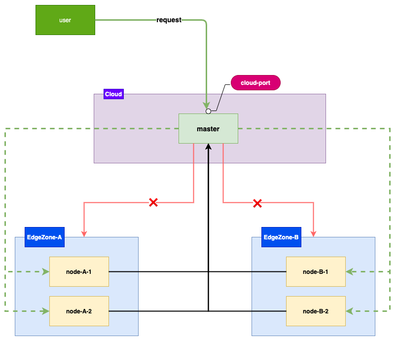

# 边缘节点运维

在边缘集群的场景下,边缘节点分布在不同的区域，且边缘节点和云端之间是单向网络(边缘节点可以访问云端，云端无法直接访问边缘节点)
，提供云端SSH登录统一入口可以简化节点的运维工作。针对这一需求在[SuperEdge](https://github.com/superedge/superedge)项目的[tunnel组件](https://github.com/superedge/superedge/blob/main/docs/components/tunnel_CN.md)添加SSH模块，实现在云端统一操作节点。

## 需求分析



边缘节点的节点分布在不同的区域，边缘节点能够访问云端master节点，但master节点无法访问边端区域内的节点，用户需要通过访问master节点的端口SSH登录到节点实施运维工作。

## SSH登录节点

### 前置条件

安装[corkscrew](https://github.com/bryanpkc/corkscrew)，Mac直接使用brew安装

```
brew install corkscrew
```

或者安装**netcat**(centos)

```
yum install -y netcat
```

### 登录节点

SSH登录边缘节点node-A-1，可以使用下面的命令：
```
ssh -o ProxyCommand="corkscrew masterIP  cloud-port node-A-1  22"  root@127.0.0.1
```

或者

```
ssh -o ProxyCommand="nc -X connect -x masterIp:cloud-port  node-A-1 22" root@127.0.0.1
```

* materIP: master节点所在节点的外网ip
* cloud-port: NodePort端口，对应的SSH模块的Server的端口

获取cloud-port

```shell
kubectl -n edge-system get svc tunnel-cloud -o=jsonpath='{range .spec.ports[*]}{.name}{"\t"}{.nodePort}{"\n"}{end}' | grep ssh | awk '{print $2}'
```
