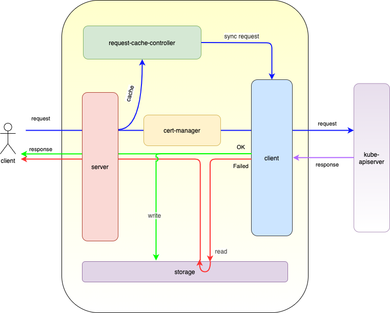

`lite-apiserver`是运行在边缘节点上的轻量级 apiserver，它代理节点上所有组件和业务容器访问云端 kube-apiserver 的请求，并对请求结果做高效缓存。在云边断连的情况下，利用这些缓存提供服务，实现边缘自治的能力。

`lite-apiserver`具有以下特点:
- 支持所有 Client 类型，包括以 bin(如 kubelet 等)或 pod(如 flannel\kube-proxy 等)形式运行的 Kubernetes 组件，以及以 InCluster 方式访问 kube-apiserver 的业务容器
- 支持缓存所有类型资源(Kubernetes 内置资源和 Custom Resources)
- 支持访问 kube-apisever 的所有认证和鉴权方式(TLS 客户端证书、token 等)，各组件和业务容器使用自己的认证方式和权限。支持证书轮换
- 支持多种存储, 包括文件存储、KV存储（bolt, badger）等

## 架构图
<div align="left">
  
</div>

从整体上看，`lite-apiserver`启动一个 HTTPS Server 接受所有 Client 的请求（https request），并根据 request tls 证书中的 Common Name 选择对应的 ReverseProxy（如果 request 没有 mtls 证书，则使用 default），将 request 转发到 kube-apiserver。当云边网络正常时，将对应的返回结果（https response）返回给client，并按需将response异步存储到缓存中；当云边断连时，访问kube-apiserver超时，从缓存中获取已缓存的数据返回给client，达到边缘自治的目的。

- **HTTPS Server**
  监听 localhost 的端口（SuperEdge 中为51003）接受 Client 的 Https 请求。
- **Cert Mgr && Transport Mgr**
  Cert Mgr 负责管理连接 kube-apiserver 的 TLS 客户端证书。它周期性加载配置的TLS证书，如果有更新，通知Transport Mgr创建或更新对应的transport。
  Transport Mgr负责管理transport。它接收Cert Mgr的通知，创建新的transport，或者关闭证书已更新的transport的旧连接。
- **Proxy**
  根据 request mtls 证书中的 Common Name 选择对应的 ReverseProxy（如果 request 没有 mtls 证书，则使用 default），将 request 转发到 kube-apiserver。如果请求成功，则将结果直接给 Client 返回，并调用 Cache Mgr 缓存数据；如果请求失败，则从 Cache Mgr 中读取数据给 Client。
- **Cache Mgr**
  根据 Client 的类型分别缓存 Get 和 List 的结果数据，并根据 Watch 的返回值，更新对应的 List 数据。

## 使用说明
可使用static pod或者systemd在边缘节点上部署lite-apiserver，参见[edgeadm](../installation/install_via_edgeadm_CN.md)或[手动部署文档](../installation/install_manually_CN.md)

## 边缘自治示例
1. 根据使用说明部署`lite-apiserver`
2. 使用下面的示例 yaml 文件部署一个运行 echoserver 的Deployment
```yaml
apiVersion: apps/v1
kind: Deployment
metadata:
  name: lite-demo
  namespace: default
spec:
  replicas: 1
  selector:
    matchLabels:
      app: echo
  template:
    metadata:
      labels:
        app: echo
    spec:
      containers:
      - image: superedge/echoserver:2.2
        name: echo
        ports:
        - containerPort: 8080
          protocol: TCP
        env:
          - name: NODE_NAME
            valueFrom:
              fieldRef:
                fieldPath: spec.nodeName
          - name: POD_NAME
            valueFrom:
              fieldRef:
                fieldPath: metadata.name
          - name: POD_NAMESPACE
            valueFrom:
              fieldRef:
                fieldPath: metadata.namespace
          - name: POD_IP
            valueFrom:
              fieldRef:
                fieldPath: status.podIP
```
3. 访问对应的 echoserver，结果正常
```bash
$ kubectl get pods -owide
NAME                        READY   STATUS    RESTARTS   AGE     IP         NODE           NOMINATED NODE   READINESS GATES
lite-demo-c7b458ddc-6lpnx   1/1     Running   0          4m23s   10.0.6.2   ecm-q5hx6hhd   <none>           <none>

$ curl http://10.0.6.2:8080 | grep pod
	pod name:	lite-demo-c7b458ddc-6lpnx
	pod namespace:	default
	pod IP:	10.0.6.2
```
4. 断开 pod 所在节点与 kube-apiserver 的网络，节点进入自治模式
5. 访问 echoserver，结果正常
```bash
$ curl http://10.0.6.2:8080 | grep pod
	pod name:	lite-demo-c7b458ddc-6lpnx
	pod namespace:	default
	pod IP:	10.0.6.2
```
6. 重启该节点，重启成功后，再次访问 echoserver，结果正常，说明边缘节点自治成功
```bash
$ curl http://10.0.6.2:8080 | grep pod
	pod name:	lite-demo-c7b458ddc-6lpnx
	pod namespace:	default
	pod IP:	10.0.6.2
```
