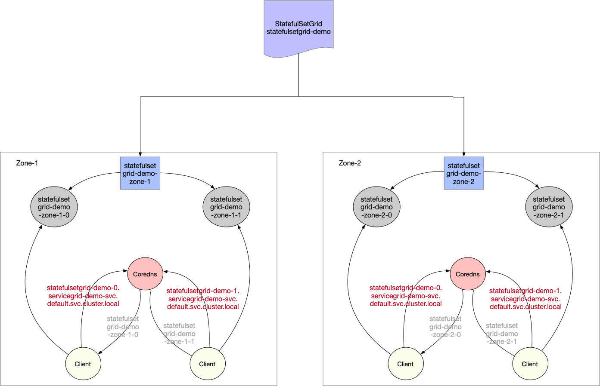

# ServiceGroup

# Why Is It Needed

## What's Different About The Edges

- In edge computing scenarios, multiple edge sites are often managed in the same cluster, and each edge site has one or more computing nodes
- We hope to run a group of services with business logic relationship in each site, and each site will run the same and complete microservices
- Due to network restrictions, the access between microservices is not expected and can not be performed in multiple sites

## What Can ServiceGroup Solve

ServiceGroup can easily deploy a group of services in different sites or regions, which belonging to the same cluster,
and make the calls between services complete within site or region, avoiding cross regional access of services.

The native k8s needs to plan the affinity of nodes to control the specific location of the pod created by the deployment.
When the number of edge sites and the number of services to be deployed are too large, the management and deployment are extremely complex, and even there is only theoretical possibility

In addition, in order to limit the mutual calls between services to the same site, it is necessary to create a dedicated service for each deployment,
which brings huge management work and is easy to make mistakes

ServiceGroup is designed for this scenario. The deployment-grid, statefulset-grid and service-grid provided by ServiceGroup can be used to easily deploy and manage edge applications, control service flow,
and ensure the number of services in each region and disaster recovery

# Key Concepts

## Architecture

<div align="left">
  
</div>

## NodeUnit

- NodeUnit is usually one or more computing resource instances located in the same edge site. It is necessary to ensure that the intranet of nodes in the same NodeUnit is connected
- Services in ServiceGroup run within a NodeUnit
- ServiceGroup allows users to set the number of pods for deployment runs in a NodeUnit
- ServiceGroup keeps calls between services in its own NodeUnit

## NodeGroup

- NodeGroup contains one or more NodeUnits
- Ensure that the services in ServiceGroup are deployed on each NodeUnit in NodeGroup
- When nodeunit is added to the cluster, the service in ServiceGroup is automatically deployed to the newly added NodeUnit

## ServiceGroup

ServiceGroup contains one or more business services. The applicable scenarios are as follows:
- Want to package and deploy multiple services
- Or, the service(s) needs to run in multiple NodeUnits and guarantee the number of pods for each NodeUnit
- Or, calls between services need to be controlled in the same NodeUnit, and traffic cannot be forwarded to other NodeUnits.

> Note: ServiceGroup is an abstract resource. Multiple ServiceGroups can be created in a cluster

## Resource Types

### DeploymentGrid

The format of the DeploymentGrid is similar to that of deployment. The < deployment template > field is the template field of
the Kubernetes original deployment, and the more special is the gridUniqKey field, which indicates the key value of the label of the node group.

```yaml
apiVersion: superedge.io/v1
kind: DeploymentGrid
metadata:
  name:
  namespace:
spec:
  gridUniqKey: <NodeLabel Key>
  <deployment-template>
```

### StatefulSetGrid

The format of the StatefulSetGrid is similar to that of statefulset. The < statefulset template > field is the template field of
the Kubernetes original statefulset, and the more special is the gridUniqKey field, which indicates the key value of the label of the node group.

```yaml
apiVersion: superedge.io/v1
kind: StatefulSetGrid
metadata:
  name:
  namespace:
spec:
  gridUniqKey: <NodeLabel Key>
  <statefulset-template>
```

### ServiceGrid

The format of ServiceGrid is similar to that of service. The < service template > field is the template field of
the Kubernetes original service. The special field is the GridUniqKey field, which indicates the key value of the label of the node group.

```yaml
apiVersion: superedge.io/v1
kind: ServiceGrid
metadata:
  name:
  namespace:
spec:
  gridUniqKey: <NodeLabel Key>
  <service-template>
```

# How To Use ServiceGroup

Taking the deployment of echo-service as an example, we hope to deploy echo-service services in multiple node groups. We need to do the following:

## Determines The Unique Identity Of The ServiceGroup

This step is logical planning, and no actual operation is required. For example, we use the UniqKey for the ServiceGroup logical tag to be created as: zone.

## Group Edge Nodes

In this step, we need to label the edge nodes with kubectl.

For example, we select node12 and node14 and label them with zone = nodeunit1; node21 and node23 are labeled with zone = nodeunit2.

> Note: in the previous step, the key of the label is consistent with the UniqKey of the ServiceGroup. Value is the unique key of the NodeUnit. Nodes with the same value belong to the same NodeUnit

If you want to use more than one ServiceGroup, assign each ServiceGroup a different UniqKey.

## Stateless ServiceGroup

### Deploy DeploymentGrid

```yaml
apiVersion: superedge.io/v1
kind: DeploymentGrid
metadata:
  name: deploymentgrid-demo
  namespace: default
spec:
  gridUniqKey: zone
  template:
    replicas: 2
    selector:
      matchLabels:
        appGrid: echo
    strategy: {}
    template:
      metadata:
        creationTimestamp: null
        labels:
          appGrid: echo
      spec:
        containers:
        - image: superedge/echoserver:2.2
          name: echo
          ports:
          - containerPort: 8080
            protocol: TCP
          env:
            - name: NODE_NAME
              valueFrom:
                fieldRef:
                  fieldPath: spec.nodeName
            - name: POD_NAME
              valueFrom:
                fieldRef:
                  fieldPath: metadata.name
            - name: POD_NAMESPACE
              valueFrom:
                fieldRef:
                  fieldPath: metadata.namespace
            - name: POD_IP
              valueFrom:
                fieldRef:
                  fieldPath: status.podIP
          resources: {}
```

### Deploy ServiceGrid

```yaml
apiVersion: superedge.io/v1
kind: ServiceGrid
metadata:
  name: servicegrid-demo
  namespace: default
spec:
  gridUniqKey: zone
  template:
    selector:
      appGrid: echo
    ports:
    - protocol: TCP
      port: 80
      targetPort: 8080
```

Since the gridUniqKey field is set to zone, the key of the label we use when grouping nodes is zone. If there are three NodeUnits,
labeled by zone: zone-0, zone: zone-1, zone: zone-2 for them. at this time, each NodeUnit has the deployment of echo-service and the corresponding pod.
If a service is accessed through servicename and clusterip in the node, the request will only be sent to the nodes in this group.

```
[~]# kubectl get dg
NAME                  AGE
deploymentgrid-demo   85s

[~]# kubectl get deploy
NAME                         READY   UP-TO-DATE   AVAILABLE   AGE
deploymentgrid-demo-zone-0   2/2     2            2           85s
deploymentgrid-demo-zone-1   2/2     2            2           85s
deploymentgrid-demo-zone-2   2/2     2            2           85s

[~]# kubectl get svc
NAME                   TYPE        CLUSTER-IP     EXTERNAL-IP   PORT(S)   AGE
kubernetes             ClusterIP   172.19.0.1     <none>        443/TCP   87m
servicegrid-demo-svc   ClusterIP   172.19.0.177   <none>        80/TCP    80s

# execute on zone-0 nodeunit
[~]# curl 172.19.0.177|grep "node name"
        node name:      node0
...
# execute on zone-1 nodeunit
[~]# curl 172.19.0.177|grep "node name"
        node name:      node1
...
# execute on zone-2 nodeunit
[~]# curl 172.19.0.177|grep "node name"
        node name:      node2
...
```

In addition, if a new NodeUnit that are added to the cluster after the DeploymentGrid and ServiceGrid resources are deployed,
the system will automatically create the corresponding deployment for the new NodeUnit.

## Stateful ServiceGroup

### Deploy StatefulSetGrid

```yaml
apiVersion: superedge.io/v1
kind: StatefulSetGrid
metadata:
  name: statefulsetgrid-demo
  namespace: default
spec:
  gridUniqKey: zone
  template:
    selector:
      matchLabels:
        appGrid: echo
    serviceName: "servicegrid-demo-svc"
    replicas: 3
    template:
      metadata:
        labels:
          appGrid: echo
      spec:
        terminationGracePeriodSeconds: 10
        containers:
        - image: superedge/echoserver:2.2
          name: echo
          ports:
          - containerPort: 8080
            protocol: TCP
          env:
            - name: NODE_NAME
              valueFrom:
                fieldRef:
                  fieldPath: spec.nodeName
            - name: POD_NAME
              valueFrom:
                fieldRef:
                  fieldPath: metadata.name
            - name: POD_NAMESPACE
              valueFrom:
                fieldRef:
                  fieldPath: metadata.namespace
            - name: POD_IP
              valueFrom:
                fieldRef:
                  fieldPath: status.podIP
          resources: {}
```

**Note that the serviceName field of statefulset template should be set to service to be created.**

### Deploy ServiceGrid

```yaml
apiVersion: superedge.io/v1
kind: ServiceGrid
metadata:
  name: servicegrid-demo
  namespace: default
spec:
  gridUniqKey: zone
  template:
    selector:
      appGrid: echo
    ports:
    - protocol: TCP
      port: 80
      targetPort: 8080
```

Since the gridUniqKey field is set to zone, the key of the label we use when grouping nodes is zone. If there are three NodeUnits,
labeled by zone: zone-0, zone: zone-1, zone: zone-2 for them. at this time, each NodeUnit has the statefulset of echo-service and the corresponding pod.
If a service is accessed through servicename and clusterip in the node, the request will only be sent to the nodes in this group.

```
[~]# kubectl get ssg
NAME                   AGE
statefulsetgrid-demo   21h

[~]# kubectl get statefulset
NAME                          READY   AGE
statefulsetgrid-demo-zone-0   3/3     21h
statefulsetgrid-demo-zone-1   3/3     21h
statefulsetgrid-demo-zone-2   3/3     21h

[~]# kubectl get svc
NAME                   TYPE        CLUSTER-IP     EXTERNAL-IP   PORT(S)   AGE
kubernetes             ClusterIP   192.168.0.1     <none>        443/TCP   22h
servicegrid-demo-svc   ClusterIP   192.168.21.99   <none>        80/TCP    21h

# execute on zone-0 nodeunit
[~]# curl 192.168.21.99|grep "node name"
        node name:      node0
...
# execute on zone-1 nodeunit
[~]# curl 192.168.21.99|grep "node name"
        node name:      node1
...
# execute on zone-2 nodeunit
[~]# curl 192.168.21.99|grep "node name"
        node name:      node2
...
```

**Note that the clusterIP field of service must not be 'None' when accessing statefulset by service since it is not currently supported by StatefulSetGrid.**

In addition to the normal service, StatefulSetGrid also provides headless service access as below:



StatefulSet headless service will be access by domains constructed by `{StatefulSetGrid}-{0..N-1}.{ServiceGrid}-svc.ns.svc.cluster.local` which corresponds to actual statefulset workload `{StatefulSetGrid}-{NodeUnit}-{0..N-1}.{ServiceGrid}-svc.ns.svc.cluster.local` of each NodeUnit, aiming to block the difference of NodeUnits.

Each NodeUnit will use the same headless service to access the pod inside its group.(eg: nodes belongs to `NodeUnit：zone-1` will have a access to `statefulsetgrid-demo-zone-1` statefulset and `statefulsetgrid-demo-zone-2` for nodes belongs to `NodeUnit：zone-2`)

```bash
# execute on zone-0 nodeunit
[~]# curl statefulsetgrid-demo-0.servicegrid-demo-svc.default.svc.cluster.local|grep "pod name"
        pod name:       statefulsetgrid-demo-zone-0-0
[~]# curl statefulsetgrid-demo-1.servicegrid-demo-svc.default.svc.cluster.local|grep "pod name"
        pod name:       statefulsetgrid-demo-zone-0-1
[~]# curl statefulsetgrid-demo-2.servicegrid-demo-svc.default.svc.cluster.local|grep "pod name"
        pod name:       statefulsetgrid-demo-zone-0-2
...
# execute on zone-1 nodeunit
[~]# curl statefulsetgrid-demo-0.servicegrid-demo-svc.default.svc.cluster.local|grep "pod name"
        pod name:       statefulsetgrid-demo-zone-1-0
[~]# curl statefulsetgrid-demo-1.servicegrid-demo-svc.default.svc.cluster.local|grep "pod name"
        pod name:       statefulsetgrid-demo-zone-1-1
[~]# curl statefulsetgrid-demo-2.servicegrid-demo-svc.default.svc.cluster.local|grep "pod name"
        pod name:       statefulsetgrid-demo-zone-1-2
...
# execute on zone-2 nodeunit
[~]# curl statefulsetgrid-demo-0.servicegrid-demo-svc.default.svc.cluster.local|grep "pod name"
        pod name:       statefulsetgrid-demo-zone-2-0
[~]# curl statefulsetgrid-demo-1.servicegrid-demo-svc.default.svc.cluster.local|grep "pod name"
        pod name:       statefulsetgrid-demo-zone-2-1
[~]# curl statefulsetgrid-demo-2.servicegrid-demo-svc.default.svc.cluster.local|grep "pod name"
        pod name:       statefulsetgrid-demo-zone-2-2
...
```

## Canary Deployment
Both DeploymentGrid and StatefulSetGrid provide build-in support for **NodeUnit** based canary deployment. User can define multiple workload templates in the `templatePool` and assign them to different NodeUnits so as to roll out different releases in different NodeUnit.  

### Configuration
To use canary deployment, additional fields need to be added to the YAML object:
* **spec.templatePool**: Defines a template pool for multiple workload templates to be used.
* **spec.templates**: Assigns the name of the template, which defined in the templatePool, to be used by each NodeUnit. For NodeUnits that don't have template assignment, the `spec.defaultTemplateName` template will be used.
* **spec.defaultTemplateName**: (Optional, default to "default") Defines a default workload template to be used by NodeUnit if not provided in the `spec.templates`. Setting it to "default" will use the workload template in the `spec.template`.
* **spec.autoDeleteUnusedTemplate**: (Optional, default to false) Setting it to true will delete unused templates in the templatePool. i.e. Unused templates can't be retrieved from etcd.

Example:

For DeploymentGrid,
```yaml
apiVersion: superedge.io/v1
kind: DeploymentGrid
metadata:
  name: deploymentgrid-demo
  namespace: default
spec:
  defaultTemplateName: test1 # (Optional) Default to "default".
  autoDeleteUnusedTemplate: false # (Optional). Default to false.
  gridUniqKey: zone
  template:
    ...... # Omit workload spec. If defaultTemplateName is set to default, this template will be used. Otherwise, it will be ignored.
  templatePool: # Defines workload templates for NodeUnits
    test1:
      replicas: 2
      selector:
        matchLabels:
          appGrid: echo
      strategy: {}
      template:
        metadata:
          creationTimestamp: null
          labels:
            appGrid: echo
        spec:
          containers:
          - image: superedge/echoserver:2.2 # Old release
            name: echo
            # Omit container spec
    test2:
      replicas: 3
      selector:
        matchLabels:
          appGrid: echo
      strategy: {}
      template:
        metadata:
          creationTimestamp: null
          labels:
            appGrid: echo
        spec:
          containers:
          - image: superedge/echoserver:2.3  # New release
            name: echo
            # Omit container spec
  templates: # Assigns workload templates to NodeUnits.
    # <NodeUnit_name>: <template_name_from_templatePool>
    zone1: test1
    zone2: test2
```

In this example, the NodeGroup
- Zone1 will use workload template **test1** with image version `2.2`.
- Zone2 will use workload template **test2** with image version `2.3`.
- Other NodeGroups will use the default template **test1**, which was specified in the `spec.defaultTemplateName`.

## Multi-cluster Distribution
Supports multi-cluster distribution of DeploymentGrid and ServiceGrid, and also supports multi-regional canary. The current multi-cluster management solution based on [clusternet](https://github.com/clusternet/clusternet)

### Feature
- Support multi-cluster canary by region
- Ensure the strong consistency, synchronize update/delete between the control cluster and the managed cluster application, achieve one-time operation, multi-cluster deployment
- The status of the aggregated distribution instances can be seen in the control cluster
- Support the supplementary distribution of application in the case of node regional information update: for example, if the cluster does not belong to a nodegroup before, nodegroup is added after the node information is updated, the application in the control cluster will supplement and distribute to the cluster in time

### Prerequisite
- Kubernetes
- SuperEdge
- Clusternet

### Key Concepts
If you want to specify a deploymentgrid or servicegrid that needs to be distributed by multiple clusters, add 'superedge. IO / Fed' to its label and set it to "yes"

### Examples
* **Control cluster**: Cluster used to manage other clusters and create application for federation.
* **Cluster A, Cluster B**: Two managed edge clusters, which are registered and managed through clusternet.

Add nodes in cluster A to nodeunit zone1.

Create a DeploymentGrid in the control cluster, where **superedge.io/fed: "yes"** is added to the labels, indicating that the DeploymentGrid needs to be distributed to managed clusters.
```yaml
apiVersion: superedge.io/v1
kind: DeploymentGrid
metadata:
  name: deploymentgrid-demo
  namespace: default
  labels:
    superedge.io/fed: "yes"
spec:
  defaultTemplateName: test1
  gridUniqKey: zone
  template:
    replicas: 1
    selector:
      matchLabels:
        appGrid: echo
    strategy: {}
    template:
      metadata:
        creationTimestamp: null
        labels:
          appGrid: echo
      spec:
        containers:
        - image: superedge/echoserver:2.2
          name: echo
          ports:
          - containerPort: 8080
            protocol: TCP
          env:
            - name: NODE_NAME
              valueFrom:
                fieldRef:
                  fieldPath: spec.nodeName
            - name: POD_NAME
              valueFrom:
                fieldRef:
                  fieldPath: metadata.name
            - name: POD_NAMESPACE
              valueFrom:
                fieldRef:
                  fieldPath: metadata.namespace
            - name: POD_IP
              valueFrom:
                fieldRef:
                  fieldPath: status.podIP
          resources: {}
  templatePool:
    test1:
      replicas: 2
      selector:
        matchLabels:
          appGrid: echo
      strategy: {}
      template:
        metadata:
          creationTimestamp: null
          labels:
            appGrid: echo
        spec:
          containers:
          - image: superedge/echoserver:2.2
            name: echo
            ports:
            - containerPort: 8080
              protocol: TCP
            env:
              - name: NODE_NAME
                valueFrom:
                  fieldRef:
                    fieldPath: spec.nodeName
              - name: POD_NAME
                valueFrom:
                  fieldRef:
                    fieldPath: metadata.name
              - name: POD_NAMESPACE
                valueFrom:
                  fieldRef:
                    fieldPath: metadata.namespace
              - name: POD_IP
                valueFrom:
                  fieldRef:
                    fieldPath: status.podIP
            resources: {}
    test2:
      replicas: 3
      selector:
        matchLabels:
          appGrid: echo
      strategy: {}
      template:
        metadata:
          creationTimestamp: null
          labels:
            appGrid: echo
        spec:
          containers:
          - image: superedge/echoserver:2.2
            name: echo
            ports:
            - containerPort: 8080
              protocol: TCP
            env:
              - name: NODE_NAME
                valueFrom:
                  fieldRef:
                    fieldPath: spec.nodeName
              - name: POD_NAME
                valueFrom:
                  fieldRef:
                    fieldPath: metadata.name
              - name: POD_NAMESPACE
                valueFrom:
                  fieldRef:
                    fieldPath: metadata.namespace
              - name: POD_IP
                valueFrom:
                  fieldRef:
                    fieldPath: status.podIP
            resources: {}
  templates:
    zone1: test1
    zone2: test2
```

After the creation is complete, you can see that in the managed cluster A, the corresponding Deployment has been created, and according to its NodeUnit information, there are two instances.
```bash
[~]# kubectl get deploy
NAME                        READY   UP-TO-DATE   AVAILABLE   AGE
deploymentgrid-demo-zone1   2/2     2            2           99s
```
If the corresponding field of deployment is manually changed in the managed cluster A, it will be updated back with the template of the control cluster.

Add nodes in cluster B to nodeunit zone2.

The control cluster will distribute the application corresponding to zone2 to the managed cluster B in time.
```bash
[~]# kubectl get deploy
NAME                        READY   UP-TO-DATE   AVAILABLE   AGE
deploymentgrid-demo-zone2   3/3     3            3           6s
```

View the status of deploymentgrid-demo in the control cluster, you can see the application status of each managed cluster that is aggregated, which is convenient for viewing.
```yaml
status:
  states:
    zone1:
      conditions:
      - lastTransitionTime: "2021-06-17T07:33:50Z"
        lastUpdateTime: "2021-06-17T07:33:50Z"
        message: Deployment has minimum availability.
        reason: MinimumReplicasAvailable
        status: "True"
        type: Available
      readyReplicas: 2
      replicas: 2
    zone2:
      conditions:
      - lastTransitionTime: "2021-06-17T07:37:12Z"
        lastUpdateTime: "2021-06-17T07:37:12Z"
        message: Deployment has minimum availability.
        reason: MinimumReplicasAvailable
        status: "True"
        type: Available
      readyReplicas: 3
      replicas: 3
```

## Refs

* [SEP: ServiceGroup StatefulSetGrid Design Specification](https://github.com/superedge/superedge/issues/26)
