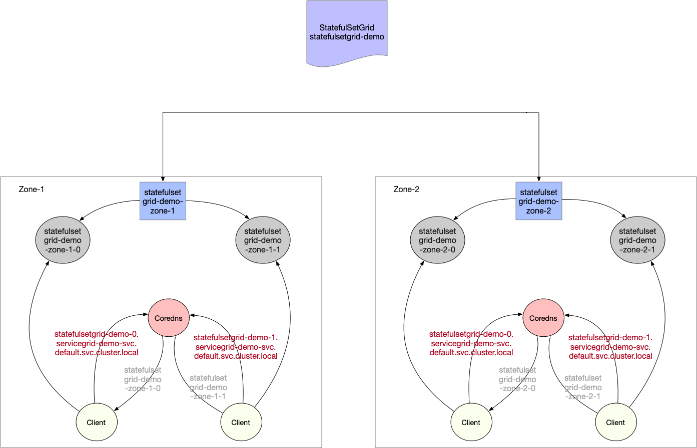

# 边缘应用管理利器: ServiceGroup

# 功能背景

## 边缘特点

- 边缘计算场景中，往往会在同一个集群中管理多个边缘站点，每个边缘站点内有一个或多个计算节点。
- 同时希望在每个站点中都运行一组有业务逻辑联系的服务，每个站点内的服务是一套完整的功能，可以为用户提供服务
- 由于受到网络限制，有业务联系的服务之间不希望或者不能跨站点访问

# 操作场景

serviceGroup可以便捷地在共属同一个集群的不同机房或区域中各自部署一组服务，并且使得各个服务间的请求在本机房或本地域内部即可完成，避免服务跨地域访问。

原生 k8s 无法控制deployment的pod创建的具体节点位置，需要通过统筹规划节点的亲和性来间接完成，当边缘站点数量以及需要部署的服务数量过多时，管理和部署方面的极为复杂，乃至仅存在理论上的可能性；

与此同时，为了将服务间的相互调用限制在一定范围，业务方需要为各个deployment分别创建专属的service，管理方面的工作量巨大且极容易出错并引起线上业务异常。

serviceGroup就是为这种场景设计的，客户只需要使用ServiceGroup提供的DeploymentGrid，StatefulSetGrid以及ServiceGrid三种SuperEdge自研的kubernetes 资源，即可方便地将服务分别部署到这些节点组中，并进行服务流量管控，另外，还能保证各区域服务数量及容灾。

# 关键概念

## 整体架构

<div align="left">
  
</div>

## NodeUnit

- NodeUnit通常是位于同一边缘站点内的一个或多个计算资源实例，需要保证同一NodeUnit中的节点内网是通的
- ServiceGroup组中的服务运行在一个NodeUnit之内
- ServiceGroup 允许用户设置服务在一个 NodeUnit中运行的pod数量
- ServiceGroup 能够把服务之间的调用限制在本 NodeUnit 内

## NodeGroup

- NodeGroup 包含一个或者多个 NodeUnit
- 保证在集合中每个 NodeUnit上均部署ServiceGroup中的服务
- 集群中增加 NodeUnit 时自动将 ServiceGroup 中的服务部署到新增 NodeUnit

## ServiceGroup

- ServiceGroup 包含一个或者多个业务服务:适用场景：1）业务需要打包部署；2）或者，需要在每一个 NodeUnit 中均运行起来并且保证pod数量；3）或者，需要将服务之间的调用控制在同一个 NodeUnit 中，不能将流量转发到其他 NodeUnit。
- 注意：ServiceGroup是一种抽象资源，一个集群中可以创建多个ServiceGroup

## 涉及的资源类型

### DeploymentGrid

DeploymentGrid的格式与Deployment类似，<deployment-template>字段就是原先deployment的template字段，比较特殊的是gridUniqKey字段，该字段指明了节点分组的label的key值：

```yaml
apiVersion: superedge.io/v1
kind: DeploymentGrid
metadata:
  name:
  namespace:
spec:
  gridUniqKey: <NodeLabel Key>
  <deployment-template>
```

### StatefulSetGrid

StatefulSetGrid的格式与StatefulSet类似，<statefulset-template>字段就是原先statefulset的template字段，比较特殊的是gridUniqKey字段，该字段指明了节点分组的label的key值：

```yaml
apiVersion: superedge.io/v1
kind: StatefulSetGrid
metadata:
  name:
  namespace:
spec:
  gridUniqKey: <NodeLabel Key>
  <statefulset-template>
```

### ServiceGrid

ServiceGrid的格式与Service类似，<service-template>字段就是原先service的template字段，比较特殊的是gridUniqKey字段，该字段指明了节点分组的label的key值：

```yaml
apiVersion: superedge.io/v1
kind: ServiceGrid
metadata:
  name:
  namespace:
spec:
  gridUniqKey: <NodeLabel Key>
  <service-template>
```

# 操作步骤

以在边缘部署echo-service为例，我们希望在多个节点组内分别部署echo-service服务，需要做如下事情：

## 确定ServiceGroup唯一标识

这一步是逻辑规划，不需要做任何实际操作。我们将目前要创建的serviceGroup逻辑标记使用的UniqKey为：`zone`

## 将边缘节点分组

这一步需要使用kubectl对边缘节点打label

例如，我们选定Node12、Node14，打上label: `zone=nodeunit1`；Node21、Node23，打上label: `zone=nodeunit2`

注意：上一步中，label的key与ServiceGroup的UniqKey一致，value是NodeUnit的唯一key，value相同的节点表示属于同一个NodeUnit

如果同一个集群中有多个ServiceGroup请为每一个ServiceGroup分配不同的UniqKey

## 无状态ServiceGroup

### 部署DeploymentGrid

```yaml
apiVersion: superedge.io/v1
kind: DeploymentGrid
metadata:
  name: deploymentgrid-demo
  namespace: default
spec:
  gridUniqKey: zone
  template:
    replicas: 2
    selector:
      matchLabels:
        appGrid: echo
    strategy: {}
    template:
      metadata:
        creationTimestamp: null
        labels:
          appGrid: echo
      spec:
        containers:
        - image: superedge/echoserver:2.2
          name: echo
          ports:
          - containerPort: 8080
            protocol: TCP
          env:
            - name: NODE_NAME
              valueFrom:
                fieldRef:
                  fieldPath: spec.nodeName
            - name: POD_NAME
              valueFrom:
                fieldRef:
                  fieldPath: metadata.name
            - name: POD_NAMESPACE
              valueFrom:
                fieldRef:
                  fieldPath: metadata.namespace
            - name: POD_IP
              valueFrom:
                fieldRef:
                  fieldPath: status.podIP
          resources: {}
```

### 部署ServiceGrid

```yaml
apiVersion: superedge.io/v1
kind: ServiceGrid
metadata:
  name: servicegrid-demo
  namespace: default
spec:
  gridUniqKey: zone
  template:
    selector:
      appGrid: echo
    ports:
    - protocol: TCP
      port: 80
      targetPort: 8080
```

gridUniqKey字段设置为了zone，所以我们在将节点分组时采用label的key为zone，如果有三组节点，分别为他们添加zone: zone-0, zone: zone-1, zone: zone-2的label即可；这时，每组节点内都有了echo-service的deployment和对应的pod，在节点内访问统一的service-name也只会将请求发向本组的节点

```
[~]# kubectl get dg
NAME                  AGE
deploymentgrid-demo   85s

[~]# kubectl get deploy
NAME                         READY   UP-TO-DATE   AVAILABLE   AGE
deploymentgrid-demo-zone-0   2/2     2            2           85s
deploymentgrid-demo-zone-1   2/2     2            2           85s
deploymentgrid-demo-zone-2   2/2     2            2           85s

[~]# kubectl get svc
NAME                   TYPE        CLUSTER-IP     EXTERNAL-IP   PORT(S)   AGE
kubernetes             ClusterIP   172.19.0.1     <none>        443/TCP   87m
servicegrid-demo-svc   ClusterIP   172.19.0.177   <none>        80/TCP    80s

# execute on zone-0 nodeunit
[~]# curl 172.19.0.177|grep "node name"
        node name:      node0
...
# execute on zone-1 nodeunit
[~]# curl 172.19.0.177|grep "node name"
        node name:      node1
...
# execute on zone-2 nodeunit
[~]# curl 172.19.0.177|grep "node name"
        node name:      node2
...
```

另外，对于部署了DeploymentGrid和ServiceGrid后才添加进集群的节点组，该功能会在新的节点组内自动创建指定的deployment

## 有状态ServiceGroup

### 部署StatefulSetGrid

```yaml
apiVersion: superedge.io/v1
kind: StatefulSetGrid
metadata:
  name: statefulsetgrid-demo
  namespace: default
spec:
  gridUniqKey: zone
  template:
    selector:
      matchLabels:
        appGrid: echo
    serviceName: "servicegrid-demo-svc"
    replicas: 3
    template:
      metadata:
        labels:
          appGrid: echo
      spec:
        terminationGracePeriodSeconds: 10
        containers:
        - image: superedge/echoserver:2.2
          name: echo
          ports:
          - containerPort: 8080
            protocol: TCP
          env:
            - name: NODE_NAME
              valueFrom:
                fieldRef:
                  fieldPath: spec.nodeName
            - name: POD_NAME
              valueFrom:
                fieldRef:
                  fieldPath: metadata.name
            - name: POD_NAMESPACE
              valueFrom:
                fieldRef:
                  fieldPath: metadata.namespace
            - name: POD_IP
              valueFrom:
                fieldRef:
                  fieldPath: status.podIP
          resources: {}
```

**注意：template中的serviceName设置成即将创建的service名称**

### 部署ServiceGrid

```yaml
apiVersion: superedge.io/v1
kind: ServiceGrid
metadata:
  name: servicegrid-demo
  namespace: default
spec:
  gridUniqKey: zone
  template:
    selector:
      appGrid: echo
    ports:
    - protocol: TCP
      port: 80
      targetPort: 8080
```

gridUniqKey字段设置为了zone，所以我们在将节点分组时采用label的key为zone，如果有三组节点，分别为他们添加zone: zone-0, zone: zone-1, zone: zone-2的label即可；这时，每组节点内都有了echo-service的statefulset和对应的pod，在节点内访问统一的service-name也只会将请求发向本组的节点

```
[~]# kubectl get ssg
NAME                   AGE
statefulsetgrid-demo   21h

[~]# kubectl get statefulset
NAME                          READY   AGE
statefulsetgrid-demo-zone-0   3/3     21h
statefulsetgrid-demo-zone-1   3/3     21h
statefulsetgrid-demo-zone-2   3/3     21h

[~]# kubectl get svc
NAME                   TYPE        CLUSTER-IP     EXTERNAL-IP   PORT(S)   AGE
kubernetes             ClusterIP   192.168.0.1     <none>        443/TCP   22h
servicegrid-demo-svc   ClusterIP   192.168.21.99   <none>        80/TCP    21h

# execute on zone-0 nodeunit
[~]# curl 192.168.21.99|grep "node name"
        node name:      node0
...
# execute on zone-1 nodeunit
[~]# curl 192.168.21.99|grep "node name"
        node name:      node1
...
# execute on zone-2 nodeunit
[~]# curl 192.168.21.99|grep "node name"
        node name:      node2
...
```

**注意：使用Headless service搭配StatefulSetGrid时，暂时不支持在各NodeUnit内通过service名直接访问情况下的闭环访问，这里与DeploymentGrid有所不同**

除了采用非Headless service访问statefulset负载外，StatefulSetGrid目前支持使用Headless service**配合pod FQDN**的方式进行闭环访问，如下所示：



StatefulSetGrid提供屏蔽NodeUnit的统一headless service访问形式，如下：

```
{StatefulSetGrid}-{0..N-1}.{ServiceGrid}-svc.ns.svc.cluster.local
```

上述访问会对应实际各个NodeUnit的具体pod：

```
{StatefulSetGrid}-{NodeUnit}-{0..N-1}.{ServiceGrid}-svc.ns.svc.cluster.local
```

每个NodeUnit通过相同的headless service只会访问本组内的pod。也即：对于`NodeUnit：zone-1`来说，会访问`statefulsetgrid-demo-zone-1`(statefulset)对应的pod；而对于`NodeUnit：zone-2`来说，会访问`statefulsetgrid-demo-zone-2`(statefulset)对应的pod

```bash
# execute on zone-0 nodeunit
[~]# curl statefulsetgrid-demo-0.servicegrid-demo-svc.default.svc.cluster.local|grep "pod name"
        pod name:       statefulsetgrid-demo-zone-0-0
[~]# curl statefulsetgrid-demo-1.servicegrid-demo-svc.default.svc.cluster.local|grep "pod name"
        pod name:       statefulsetgrid-demo-zone-0-1
[~]# curl statefulsetgrid-demo-2.servicegrid-demo-svc.default.svc.cluster.local|grep "pod name"
        pod name:       statefulsetgrid-demo-zone-0-2
...
# execute on zone-1 nodeunit
[~]# curl statefulsetgrid-demo-0.servicegrid-demo-svc.default.svc.cluster.local|grep "pod name"
        pod name:       statefulsetgrid-demo-zone-1-0
[~]# curl statefulsetgrid-demo-1.servicegrid-demo-svc.default.svc.cluster.local|grep "pod name"
        pod name:       statefulsetgrid-demo-zone-1-1
[~]# curl statefulsetgrid-demo-2.servicegrid-demo-svc.default.svc.cluster.local|grep "pod name"
        pod name:       statefulsetgrid-demo-zone-1-2
...
# execute on zone-2 nodeunit
[~]# curl statefulsetgrid-demo-0.servicegrid-demo-svc.default.svc.cluster.local|grep "pod name"
        pod name:       statefulsetgrid-demo-zone-2-0
[~]# curl statefulsetgrid-demo-1.servicegrid-demo-svc.default.svc.cluster.local|grep "pod name"
        pod name:       statefulsetgrid-demo-zone-2-1
[~]# curl statefulsetgrid-demo-2.servicegrid-demo-svc.default.svc.cluster.local|grep "pod name"
        pod name:       statefulsetgrid-demo-zone-2-2
...
```

## 按NodeUnit灰度
DeploymentGrid和StatefulSetGrid均支持按照NodeUnit进行灰度

### 重要字段
和灰度功能相关的字段有这些：

autoDeleteUnusedTemplate，templatePool，templates，defaultTemplateName

templatePool：用于灰度的template集合

templates：NodeUnit和其使用的templatePool中的template的映射关系，如果没有指定，NodeUnit使用defaultTemplateName指定的template

defaultTemplateName：默认使用的template，如果不填写或者使用"default"就采用spec.template

autoDeleteUnusedTemplate：默认为false，如果设置为true，会自动删除templatePool中既不在templates中也不在spec.template中的template模板

### 使用相同的template创建workload
和上面的DeploymentGrid和StatefulsetGrid例子完全一致，如果不需要使用灰度功能，则无需添加额外字段

### 使用不同的template创建workload
```yaml
apiVersion: superedge.io/v1
kind: DeploymentGrid
metadata:
  name: deploymentgrid-demo
  namespace: default
spec:
  defaultTemplateName: test1
  gridUniqKey: zone
  template:
    replicas: 1
    selector:
      matchLabels:
        appGrid: echo
    strategy: {}
    template:
      metadata:
        creationTimestamp: null
        labels:
          appGrid: echo
      spec:
        containers:
        - image: superedge/echoserver:2.2
          name: echo
          ports:
          - containerPort: 8080
            protocol: TCP
          env:
            - name: NODE_NAME
              valueFrom:
                fieldRef:
                  fieldPath: spec.nodeName
            - name: POD_NAME
              valueFrom:
                fieldRef:
                  fieldPath: metadata.name
            - name: POD_NAMESPACE
              valueFrom:
                fieldRef:
                  fieldPath: metadata.namespace
            - name: POD_IP
              valueFrom:
                fieldRef:
                  fieldPath: status.podIP
          resources: {}
  templatePool:
    test1:
      replicas: 2
      selector:
        matchLabels:
          appGrid: echo
      strategy: {}
      template:
        metadata:
          creationTimestamp: null
          labels:
            appGrid: echo
        spec:
          containers:
          - image: superedge/echoserver:2.2
            name: echo
            ports:
            - containerPort: 8080
              protocol: TCP
            env:
              - name: NODE_NAME
                valueFrom:
                  fieldRef:
                    fieldPath: spec.nodeName
              - name: POD_NAME
                valueFrom:
                  fieldRef:
                    fieldPath: metadata.name
              - name: POD_NAMESPACE
                valueFrom:
                  fieldRef:
                    fieldPath: metadata.namespace
              - name: POD_IP
                valueFrom:
                  fieldRef:
                    fieldPath: status.podIP
            resources: {}
    test2:
      replicas: 3
      selector:
        matchLabels:
          appGrid: echo
      strategy: {}
      template:
        metadata:
          creationTimestamp: null
          labels:
            appGrid: echo
        spec:
          containers:
          - image: superedge/echoserver:2.3
            name: echo
            ports:
            - containerPort: 8080
              protocol: TCP
            env:
              - name: NODE_NAME
                valueFrom:
                  fieldRef:
                    fieldPath: spec.nodeName
              - name: POD_NAME
                valueFrom:
                  fieldRef:
                    fieldPath: metadata.name
              - name: POD_NAMESPACE
                valueFrom:
                  fieldRef:
                    fieldPath: metadata.namespace
              - name: POD_IP
                valueFrom:
                  fieldRef:
                    fieldPath: status.podIP
            resources: {}
  templates:
    zone1: test1
    zone2: test2
```
这个例子中，NodeUnit zone1将会使用test1 template，NodeUnit zone2将会使用test2 template，其余NodeUnit将会使用defaultTemplateName中指定的template，这里
会使用test1

## 多集群分发
支持DeploymentGrid和ServiceGrid的多集群分发，分发的同时也支持多地域灰度，当前基于的多集群管理方案为[clusternet](https://github.com/clusternet/clusternet)

### 特点
- 支持多集群的按NodeUnit灰度
- 保证控制集群和被纳管集群应用的强一致和同步更新/删除，做到一次操作，多集群部署
- 在控制集群可以看到聚合的各分发实例的状态
- 支持节点地域信息更新情况下应用的补充分发：如原先不属于某个NodeGroup的集群，更新节点信息后加入了NodeGroup，控制集群中的应用会及时向该集群补充下发

### 前置条件
- 集群部署了SuperEdge中的组件，如果没有Kubernetes集群，可以通过edgeadm进行创建，如果已有Kubernetes集群，可以通过edageadm的addon部署SuperEdge相关组件，将集群转换为一个SuperEdge边缘集群
- 通过clusternet进行集群的注册和纳管

### 重要字段
如果要指定某个DeploymentGrid或ServiceGrid需要进行多集群的分发，则在其label中添加`superedge.io/fed`，并置为"yes"

### 使用示例
创建3个集群，分别为一个管控集群和2个被纳管的边缘集群A,B，通过clusternet进行注册和纳管

其中A集群中一个节点添加zone: zone1的label，加入NodeUnit zone1；集群B不加入NodeGroup

在管控集群中创建DeploymentGrid，其中labels中添加了superedge.io/fed: "yes"，表示该DeploymentGrid需要进行集群的分发，同时灰度指定分发出去的应用在zone1和zone2中使用不同的副本个数
```yaml
apiVersion: superedge.io/v1
kind: DeploymentGrid
metadata:
  name: deploymentgrid-demo
  namespace: default
  labels:
    superedge.io/fed: "yes"
spec:
  defaultTemplateName: test1
  gridUniqKey: zone
  template:
    replicas: 1
    selector:
      matchLabels:
        appGrid: echo
    strategy: {}
    template:
      metadata:
        creationTimestamp: null
        labels:
          appGrid: echo
      spec:
        containers:
        - image: superedge/echoserver:2.2
          name: echo
          ports:
          - containerPort: 8080
            protocol: TCP
          env:
            - name: NODE_NAME
              valueFrom:
                fieldRef:
                  fieldPath: spec.nodeName
            - name: POD_NAME
              valueFrom:
                fieldRef:
                  fieldPath: metadata.name
            - name: POD_NAMESPACE
              valueFrom:
                fieldRef:
                  fieldPath: metadata.namespace
            - name: POD_IP
              valueFrom:
                fieldRef:
                  fieldPath: status.podIP
          resources: {}
  templatePool:
    test1:
      replicas: 2
      selector:
        matchLabels:
          appGrid: echo
      strategy: {}
      template:
        metadata:
          creationTimestamp: null
          labels:
            appGrid: echo
        spec:
          containers:
          - image: superedge/echoserver:2.2
            name: echo
            ports:
            - containerPort: 8080
              protocol: TCP
            env:
              - name: NODE_NAME
                valueFrom:
                  fieldRef:
                    fieldPath: spec.nodeName
              - name: POD_NAME
                valueFrom:
                  fieldRef:
                    fieldPath: metadata.name
              - name: POD_NAMESPACE
                valueFrom:
                  fieldRef:
                    fieldPath: metadata.namespace
              - name: POD_IP
                valueFrom:
                  fieldRef:
                    fieldPath: status.podIP
            resources: {}
    test2:
      replicas: 3
      selector:
        matchLabels:
          appGrid: echo
      strategy: {}
      template:
        metadata:
          creationTimestamp: null
          labels:
            appGrid: echo
        spec:
          containers:
          - image: superedge/echoserver:2.2
            name: echo
            ports:
            - containerPort: 8080
              protocol: TCP
            env:
              - name: NODE_NAME
                valueFrom:
                  fieldRef:
                    fieldPath: spec.nodeName
              - name: POD_NAME
                valueFrom:
                  fieldRef:
                    fieldPath: metadata.name
              - name: POD_NAMESPACE
                valueFrom:
                  fieldRef:
                    fieldPath: metadata.namespace
              - name: POD_IP
                valueFrom:
                  fieldRef:
                    fieldPath: status.podIP
            resources: {}
  templates:
    zone1: test1
    zone2: test2
```

创建完成后，可以看到在纳管的A集群中，创建了对应的Deployment，而且依照其NodeUnit信息，有两个实例。
```bash
[root@VM-0-174-centos ~]# kubectl get deploy
NAME                        READY   UP-TO-DATE   AVAILABLE   AGE
deploymentgrid-demo-zone1   2/2     2            2           99s
```
如果在纳管的A集群中手动更改了deployment的相应字段，会以管控集群的为模板更新回来

B集群中的一个节点添加zone: zone2的label，将其加入NodeUnit zone2;管控集群会及时向该集群补充下发zone2对应的应用
```bash
[root@VM-0-42-centos ~]# kubectl get deploy
NAME                        READY   UP-TO-DATE   AVAILABLE   AGE
deploymentgrid-demo-zone2   3/3     3            3           6s
```

在管控集群查看deploymentgrid-demo的状态，可以看到被聚合在一起的各个被纳管集群的应用状态，便于查看
```yaml
status:
  states:
    zone1:
      conditions:
      - lastTransitionTime: "2021-06-17T07:33:50Z"
        lastUpdateTime: "2021-06-17T07:33:50Z"
        message: Deployment has minimum availability.
        reason: MinimumReplicasAvailable
        status: "True"
        type: Available
      readyReplicas: 2
      replicas: 2
    zone2:
      conditions:
      - lastTransitionTime: "2021-06-17T07:37:12Z"
        lastUpdateTime: "2021-06-17T07:37:12Z"
        message: Deployment has minimum availability.
        reason: MinimumReplicasAvailable
        status: "True"
        type: Available
      readyReplicas: 3
      replicas: 3
```

## Refs

* [SEP: ServiceGroup StatefulSetGrid Design Specification](https://github.com/superedge/superedge/issues/26)
