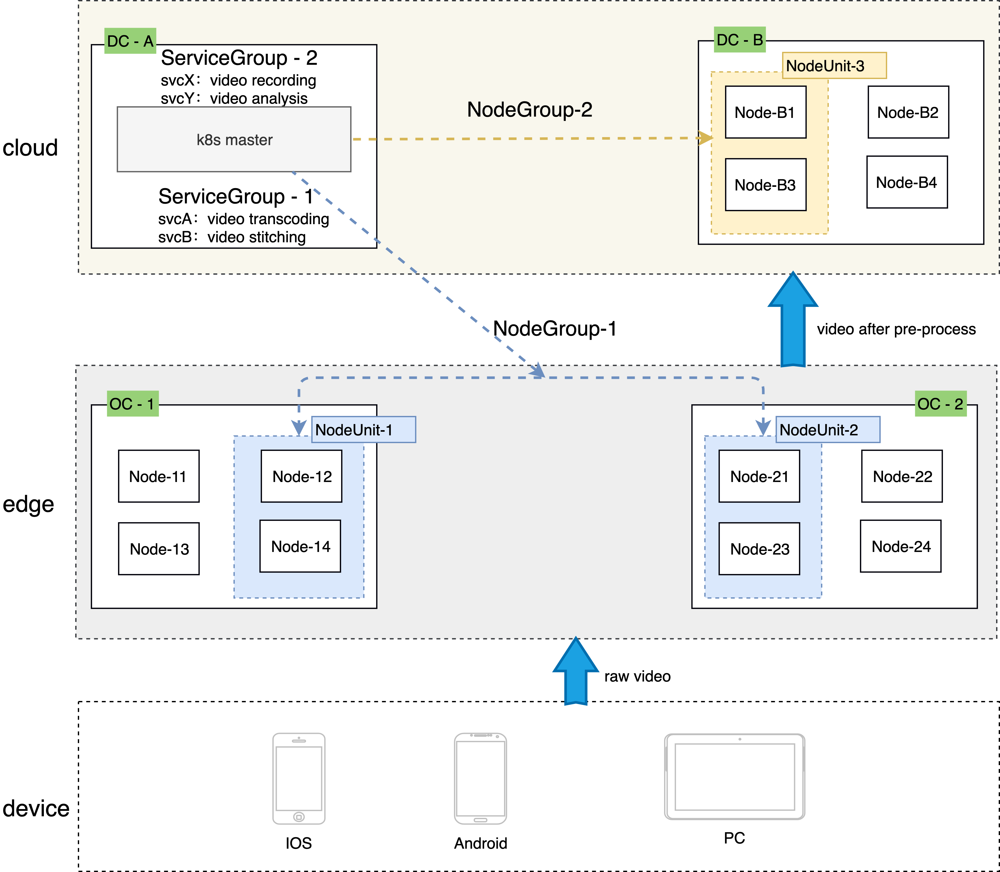

# 边缘资源按应用资源池进行管理

* [边缘资源按应用资源池进行管理](#边缘资源按应用资源池进行管理)
   * [1. 背景](#1-背景)
   * [2. CRD 设计](#2-crd-设计)
      * [2.1 NodeUnit](#21-nodeunit)
      * [2.2 NodeGroup](#22-nodegroup)
   * [3.效果展示](#3效果展示)
      * [3.1 部署](#31-部署)
      * [3.2 NodeUnit demo](#32-nodeunit-demo)
      * [3.2 NodeGroup demo](#33-nodegroup-demo)
   * [4.site-manager的动作说明](#4site-manager的动作说明)
   * [5. 后续计划](#5-后续计划)

## 1. 背景

SuperEdge在2020年开源的第一版就提出了ServiceGroup的概念，如下图：

<div align="center">
  
</div>

但是NodeUnit和NodeGroup资源一直没有实例化，一直是通过label进行管理的。在用户想看他的NodeUnit和NodeGroup资源到底有什么资源的时候就相当繁琐，需要自己通过label去进行过滤。为此，用户提出了强烈的需求，让把NodeUnit和NodeGroup可视化。

说说可视化后的好处：

-   可以把自己各处的物理站点数字化，直接用CR在K8s集群中进行站点的数字化管理；
-   单个物理站点可划分成多个逻辑站点，多个逻辑站点可以组成一个NodeGroup；（一个node可同时属于多个逻辑站点NodeUnit）
-   一个NodeGroup可以在云端绑定一套应用，在云端利用ServiceGroup的能力，一次应用提交，同时部署到不同逻辑站点；
-   使用方式和ServiceGroup完全兼容，ServiceGroup是应用的抽象，NodeGroup是资源的抽象，两者进行灵活的组合，来运行应用。

## 2. CRD 设计

### 2.1 NodeUnit

```go
type NodeUnit struct {
	metav1.TypeMeta       `json:",inline"`
	metav1.ObjectMeta     `json:"metadata,omitempty"`

	Spec   NodeUnitSpec   `json:"spec,omitempty"`
	Status NodeUnitStatus `json:"status,omitempty"`
}

// NodeUnitSpec defines the desired state of NodeUnit
type NodeUnitSpec struct {
	// Type of nodeunit， vaule: cloud、edge、master、other
	// +optional
	//+kubebuilder:default=edge
	Type NodeUnitType `json:"type"`
	// Unschedulable controls nodeUnit schedulability of new workwolads. By default, nodeUnit is schedulable.
	// +optional
	//+kubebuilder:default=false
	Unschedulable bool `json:"unschedulable,omitempty"`
	// If specified, If node exists, join nodeunit directly
	// +optional
	Nodes []string `json:"nodes,omitempty"`
	// If specified, Label selector for nodes.
	// +optional
	Selector *Selector `json:"selector,omitempty"`
	// If specified, set the relevant properties to the node of nodeunit.
	// +optional
	SetNode SetNode `json:"setnode,omitempty"`
	// If specified, allow to set taints to nodeunit for the scheduler to choose
	// +optional
	Taints []corev1.Taint `json:"taints,omitempty"`
}

// NodeUnitStatus defines the observed state of NodeUnit
type NodeUnitStatus struct {
	// Node that is ready in nodeunit
	//+kubebuilder:default='1/1'
	// +optional
	ReadyRate string `json:"readyrate"`
	// Node selected by nodeunit
	// +optional
	ReadyNodes []string `json:"readynodes,omitempty"`
	// Node that is not ready in nodeunit
	// +optional
	NotReadyNodes []string `json:"notreadynodes,omitempty"`
}
```

-   Type NodeUnitType：NodeUnit 中的节点的类型的标识

    节点类型标识目前有四个值，设计如下：

    ```go
    type NodeUnitType string
    
    const (
    	EdgeNodeUnit   NodeUnitType = "edge"  // NodeUnit's nodes are all edge nodes
    	CloudNodeUnit  NodeUnitType = "cloud" // NodeUnit's nodes witch master's intranet are interoperable
    	MasterNodeUnit NodeUnitType = "master"// NodeUnit's nodes are all master nodes
    	OtherNodeUnit  NodeUnitType = "other" // Maybe edge node、cloud node or master node
    )
    ```

-   Selector *Selector: NodeUnit 中节点的选择条件

    Selector 为NodeUnit 中节点的选择条件，以多个label进行node节点选择，只要node符合Selector的条件就会自动被加入到其对一个NodeUnit中。除此之外进行Selector选择，也可以直接将NodeName给到NodeUnitSpec.Nodes，只要Node存在，符合NodeUnitSpec.Nodes 和NodeUnitSpec.Selector 之一就会被加入到对应的NodeUnit中。

    ```go
    type Selector struct {
    	// matchLabels is a map of {key,value} pairs.
    	// +optional
    	MatchLabels map[string]string `json:"matchLabels,omitempty"`
    	// matchExpressions is a list of label selector requirements. The requirements are ANDed.
    	// +optional
    	MatchExpressions []metav1.LabelSelectorRequirement `json:"matchExpressions,omitempty"`
    }
    ```

-   SetNode SetNode： 给NodeUnit中node进行相应的属性设置 (todo)

    可以支持为NodeUnit中所有node同时进行Labels、Annotations和Taints的设置

    ```go
    type SetNode struct {
    	//If specified, set labels to all nodes of nodeunit
    	// +optional
    	Labels map[string]string `json:"labels,omitempty"`
    
    	//If specified, set annotations to all nodes of nodeunit
    	// +optional
    	Annotations map[string]string `json:"annotations,omitempty"`
    
    	// If specified, set taints to all nodes of nodeunit
    	// +optional
    	Taints []corev1.Taint `json:"taints,omitempty"`
    }
    ```

-   Taints []corev1.Taint是K8s原生的Taints，可以为NodeUnit设置Taints，从而影响应用的调度。

### 2.2 NodeGroup

```go
// NodeGroup is the Schema for the nodegroups API
type NodeGroup struct {
	metav1.TypeMeta   `json:",inline"`
	metav1.ObjectMeta `json:"metadata,omitempty"`
    
	Spec   NodeGroupSpec   `json:"spec,omitempty"`
	Status NodeGroupStatus `json:"status,omitempty"`
}

// NodeGroupSpec defines the desired state of NodeGroup
type NodeGroupSpec struct {
	// If specified, If nodeUnit exists, join NodeGroup directly
	// +optional
	NodeUnits []string `json:"nodeunits,omitempty"`
	// If specified, Label selector for nodeUnit.
	// +optional
	Selector *Selector `json:"selector,omitempty"`
	// If specified, Nodegroup bound workload
	// +optional
	Workload []Workload `json:"workload,omitempty"`
}
```

-   Selector *Selector的结构体同NodeUnit, 不过现在是对符合条件的NodeUnit进行选择，同样支持填写NodeUnit的Name给NodeGroupSpec.NodeUnits。同样只要NodeUnit存在并能满足NodeGroupSpec.Selector和NodeGroupSpec.NodeUnits 之一，就会被自动加入。

-   Workload []Workload：本NodeGroup中应用的数组 

    和ServerGroup结合，将应用信息填入Workload进项绑定，其中Selector设计同NodeUnit, 不过含义是进行NodeUite选择。自定位结构体,不是[]string数组，为是后续扩展。

    ```go
    type Workload struct {
    	// workload name
    	// +optional
    	Name string `json:"name"`
    }
    ```

 `注意：`  NodeGroupSpec.Workload 只负责记录NodeGroup绑定的应用有那些，并不负责维护Workload的状态。NodeGroup是资源范畴，应用范畴由其他组件维护。

## 3.效果展示

### 3.1 部署

-   部署site-manager（NodeUnit 和NodeGroup的controller)

```shell
kubectl apply -f https://raw.githubusercontent.com/superedge/superedge/main/deployment/site-manager.yaml
```

默认会往K8s集群中提交NodeUnit和NodeGroup，分开提交可把site-manager的`--ensure-crd`置为false, 然后可可分别执行如下命令提交NodeUnit和NodeGroup的定义。

-   NodeUnit

```powershell
kubectl apply -f https://raw.githubusercontent.com/superedge/superedge/main/pkg/site-manager/crd/site.superedge.io_nodeunits.yaml
```

-   NodeGroup

```powershell
kubectl apply -f https://raw.githubusercontent.com/superedge/superedge/main/pkg/site-manager/crd/site.superedge.io_nodegroups.yaml
```

### 3.2 NodeUnit demo

-   集群node的情况

    ```powershell
    attlee➜ kubectl get node 
    NAME           STATUS     ROLES    AGE     VERSION
    cvm-5bgl56p8   Ready      Edge     107m    v1.18.2
    cvm-9baltd2c   NotReady   Edge     6d23h   v1.18.2
    cvm-cknyqhq8   Ready      Edge     107m    v1.18.2
    cvm-j1orgsec   Ready      Cloud    108m    v1.18.2
    cvm-lstmy4di   Ready      Cloud    112m    v1.18.2
    cvm-q984rksk   NotReady   Cloud    5d17h   v1.18.2
    ```

-   NodeUnit Demo

    ```yaml
    apiVersion: site.superedge.io/v1
    kind: NodeUnit
    metadata:
      name: nodeunit-demo
    spec:
      type: edge
      unschedulable: false
      nodes:
        - cvm-q984rksk
      selector:
        matchLabels:
          kubernetes.io/hostname: cvm-9baltd2c
      setnode:
        labels:
          nodeunit: demo
    ```

    显示：

    ```powershell
    attlee➜ kubectl get nu (nu是nodeunit的简写)
    NAME               TYPE     READY   AGE
    nodeunit-demo      edge     1/2     2m49s  ## 选中两个node,其中一个Node NotReady
    unit-node-all      other    4/6     119m
    unit-node-cloud    cloud    2/3     119m
    unit-node-edge     edge     2/3     119m
    unit-node-master   master   0/0     119m
    ```

    `注意:` NodeUnit有四个默认的NodeUnit:

    -   unit-node-all：此集群所有节点集合的NodeUnit
    -   unit-node-master：此集群Master节点集合的NodeUnit
    -   unit-node-cloud：此集群云端节点集合的NodeUnit
    -   unit-node-edge：此集群边缘节点集合的NodeUnit

    查看细节：

    ```yaml
    attlee➜ kubectl get nu -o yaml nodeunit-demo
    apiVersion: site.superedge.io/v1
    kind: NodeUnit
    metadata:
      name: nodeunit-demo
    spec:
      nodes:
      - cvm-5bgl56p8
      selector:
        matchLabels:
          kubernetes.io/hostname: cvm-9baltd2c
      setnode:
        labels:
          nodeunit: demo 
      type: edge
      unschedulable: false
    status:
      notreadynodes:
      - cvm-9baltd2c   ## NotReady的node数组
      readynodes:
      - cvm-5bgl56p8   ## Ready的node数组
      readyrate: 1/2   ## Ready的node/所有被选中的node
    ```

    也可以从节点上看到此节点都属于那些NodeUnit

    ```yaml
    attlee➜ kubectl get node cvm-5bgl56p8 -o yaml         
    apiVersion: v1
    kind: Node
    metadata:
      annotations:
        ...
        flannel.alpha.coreos.com/backend-type: vxlan
        nodeunits.superedge.io: '["unit-node-edge","unit-node-all","nodeunit-demo"]' #nodeunit
      creationTimestamp: "2021-11-29T01:42:31Z"
      labels:
        ...
        kubernetes.io/os: linux
        nodeunit: demo
    ...
    ```

### 3.3 NodeGroup demo

-   提交demo

    ```yaml
    apiVersion: site.superedge.io/v1
    kind: NodeGroup
    metadata:
      name: nodegroup-demo
    spec:
      nodeunits:
      - unit-node-edge
      selector:
        matchLabels:
          nodeunit: demo
      workload:
      - name: demo
    ```
    
-   显示

    ```yaml
    attlee➜ kubectl get ng (ng是nodegroup的简写)                              
    NAME             UNITS   AGE
    nodegroup-demo   2       3m7s ## 此NodeGroup有选中了两个NodeUnit
    ```

-   展示细节

    ```yaml
    attlee➜ kubectl get ng nodegroup-demo -o yaml 
    apiVersion: site.superedge.io/v1
    kind: NodeGroup
    metadata:
       ...
      name: nodegroup-demo
    spec:
      nodeunits:
      - unit-node-edge
      selector:
        matchLabels:
          nodeunit: demo
      workload:
      - name: demo
    status:
      nodeunits:         ## 选中了两个nodeunits
      - nodeunit-demo
      - unit-node-edge
      unitnumber: 2
    ```

## 4.site-manager的动作说明

-   添加和更新NodeUnit 
    -   Ndoe节点：会将符合每个NodeUnit Selector条件的节点加入到相应的NodeUnit中去；
    -   NodeGroup：将符合NodeGroup Selector条件的NodeUnit加入到NodeGroup的NodeUnit列表中；
-   删除NodeUnit
    -   Ndoe节点：会将NodeUnit绑定到每个Node的SetNode属性和此NodeUnit的Name从node的相应属性中移除；
    -   NodeGroup：会将本NodeUnit从所有NodeGroup的NodeUnit列表中移除；
-   添加和更新Node
    -   NodeUnit：添加和更新的Node后，符合某个NodeUnit Selector，会将Node加入到对应的NodeUnit中去，并将相应NodeUnit的SetNode属性设置到这个新的Node上
-   删除Node
    -   会将此Node从所有包含此Node的NodeUnit中移除；

## 5. 后续计划

-   演示文档中标识todo部分还在实现中，是确定会提供的功能；

-   NodeGroup和ServiceGroup的绑定部分还需要两个模块共同来完善，以便给用户带来更好的体验。

    