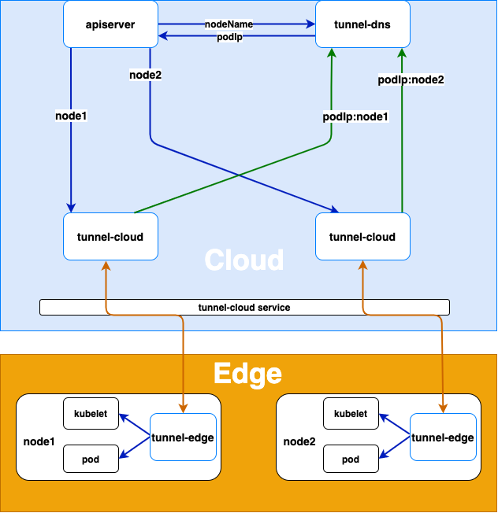

# Tunnel
Tunnel acts as the bridge between edge and cloud. It consists of **tunnel-cloud** and **tunnel-edge**, which responsible for maintaining persistent cloud-to-edge network connection. It allows edge nodes without public IP address to be managed by Kubernetes on the cloud for unified operation and maintenance.

## Architecture Diagram
<div align="left">
  
</div>

## Implementation

### Node Registration

- The **tunnel-edge** on the edge node actively connects to **tunnel-cloud** service, and **tunnel-cloud** service transfers the
  request to the **tunnel-cloud** pod according to the load balancing policy.
- After **tunnel-edge** establishes a gRPC connection with **tunnel-cloud**, **tunnel-cloud** will write the mapping of its podIp
  and nodeName of the node where **tunnel-edge** is located into DNS. If the gRPC connection is disconnected, **tunnel-cloud**
  will delete the podIp and node name mapping.

### Cloud Request Forwarding

- When apiserver or other cloud applications access the kubelet or other applications on the edge node, the tunnel-dns
  uses DNS hijacking (resolving the node name in the host to the podIp of **tunnel-cloud**) to forward the request to the
  pod of the **tunnel-cloud**.
- The **tunnel-cloud** forwards the request information to the gRPC connection established with the **tunnel-edge** according to
  the node name.
- The **tunnel-edge** requests the application on the edge node according to the received request information.

## Configuration File

The tunnel component includes **tunnel-cloud** and **tunnel-edge**. The **tunnel-edge** running on the edge node establishes a gRPC long-lived with the **tunnel-cloud** running on the cloud, which is used to forward the tunnel from the cloud to the edge node.
### Tunnel-cloud
The **tunnel-cloud** contains three modules of **stream**, **TCP** and **HTTPS**. The **stream module**  includes gRPC server and dns components. The gRPC server is used to receive gRPC long-lived requests from **tunnel-edge**, and the dns component is used to update the node name and IP mapping in the **tunnel-cloud** memory to the coredns hosts plug-in configmap.
### Tunnel-cloud Configuration
tunnel-cloud-conf.yaml
````yaml
apiVersion: v1
kind: ConfigMap
metadata:
  name: tunnel-cloud-conf
  namespace: edge-system
data:
  tunnel_cloud.toml: |
    [mode]
      [mode.cloud]
        [mode.cloud.stream]                             # stream module
          [mode.cloud.stream.server]                    # gRPC server component
            grpcport = 9000                             # listening port of gRPC server
            logport = 8000                              # The listening port of the http server for log and health check,use (curl -X PUT http://podip:logport/debug/flags/v -d "8") to set the log level
            channelzaddr = "0.0.0.0:6000"               # The listening address of the gRPC [channlez](https://grpc.io/blog/a-short-introduction-to-channelz/)server, used to obtain the debugging information of gRPC
            key = "../../conf/certs/cloud.key"          # The server-side private key of gRPC server
            cert = "../../conf/certs/cloud.crt"         # Server-side certificate of gRPC server
            tokenfile = "../../conf/token"              # The token list file (nodename: random string) is used to verify the token sent by the edge node tunneledge. If the verification fails according to the node name, the token corresponding to the default will be used to verify
          [mode.cloud.stream.dns]                       # DNS component
            configmap= "proxy-nodes"                    # configmap of the configuration file of the coredns hosts plugin
            hosts = "/etc/superedge/proxy/nodes/hosts"  # The path of the configmap of the configuration file of the coredns hosts plugin in the mount file of the tunnel-cloud pod
            service = "proxy-cloud-public"              # tunnel-cloud service name
            debug = true                                # DNS component switch, debug=true dns component is closed, the node name mapping in the tunnel-cloud memory will not be saved to the configmap of the coredns hosts plug-in configuration file, the default value is false
          [mode.cloud.tcp]                              # TCP module
            "0.0.0.0:6443" = "127.0.0.1:6443"           # The parameter format is "0.0.0.0:cloudPort": "EdgeServerIp:EdgeServerPort", cloudPort is the server listening port ofthe tunnel-cloud TCP module, EdgeServerIp and EdgeServerPort are the IP and port of the edge node server forwarded by the proxy
          [mode.cloud.https]                            # HTTPS module
            cert ="../../conf/certs/kubelet.crt"        # HTTPS module server certificate
            key = "../../conf/certs/kubelet.key"        # HTTPS module server private key
            [mode.cloud.https.addr]                     # The parameter format is "httpsServerPort": "EdgeHttpsServerIp: EdgeHttpsServerPort", httpsServerPort is the listening port of the HTTPS module server, EdgeHttpsServerIp:EdgeHttpsServerPort is the proxy forwarding the IP and port of the edge node HTTPS server, The server of the HTTPS module skips verifying the client certificate, so you can use (curl -k https://podip:httpsServerPort) to access the port monitored by the HTTPS module. The data type of the addr parameter is map, which can support monitoring multiple ports.
              "10250" = "101.206.162.213:10250"

````

### Tunnel-edge
The **tunnel-edge** also contains three modules of **stream**, **TCP** and **HTTPS**. The **stream module**  includes the gRPC client component, which is used to send gRPC long-lived requests to the **tunnel-cloud**.
### Tunnel-edge Configuration
tunnel-edge-conf.yaml
```yaml
apiVersion: v1
kind: ConfigMap
metadata:
  name: tunnel-edge-conf
  namespace: edge-system
data:
  tunnel_edge.toml: |
    [mode]
      [mode.edge]
        [mode.edge.stream]                              # stream module
          [mode.edge.stream.client]                     # gRPC client component
            token = "6ff2a1ea0f1611eb9896362096106d9d"  # Authentication token for access to tunnel-cloud
            cert = "../../conf/certs/ca.crt"            # The ca certificate of the server-side certificate of the gRPC server of tunnel-cloud is used to verify the server-side certificate
            dns = "localhost"                           # The IP or domain name signed by the gRPC server certificate of tunnel-cloud
            servername = "localhost:9000"               # The IP and port of gRPC server of tunnel-cloud
            logport = 7000                              # The listening port of the http server for log and health check,use (curl -X PUT http://podip:logport/debug/flags/v -d "8") to set the log level
            channelzaddr = "0.0.0.0:5000"               # The listening address of the gRPC channlez server, used to obtain the debugging information of gRPC
        [mode.edge.https]
          cert= "../../conf/certs/kubelet-client.crt"   # The client certificate of the HTTPS server forwarded by tunnel-cloud proxy
          key= "../../conf/certs/kubelet-client.key"    # The private key of the client side of the HTTPS server forwarded by the tunnel-cloud proxy
```

## Tunnel Forwarding Mode
Tunnel proxy supports either **TCP** or **HTTPS** request forwarding.

<details><summary>TCP Forwarding</summary>
<p>

The **TCP module** will forward the **TCP** request to the [first edge node connected to the cloud](https://github.com/superedge/superedge/blob/main/pkg/tunnel/proxy/tcp/tcp.go#L69). When there is only one **tunnel-edge** connected to the **tunnel-cloud**, The request will be forwarded to the node where the **tunnel-edge** is located
#### Tunnel-cloud Configuration 
tunnel-cloud-conf.yaml
```yaml
apiVersion: v1
kind: ConfigMap
metadata:
  name: tunnel-cloud-conf
  namespace: edge-system
data:
  tunnel_cloud.toml: |
    [mode]
      [mode.cloud]
        [mode.cloud.stream]
            [mode.cloud.stream.server]
                grpcport = 9000
                key = "/etc/superedge/tunnel/certs/tunnel-cloud-server.key"
                cert = "/etc/superedge/tunnel/certs/tunnel-cloud-server.crt"
                tokenfile = "/etc/superedge/tunnel/token/token"
                logport = 51000
            [mode.cloud.stream.dns]
                debug = true
        [mode.cloud.tcp]
            "0.0.0.0:6443" = "127.0.0.1:6443"
        [mode.cloud.https]

```

The gRPC server of the **tunnel-cloud** listens on port 9000 and waits for the **tunnel-edge** to establish a gRPC long-lived. The 6443 request to access the **tunnel-cloud** will be forwarded to the server with the access address 127.0.0.1:6443 of the edge node.
#### tunnel-cloud.yaml

```yaml

apiVersion: v1
kind: ConfigMap
metadata:
  name: tunnel-cloud-conf
  namespace: edge-system
data:
  mode.toml: |
    {{tunnel-cloud-tcp.toml}}
---
apiVersion: v1
kind: ConfigMap
metadata:
  name: tunnel-cloud-token
  namespace: edge-system
data:
  token: |
    default:{{.TunnelCloudEdgeToken}}
---
apiVersion: v1
data:
  tunnel-cloud-server.crt: '{{tunnel-cloud-server.crt}}'
  tunnel-cloud-server.key: '{{tunnel-cloud-server.key}}'
kind: Secret
metadata:
  name: tunnel-cloud-cert
  namespace: edge-system
type: Opaque
---
apiVersion: v1
kind: Service
metadata:
  name: tunnel-cloud
  namespace: edge-system
spec:
  ports:
    - name: proxycloud
      port: 9000
      protocol: TCP
      targetPort: 9000
  selector:
    app: tunnel-cloud
  type: NodePort
---
apiVersion: apps/v1
kind: Deployment
metadata:
  labels:
    app: tunnel-cloud
  name: tunnel-cloud
  namespace: edge-system
spec:
  selector:
    matchLabels:
      app: tunnel-cloud
  template:
    metadata:
      labels:
        app: tunnel-cloud
    spec:
      serviceAccount: tunnel-cloud
      serviceAccountName: tunnel-cloud
      containers:
        - name: tunnel-cloud
          image: superedge/tunnel:v0.2.0
          imagePullPolicy: IfNotPresent
          livenessProbe:
            httpGet:
              path: /cloud/healthz
              port: 51010
            initialDelaySeconds: 10
            periodSeconds: 60
            timeoutSeconds: 3
            successThreshold: 1
            failureThreshold: 1
          command:
            - /usr/local/bin/tunnel
          args:
            - --m=cloud
            - --c=/etc/superedge/tunnel/conf/mode.toml
            - --log-dir=/var/log/tunnel
            - --alsologtostderr
          volumeMounts:
            - name: token
              mountPath: /etc/superedge/tunnel/token
            - name: certs
              mountPath: /etc/superedge/tunnel/certs
            - name: conf
              mountPath: /etc/superedge/tunnel/conf
          ports:
            - containerPort: 9000
              name: tunnel
              protocol: TCP
            - containerPort: 6443
              name: apiserver
              protocol: TCP
          resources:
            limits:
              cpu: 50m
              memory: 100Mi
            requests:
              cpu: 10m
              memory: 20Mi
      volumes:
        - name: token
          configMap:
            name: tunnel-cloud-token
        - name: certs
          secret:
            secretName: tunnel-cloud-cert
        - name: conf
          configMap:
            name: tunnel-cloud-conf
      nodeSelector:
        node-role.kubernetes.io/master: ""
      tolerations:
        - key: "node-role.kubernetes.io/master"
          operator: "Exists"
          effect: "NoSchedule"
```

The TunnelCloudEdgeToken in the configmap of tunnel-cloud-token is a random string used to verify the **tunnel-edge**; The server-side certificate and private key of gRPC server corresponding to the secret of tunnel-cloud-cert.
#### Tunnel-edge Configuration
```yaml
apiVersion: v1
kind: ConfigMap
metadata:
  name: tunnel-edge-conf
  namespace: edge-system
data:
  tunnel_edge.toml: |
    [mode]
      [mode.edge]
        [mode.edge.stream]
            [mode.edge.stream.client]
                token = "{{.TunnelCloudEdgeToken}}"
                cert = "/etc/superedge/tunnel/certs/tunnel-ca.crt"
                dns = "{{ServerName}}"
                servername = "{{.MasterIP}}:9000"
                logport = 51000
```

The **tunnel-edge** uses MasterIP:9000 to access the  **tunnel-cloud**, uses TunnelCloudEdgeToken as the verification token,and sends it to the cloud for verification. The token is the TunnelCloudEdgeToken in the configmap of the tunnel-cloud-token of the deployment of the **tunnel-cloud**; DNS is the domain name or IP signed by the gRPC server certificate of the **tunnel-cloud**; MasterIP is the IP of the node where the  **tunnel-cloud** is located, and 9000 is the **tunnel-cloud** service NodePort.
#### tunnel-edge.yaml

```yaml
---
kind: ClusterRole
apiVersion: rbac.authorization.k8s.io/v1
metadata:
  name: tunnel-edge
rules:
  - apiGroups: [ "" ]
    resources: [ "configmaps" ]
    verbs: [ "get" ]
---
apiVersion: rbac.authorization.k8s.io/v1
kind: ClusterRoleBinding
metadata:
  name: tunnel-edge
roleRef:
  apiGroup: rbac.authorization.k8s.io
  kind: ClusterRole
  name: tunnel-edge
subjects:
  - kind: ServiceAccount
    name: tunnel-edge
    namespace: edge-system
---
apiVersion: v1
kind: ServiceAccount
metadata:
  name: tunnel-edge
  namespace: edge-system
---
apiVersion: v1
kind: ConfigMap
metadata:
  name: tunnel-edge-conf
  namespace: edge-system
data:
  mode.toml: |
    {{tunnel-edge-conf}}
---
apiVersion: v1
data:
  tunnel-ca.crt: '{{.tunnel-ca.crt}}'
kind: Secret
metadata:
  name: tunnel-edge-cert
  namespace: edge-system
type: Opaque
---
apiVersion: apps/v1
kind: Deployment
metadata:
  name: tunnel-edge
  namespace: edge-system
spec:
  selector:
    matchLabels:
      app: tunnel-edge
  template:
    metadata:
      labels:
        app: tunnel-edge
    spec:
      hostNetwork: true
      containers:
        - name: tunnel-edge
          image: superedge/tunnel:v0.2.0
          imagePullPolicy: IfNotPresent
          livenessProbe:
            httpGet:
              path: /edge/healthz
              port: 51010
            initialDelaySeconds: 10
            periodSeconds: 180
            timeoutSeconds: 3
            successThreshold: 1
            failureThreshold: 3
          resources:
            limits:
              cpu: 20m
              memory: 20Mi
            requests:
              cpu: 10m
              memory: 10Mi
          command:
            - /usr/local/bin/tunnel
          env:
            - name: NODE_NAME
              valueFrom:
                fieldRef:
                  apiVersion: v1
                  fieldPath: spec.nodeName
          args:
            - --m=edge
            - --c=/etc/superedge/tunnel/conf/tunnel_edge.toml
            - --log-dir=/var/log/tunnel
            - --alsologtostderr
          volumeMounts:
            - name: certs
              mountPath: /etc/superedge/tunnel/certs
            - name: conf
              mountPath: /etc/superedge/tunnel/conf
      volumes:
        - secret:
            secretName: tunnel-edge-cert
          name: certs
        - configMap:
            name: tunnel-edge-conf
          name: conf
```

The ca certificate corresponding to the secret of tunnel-edge-cert to verify the gRPC server certificate; **tunnel-edge** is deployed in the form of deployment, and the number of copies is 1 , Tcp forwarding now only supports forwarding to a single node.
</p>
</details>

<details><summary>HTTPS Forwarding</summary>
<p>

To forward cloud requests to edge nodes through tunnel, you need to use the edge node name as the domain name of the
**HTTPS** request host. Domain name resolution can reuse [tunnel-coredns](https://github.com/superedge/superedge/blob/main/deployment/tunnel-coredns.yaml) ,To use **HTTPS** forwarding, you need to deploy [**tunnel-cloud**](https://github.com/superedge/superedge/blob/main/deployment/tunnel-cloud.yaml), [**tunnel-edge**](https://github.com/superedge/superedge/blob/main/deployment/tunnel-edge.yaml) and **tunnel-coredns** three modules .
#### Tunnel-cloud Configuration
tunnel-cloud-conf.yaml
```yaml
apiVersion: v1
kind: ConfigMap
metadata:
  name: tunnel-cloud-conf
  namespace: edge-system
data:
  tunnel_cloud.toml: |
    [mode]
      [mode.cloud]
        [mode.cloud.stream]
            [mode.cloud.stream.server]
                grpcport = 9000
                logport = 51010
                key = "/etc/superedge/tunnel/certs/tunnel-cloud-server.key"
                cert = "/etc/superedge/tunnel/certs/tunnel-cloud-server.crt"
                tokenfile = "/etc/superedge/tunnel/token/token"
            [mode.cloud.stream.dns]
                configmap = "tunnel-nodes"
                hosts = "/etc/superedge/tunnel/nodes/hosts"
                service = "tunnel-cloud"
            [mode.cloud.https]
                cert = "/etc/superedge/tunnel/certs/apiserver-kubelet-server.crt"
                key = "/etc/superedge/tunnel/certs/apiserver-kubelet-server.key"
                [mode.cloud.https.addr]
                    "10250" = "127.0.0.1:10250"

```

The gRPC server of the **tunnel-cloud** listens on port 9000 and waits for the **tunnel-edge** to establish a gRPC long-lived. The request to access **tunnel-cloud** 10250 will be forwarded to the server with the access address 127.0.0.1:10250 of the edge node.
#### tunnel-cloud.yaml

[tunnel-cloud.yaml](https://github.com/superedge/superedge/blob/main/deployment/tunnel-cloud.yaml)
#### Tunnel-edge Configuration
tunnel-edge-conf.yaml
```yaml
apiVersion: v1
kind: ConfigMap
metadata:
  name: tunnel-edge-conf
  namespace: edge-system
data:
  tunnel_edge.toml: |
    [mode]
      [mode.edge]
        [mode.edge.stream]
            [mode.edge.stream.client]
                token = "{{.TunnelCloudEdgeToken}}"
                cert = "/etc/superedge/tunnel/certs/cluster-ca.crt"
                dns = "tunnel.cloud.io"
                servername = "{{.MasterIP}}:9000"
                logport = 51000
        [mode.edge.https]
            cert = "/etc/superedge/tunnel/certs/apiserver-kubelet-client.crt"
            key = "/etc/superedge/tunnel/certs/apiserver-kubelet-client.key"
```

The certificate and private key of the **HTTPS module** are the client certificate corresponding to the server-side certificate of the server of the edge node forwarded by the **tunnel-cloud**. For example, when **tunnel-cloud** forwards the request from apiserver to kubelet, it is necessary to configure the client certificate and private key corresponding to the kubelet port 10250 server certificate.  
#### tunnel-edge.yaml

[tunnel-edge.yaml](https://github.com/superedge/superedge/blob/main/deployment/tunnel-edge.yaml)
</p>
</details>


## Local Debugging

Tunnel supports **HTTPS** (**HTTPS module**) and **TCP** protocol (**TCP module**). The data of the protocol module is transmitted through gRPC long-lived (**stream module** ), so it can be divided into modules for local debugging. Local debugging can use go's testing framework. The configuration file can be generated by
calling [config_test](https://github.com/superedge/superedge/blob/main/pkg/tunnel/conf/config_test.go) test method Test_Config (where the constant variable config_path is the path of the generated configuration file relative to the path of the config_test go file, and main_path is the configuration file relative to the test file Path), such as the local debugging of the **stream module**: config_path = "../../../conf" (The generated configuration file is in
the conf folder under the root directory of the project), then main_path="../../../../conf"(the path of [stream_test](https://github.com/superedge/superedge/blob/main/pkg/tunnel/proxy/stream/stream_test.go)
relative to conf), the configuration file is generated to support the configuration of ca.crt and
ca.key (when configpath/certs/ca.crt and configpath/certs/ca.key exist, the specified ca is used to issue the
certificate).
### stream module debugging
#### start of the stream server

```go
func Test_StreamServer(t *testing.T) {
	err := conf.InitConf(util.CLOUD, "../../../../../conf/cloud_mode.toml")
	if err != nil {
		t.Errorf("failed to initialize stream server configuration file err = %v", err)
		return
	}
	model.InitModules(util.CLOUD)
	InitStream(util.CLOUD)
	model.LoadModules(util.CLOUD)
	tunnelContext.GetContext().RegisterHandler(util.MODULE_DEBUG, util.STREAM, StreamDebugHandler)
	model.ShutDown()

}
```

```
Load configuration file(conf.InitConf)->Initialize the module(model.InitMoudule)->Initialize the stream module(InitStream)->Load the initialized module->Register a custom handler (StreamDebugHandler)->Shut down the module (model.ShutDown)
```

StreamDebugHandler is a custom handler for debugging cloud side messaging
#### start of the stream client

```go
func Test_StreamClient(t *testing.T) {
	os.Setenv(util.NODE_NAME_ENV, "node1")
	err := conf.InitConf(util.EDGE, "../../../../../conf/edge_mode.toml")
	if err != nil {
		t.Errorf("failed to initialize stream client configuration file err = %v", err)
		return
	}
	model.InitModules(util.EDGE)
	InitStream(util.EDGE)
	model.LoadModules(util.EDGE)
	tunnelContext.GetContext().RegisterHandler(util.MODULE_DEBUG, util.STREAM, StreamDebugHandler)
	go func() {
		running := true
		for running {
			node := tunnelContext.GetContext().GetNode(os.Getenv(util.NODE_NAME_ENV))
			if node != nil {
				node.Send2Node(&proto.StreamMsg{
					Node:     os.Getenv(util.NODE_NAME_ENV),
					Category: util.STREAM,
					Type:     util.MODULE_DEBUG,
					Topic:    uuid.NewV4().String(),
					Data:     []byte{'c'},
				})
			}
			time.Sleep(10 * time.Second)
		}
	}()
	model.ShutDown()

}
```

```
Set the node name environment variable->Load configuration file (conf.InitConf)->Initialization module (model.InitMoudule)->Initialize the stream module (InitStream)->Load the initialized module->Register a custom handler (StreamDebugHandler)->Shut down the module (model.ShutDown)
```

The node name is loaded through the environment variable of NODE_NAME
### TCP module debugging
####  TCP server debugging

```go
func Test_TcpServer(t *testing.T) {
	err := conf.InitConf(util.CLOUD, "../../../../../conf/cloud_mode.toml")
	if err != nil {
		t.Errorf("failed to initialize stream server configuration file err = %v", err)
		return
	}
	model.InitModules(util.CLOUD)
	InitTcp()
	stream.InitStream(util.CLOUD)
	model.LoadModules(util.CLOUD)
	model.ShutDown()
}
```

Need to initialize the **TCP module** (InitTcp) and the **stream module**  (stream.InitStream) at the same time
#### TCP client debugging

```go
func Test_TcpClient(t *testing.T) {
	os.Setenv(util.NODE_NAME_ENV, "node1")
	err := conf.InitConf(util.EDGE, "../../../../../conf/edge_mode.toml")
	if err != nil {
		t.Errorf("failed to initialize stream client configuration file err = %v", err)
		return
	}
	model.InitModules(util.EDGE)
	InitTcp()
	stream.InitStream(util.EDGE)
	model.LoadModules(util.EDGE)
	model.ShutDown()
}
```
### HTTPS module debugging

Similar to **TCP module**  debugging, **HTTPS module** and **stream module**  need to be loaded at the same time.
### Debugging of tunnel main() function

In the main test file of the
tunnel [tunnel_test](https://github.com/superedge/superedge/blob/main/cmd/tunnel/tunnel_test.go), you need to use init() set the parameters, at the same time you need to use TestMain to parse the parameters and call the test method
