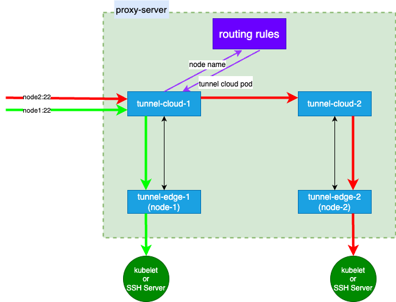
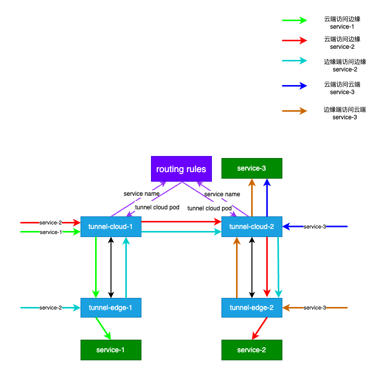

# Tunnel 详解

在 SuperEdge 架构里，lite-apiserver 用于 K8s 控制面的云边协同，另外一个需要云边协同的就是K8s 的数据面。SuperEdge 给出了一个基础的实现方案，就是云边隧道 Tunnel。Tunnel 基于 grpc 创建双向隧道，上层可以承载 7 层协议（http/https），实现云——边之间的网络互通。本文会详细介绍 Tunnel 的功能、实现原理以及最佳实践等。

## 1. 功能介绍

Tunnel 设计的初衷是为了在云端能够主动访问边缘节点上运行的kubelet的10250端口，后续在迭代过程中加入了对更多场景的支持，现在 Tunnel 的主要场景目标如下：

- 云端 apiserver 访问云端节点和边缘节点kubelet:10250，这里就是典型的kubectl exec/log场景。

- 云端 pod 访问云端节点和边缘节点的主机端口，例如kubelet:10250， node-exporter:9100等，适用于 metrics-erver 和 Prometheus 等云端服务场景。

- 边缘访问云端的集群外的内网服务，例如边缘节点从云端内网的镜像仓库拉取镜像。

- 云端/边端 pod 访问云端 service 和边缘端 service。

- 云端/边端 pod 访问云端 pod 和边缘端 pod。

- 支持通过云端控制面 ssh 远程登录边缘节点，进行远程运维。

## 2. 架构图

Tunnel 底层链接使用 gRPC 创建边——云双向隧道，通过此链路，实现上层 http/https 应用连接能力，同时通过 tunnel 实现了 gRPC 的连接管理，用于云边之间消息选择正确的链路进行分发。用户本身只需要和 http/https 的代理进行交互，即可实现上面描述的能力。

### 2.1 云端访问边缘节点




### 2.2 云边之间 Service/Pod 访问




## 

## 3. Tunnel 部署配置

tunnel组件包括**tunnel-cloud**和**tunnel-edge**，运行在边缘节点的**tunnel-edge**与运行在云端的**tunnel-cloud**建立gRPC长连接，用于云边通信的隧道。

### 3.1 tunnel-cloud配置

- `deployment:tunnel-cloud`，tunnel-cloud 是部署在云端的服务，可以单副本或者多副本部署，通过 NodePort  对公网提供服务，供边缘节点的 tunnel-edge 远程连接创建双向隧道。

<details><summary>tunnel-cloud.yaml</summary>
<p>

```yaml
---
apiVersion: apps/v1
kind: Deployment
metadata:
  labels:
    app: tunnel-cloud
  name: tunnel-cloud
  namespace: edge-system
spec:
  progressDeadlineSeconds: 600
  replicas: 1
  revisionHistoryLimit: 10
  selector:
    matchLabels:
      app: tunnel-cloud
  strategy:
    rollingUpdate:
      maxSurge: 25%
      maxUnavailable: 25%
    type: RollingUpdate
  template:
    metadata:
      creationTimestamp: null
      labels:
        app: tunnel-cloud
    spec:
      containers:
        - args:
            - '--m=cloud'
            - '--c=/etc/tunnel/conf/mode.toml'
            - '--log-dir=/var/log/tunnel'
            - '--alsologtostderr'
          command:
            - /usr/local/bin/tunnel
          env:
            - name: POD_IP
              valueFrom:
                fieldRef:
                  apiVersion: v1
                  fieldPath: status.podIP
            - name: POD_NAMESPACE
              valueFrom:
                fieldRef:
                  apiVersion: v1
                  fieldPath: metadata.namespace
            - name: POD_NAME
              valueFrom:
                fieldRef:
                  apiVersion: v1
                  fieldPath: metadata.name
            - name: USER_NAMESPACE
              value: edge-system
          image: 'superedge.tencentcloudcr.com/superedge/tunnel:v0.8.2'
          imagePullPolicy: IfNotPresent
          livenessProbe:
            failureThreshold: 1
            httpGet:
              path: /cloud/healthz
              port: 51010
              scheme: HTTP
            initialDelaySeconds: 10
            periodSeconds: 60
            successThreshold: 1
            timeoutSeconds: 3
          name: tunnel-cloud
          ports:
            - containerPort: 9000
              name: tunnel
              protocol: TCP
          resources:
            limits:
              cpu: 50m
              memory: 100Mi
            requests:
              cpu: 10m
              memory: 20Mi
          terminationMessagePath: /dev/termination-log
          terminationMessagePolicy: File
          volumeMounts:
            - mountPath: /etc/tunnel/token
              name: token
            - mountPath: /etc/tunnel/certs
              name: certs
            - mountPath: /etc/tunnel/nodes
              name: hosts
            - mountPath: /etc/tunnel/conf
              name: conf
            - mountPath: /etc/tunnel/cache
              name: cache
      dnsPolicy: ClusterFirst
      nodeSelector:
        node-role.kubernetes.io/master: ''
      restartPolicy: Always
      schedulerName: default-scheduler
      securityContext: {}
      serviceAccount: tunnel-cloud
      serviceAccountName: tunnel-cloud
      terminationGracePeriodSeconds: 30
      tolerations:
        - effect: NoSchedule
          key: node-role.kubernetes.io/master
          operator: Exists
      volumes:
        - configMap:
            defaultMode: 420
            name: tunnel-cloud-token
          name: token
        - name: certs
          secret:
            defaultMode: 420
            secretName: tunnel-cloud-cert
        - configMap:
            defaultMode: 420
            name: tunnel-nodes
          name: hosts
        - configMap:
            defaultMode: 420
            name: tunnel-cache
          name: cache
        - configMap:
            defaultMode: 420
            name: tunnel-cloud-conf
          name: conf
---
apiVersion: v1
kind: Service
metadata:
  name: tunnel-cloud
  namespace: edge-system
spec:
  ports:
    - name: grpc
      nodePort: 31725
      port: 9000
      protocol: TCP
      targetPort: 9000
    - name: ssh
      nodePort: 31940
      port: 22
      protocol: TCP
      targetPort: 22
    - name: tunnel-metrics
      nodePort: 31395
      port: 6000
      protocol: TCP
      targetPort: 6000
    - name: egress
      nodePort: 30008
      port: 8000
      protocol: TCP
      targetPort: 8000
    - name: http-proxy
      nodePort: 30638
      port: 8080
      protocol: TCP
      targetPort: 8080
  selector:
    app: tunnel-cloud
  sessionAffinity: None
  type: NodePort
```
</p>
</details>

> `tunnel-cloud`对外暴露的几个端口的主要用途如下：
>
> grpc-9000：grpc 对外服务端口，用于边缘端连接创建双向隧道。
>
> ssh-22：用于云端通过 tunnel 可以远程 ssh 登录边缘节点。
>
> egress-8000：ANP 支持，apiserver 会通过 egress 访问 8000 端口，通过 tunnel 远程 kubectl log/exec 边缘侧 pod。
>
> http-proxy-8080：云端 http 代理端口，云上 pod 需要访问边缘侧节点、svc、pod 的情况下，都需要在环境变量中指定使用这个代理，固定为如下配置：
>
> `http_proxy=http://tunnel-cloud.edge-system.svc.cluster.local:8080`
> `https_proxy=http://tunnel-cloud.edge-system.svc.cluster.local:8080`


上述这些端口可以在下面的 Configmap 种修改配置`tunnel-cloud-conf`：

<details><summary>tunnel-cloud-conf.yaml</summary>
<p>

```yaml
apiVersion: v1
kind: ConfigMap
metadata:
  name: tunnel-cloud-conf
  namespace: edge-system
data:
  tunnel_cloud.toml: |
    [mode]
      [mode.cloud]
        [mode.cloud.tls]                                # tls 配置 ciphersuites
          tls_cipher_suites = "TLS_ECDHE_RSA_WITH_AES_128_GCM_SHA256,TLS_ECDHE_RSA_WITH_AES_256_GCM_SHA384,TLS_ECDHE_ECDSA_WITH_AES_128_GCM_SHA256,TLS_ECDHE_ECDSA_WITH_AES_256_GCM_SHA384,TLS_ECDHE_RSA_WITH_CHACHA20_POLY1305,TLS_ECDHE_ECDSA_WITH_CHACHA20_POLY1305,TLS_ECDHE_RSA_WITH_AES_128_CBC_SHA,TLS_ECDHE_RSA_WITH_AES_256_CBC_SHA,TLS_RSA_WITH_AES_128_GCM_SHA256,TLS_RSA_WITH_AES_256_GCM_SHA384,TLS_RSA_WITH_AES_128_CBC_SHA,TLS_RSA_WITH_AES_256_CBC_SHA"    
        [mode.cloud.stream]                             # stream模块
          [mode.cloud.stream.server]                    # gRPC server组件
            grpc_port = 9000                             # gRPC server监听的端口
            log_port = 7000                              # log和健康检查的http server的监听端口，使用(curl -X PUT http://podip:logport/debug/flags/v -d "8")可以设置日志等级
            metrics_port = 6000
            channelz_addr = "0.0.0.0:5000"               # gRPC [channlez](https://grpc.io/blog/a-short-introduction-to-channelz/) server的监听地址，用于获取gRPC的调试信息
          [mode.cloud.stream.register]                  # 节点注册
            service = "tunnel-cloud"                    # tunnel-cloud的service name 
       [mode.cloud.egress]                              # EgressSelector模块
          port = 8000
       [mode.cloud.http_proxy]
          port = 8080
       [mode.cloud.ssh]
          port = 22
```
</p>
</details>


### 3.2 tunnel-edge 配置

`tunnel-edge`作为一个 Daemonset，会在每个边缘节点上部署，作为 grpc 客户端连接到云端，创建隧道，其配置如下：

<details><summary>tunnel-edge.yaml</summary>
<p>

```yaml
---
apiVersion: apps/v1
kind: DaemonSet
metadata:
  labels: {}
  name: tunnel-edge
  namespace: edge-system
spec:
  revisionHistoryLimit: 10
  selector:
    matchLabels:
      app: tunnel-edge
  template:
    metadata:
      creationTimestamp: null
      labels:
        app: tunnel-edge
    spec:
      containers:
        - args:
            - '--m=edge'
            - '--c=/etc/tunnel/conf/mode.toml'
            - '--log-dir=/var/log/tunnel'
            - '--alsologtostderr'
          command:
            - /usr/local/bin/tunnel
          env:
            - name: NODE_NAME
              valueFrom:
                fieldRef:
                  apiVersion: v1
                  fieldPath: spec.nodeName
          image: 'superedge.tencentcloudcr.com/superedge/tunnel:v0.8.2'
          imagePullPolicy: IfNotPresent
          livenessProbe:
            failureThreshold: 3
            httpGet:
              path: /edge/healthz
              port: 51010
              scheme: HTTP
            initialDelaySeconds: 10
            periodSeconds: 180
            successThreshold: 1
            timeoutSeconds: 3
          name: tunnel-edge
          resources:
            limits:
              cpu: 20m
              memory: 40Mi
            requests:
              cpu: 10m
              memory: 10Mi
          terminationMessagePath: /dev/termination-log
          terminationMessagePolicy: File
          volumeMounts:
            - mountPath: /etc/tunnel/certs
              name: certs
            - mountPath: /etc/tunnel/conf
              name: conf
      dnsPolicy: ClusterFirst
      hostNetwork: true
      nodeSelector:
        superedge.io/node-edge: enable
      restartPolicy: Always
      schedulerName: default-scheduler
      securityContext: {}
      terminationGracePeriodSeconds: 35
      volumes:
        - name: certs
          secret:
            defaultMode: 420
            secretName: tunnel-edge-cert
        - configMap:
            defaultMode: 420
            name: tunnel-edge-conf
          name: conf
  updateStrategy:
    rollingUpdate:
      maxSurge: 0
      maxUnavailable: 1
    type: RollingUpdate
```
</p>
</details>


其依赖的配置文件参考 Configmap：`tunnel-edge-conf`

<details><summary>tunnel-edge-conf.yaml</summary>
<p>

```yaml
apiVersion: v1
kind: ConfigMap
metadata:
  name: tunnel-edge-conf
  namespace: edge-system
data:
  tunnel_edge.toml: |
    [mode]
      [mode.edge]
        [mode.edge.stream]                              # stream模块
          [mode.edge.stream.client]                     # gRPC client组件
            token = "6ff2a1ea0f1611eb9896362096106d9d"  # 访问tunnel-cloud的验证token
            dns = "localhost"                           # tunnel-cloud的gRPC server证书签的IP或域名
            server_name = "114.114.114.114:9000"        # tunnel-cloud的gRPC server的IP和端口
            log_port = 7000                             # log和健康检查的http server的监听端口，使用(curl -X PUT http://podip:logport/debug/flags/v -d "8")可以设置日志等级
        [mode.edge.http_proxy]                          
           ip = "0.0.0.0"
           port = "51009"                                # 在边缘节点上开启的 http_proxy 服务端口
```
</p>
</details>


### 3.3 其余相关配置

Tunnel 依赖的其他配置均在 edge-system 下的几个 Configmap 中，介绍如下：

`tunnel-cloud-token`：云端 tunnel-cloud 用于认证 tunnel-edge 连接的 token，参考上面`tunnel-edge-conf`里 token 的配置，要保持一致才能认证连接成功。

`tunnel-nodes`：当边缘节点 tunnel-edge 成功注册到 tunnel-cloud 以后，会讲此节点信息记录到此 Configmap 中，同时记录了此节点注册的云端 tunnle-cloud 的 pod ip 地址（单 tunnel-cloud 下 pod ip 地址都是一样的；这个用于在多 tunnel-cloud 情况下，用来寻址）。

`tunnel-cache`：用于云端转发请求到边缘的路由查询，即架构图中的routing rules模块。
- cloud_nodes：  云端节点，tunnel-cloud会将带有**superedge.io/node-cloud=enable**标签的节点视为云端节点。云端pod将tunnel-cloud配置为代理server后，到云端节点上的server请求会经过tunnel-cloud，而不是直接请求。
- edge_nodes： 边缘节点，tunnel-cloud会根据云边隧道的状态（断开/连接）更新边缘节点。从云端访问边缘节点上的server时，需要经过云边隧道转发。
- services： 集群内的service，由tunnel-cloud通过自动发现进行填充，格式为<service-name>:<cloud/edge>。云端pod将tunnel-cloud配置为代理server后，到云端service的请求也会经过tunnel-cloud，而不是根据云端节点上的转发规则直接请求，到边缘service的会经过
  云边隧道转发。tunnel-cloud会将请求随机转发到service下的任意一个pod。
- user_service: 用户自定义的云边端service。

<details><summary>tunnel-cache.yaml</summary>
<p>

```yaml
---
apiVersion: v1
data:
  cloud_nodes: |
    192.168.20.38    worker2
    192.168.20.14    master
    192.168.20.11    worker1
  edge_nodes: |
    10.233.0.4    edge1
    10.233.0.4    edge2
  services: |
    operator.kubescape    cloud
    kubevuln.kubescape    edge
    metrics-server.kube-system    cloud
    kube-dns.kube-system    cloud
    gateway.kubescape    cloud
    kubescape.kubescape    edge
    tunnel-cloud.edge-system    cloud
    edge-health-admission.edge-system    cloud
    echo.default    cloud
  user_services: ''
kind: ConfigMap
metadata:
  labels: {}
  name: tunnel-cache
  namespace: edge-system
```
</p>
</details>


## 4.  云边访问场景详解

### 4.1 云端 Pod 访问边缘节点

#### 4.1.1 kubectl log/exec

为了便于云厂商能控制kube-apiserver访问node，pod和service的流量，k8s社区提供了[ANP](https://github.com/kubernetes/enhancements/tree/master/keps/sig-api-machinery/1281-network-proxy#proposal)特性，在kuber-apiserver中设置[egress-selector-config-file](https://kubernetes.io/zh-cn/docs/tasks/extend-kubernetes/setup-konnectivity/)参数启用该特性。
配置ANP将kube-apiserver的log/exec的请求导向tunnel，log/exec请求的详细过程可以参考链接[kubectl exec 的来龙去脉](https://cloud.tencent.com/developer/article/1495314)，tunnel-cloud在转发时会根据节点名（请求中的host）将请求分发到不同的云边隧道。

#### 4.1.2 云端pod访问kubelet的10250端口

边缘节点 Kubelet 监听在10250端口的HTTPS Server会对访问请求进行认证和鉴权，作为"中间人"的tunnel，无法获取使用client的身份认证信息与kubelet进行通信。由于鉴权的存在，tunnel 也不能使用固定身份认证信息与kubelet通信，因此需要对请求数据进行透明转发。这里通过设置代理
`http_proxy/https_proxy=http://tunnel-cloud.edge-system.svc.cluster.local:8080` 来访问边缘节点，例如 edge1:10250/worker1:10250。这里可以同时支持访问云上标准 worker 节点，以及边缘 edge 节点。

#### 4.1.3 Prometheus 访问边缘节点 9100 端口

和 4.1.2 类似，通过http/https代理访问边缘节点。

#### 4.1.4 访问 SSH Server

在后台不保留SSH登录节点的凭证，避免凭证泄露带来的用户节点被攻破的风险，因此需要透传SSH Client和Server之间通信的SSH协议数据，实现细节可以参考链接 [SuperEdge 云边隧道新特性：从云端SSH运维边缘节点](https://mp.weixin.qq.com/s/J-sxkiL62FAjGBRHERPbKg)。

### 4.2  Service 云边互访

#### 4.2.1  云端访问边缘节点的service

* kube-apiserver 访问边缘节点的service：  
  kube-apiserver开启**EgressSelector**特性

* 云端pod访问边缘节点的service：  
  配置**HTTP_PROXY/HTTPS_PROXY**环境变量指向tunnel-cloud service，如架构图（**Service访问**）所示，通过tunnel-cloud-1访问边缘节点上的service-1和service-2。
  同时支持用户自定义边缘节点service，在**tunnel-cache** configMap的**user_services**中添加

  ```yaml
  serviceName edge
  ```

  tunnel-cloud会自定检查集群的边缘端service，将serviceName 写入到**tunnel-cache** configMap的**services**中

  ```yaml
  serviceName edge
  ```

#### 4.2.2  云端访问云端的service

在云端pod同时访问边缘端service和云端service时，可以配置**HTTP_PROXY**指向tunnel-cloud service，tunnel-cloud将请求转发目标service，如架构图（**Service访问**）所示，通过tunnel-cloud-2访问
service-3。  
同时支持用户自定义云端service，在**tunnel-cache** configMap的**user_services**中添加

```yaml
serviceName cloud
```

tunnel-cloud会自定检查集群的边缘端service，将serviceName 写入到**tunnel-cache** configMap的**services**中

```yaml
serviceName cloud
```

#### 4.2.3 边缘端访问云端的service

边缘端到tunnel-edge的请求，会通过云边隧道转发到云端的tunnel-cloud，由tunnel-cloud对云端的service发送请求，如架构图（**Service访问**）所示，通过
tunnel-edge-2访问云端的service-3。  
同时支持访问云端集群外的服务，比如访问云端的内网镜像仓库，为了把集群内的服务和集群外的服务区分开来，访问集群内的服务名的格式为**serviceName.NameSpace**

#### 4.2.4 边缘端访问其他边缘区域边缘节点上的service

跨地区的服务访问需要通过云端的tunnel-cloud进行中继转发，如架构图（**Service访问**）所示，通过tunnel-edge-1访问service-2。

## 5. 实现原理

tunnel-cloud使用边缘节点名来管理gRPC云边隧道，细节实现请参考链接[一文读懂 SuperEdge 云边隧道](https://mp.weixin.qq.com/s/5btXwUot0vSGvUlzVcofLg)，云端到边缘端在通过云边隧道进行转发之前必须获取目标节点的节点名，下面对不同的访问场景获取节点名的方式做一下概述：
- kubectl exec/logs:  
设置kube-apiserver的参数**kubelet-preferred-address-types=Hostname**，kube-apiserver在请求时候就会使用节点名作为host。
- 云端pod访问边缘节点的主机端口：  
与kube-apiserver类似，使用边缘节点的节点名作为请求的host。
- 云端pod访问边缘节pod：  
根据podIp，获取pod所在的边缘节点。
- 云端pod访问边缘端service：  
tunnel-cloud会随机选取service下的一个pod，接下的流程和访问边缘节点pod的流程类似。

在云端pod同时访问云端和边缘端service的场景下，tunnel-cloud只需转发请求，而无需做负载均衡，tunnel-cloud会根据**tunnel-cache**configMap中的**services**和**user_services**对云端和边缘端的service分开转发。
tunnel-cloud会周期检查service下所有pod实例，根据pod所在的节点的位置（云端/边缘端），更新**services**中的service，而**user_services**则是由用户自定义。  


### 5.1 无侵入转发请求数据

tunnel在转发数据之前会在client和server之间建立HTTP隧道，数据通过隧道进行转发。

### 5.2 云端tunnel-cloud多副本

tunnel-edge的连接请求会通过tunnel-cloud service的负载均衡转发到不同的tunnel-cloud pod，tunnel-cloud在转发请求时候，如果与目标节点云边隧道没有
建立，则会将请求转发到与目标节点建立云边隧道的tunnel-cloud pod。