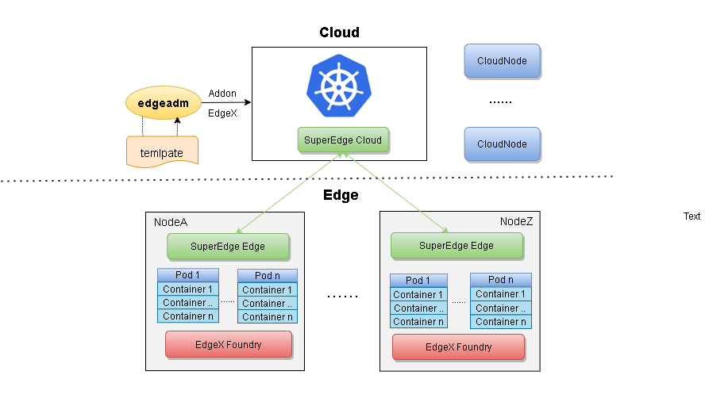
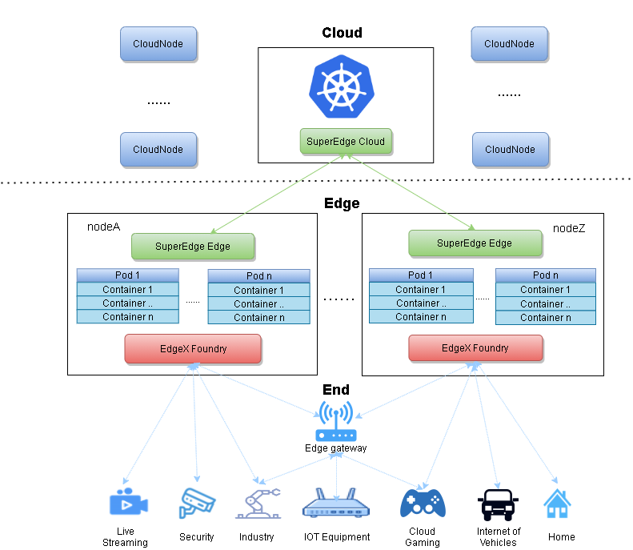

English|[简体中文](./addon_edgex_CN.md)  

# One-click to deploy EdgeX Foundry to an edge cluster  
* [One\-click to deploy EdgeX Foundry to an edge cluster](#one-click-to-deploy-edgex-foundry-to-an-edge-cluster)
  * [1\. Background](#1-background)
  * [2\. Design](#2-design)
  * [3\. Installation of EdgeX Foundry components](#3-installation-of-edgex-foundry-components)
    * [&lt;1&gt; Preparation conditions](#1-preparation-conditions)
    * [&lt;2&gt; Install EdgeX Foundry components](#2-install-edgex-foundry-components)
  * [4\. EdgeX Foundry interface](#4-edgex-foundry-interface)
    * [&lt;1&gt; Visit CONSUL](#1-visit-consul)
    * [&lt;2&gt; Access UI](#2-access-ui)
  * [5\. Verification of EdgeX Foundry](#5-verification-of-edgex-foundry)
    * [&lt;1&gt; Connect the device](#1-connect-the-device)
    * [&lt;2&gt; Data access](#2-data-access)
    * [&lt;3&gt; Equipment control](#3-equipment-control)
      * [(1) View available commands](#1-view-available-commands)
      * [(2) Put command](#2-put-command)
      * [(3) Get command](#3-get-command)
    * [&lt;4&gt; Data output](#4-data-output)
  * [6\. Uninstallation of EdgeX Foundry](#6-uninstallation-of-edgex-foundry)
  * [7\. Later plan](#7-later-plan)
  

## 1. Background  

With the development of the Internet of Things, there are more and more types and numbers of devices connected to the cloud,[There are 12.6 billion IoT devices worldwide in 2020](https://mp.ofweek.com/iot/a556714409057),and it is also growing at a rate of more than ten percent per year. It is an unavoidable problem to perform unified management and control of many devices and process the data generated by many devices.  

EdgeX Foundry is an open source edge device management platform that can be deployed at the edge of the network to connect devices and upper-layer components for interaction, and it has a mature solution for device management and control. Deploying EdgeX Foundry in edge clusters can further enhance the functions of edge clusters. Compared with deploying EdgeX Foundry in central cloud clusters, you can take advantage of the advantages of edge clusters and give full play to the functions of EdgeX Foundry.  

-   EdgeX Foundry running at the edge requires an edge computing platform as a support, which acts as a link between the top and the bottom. The top can be connected to the central cloud, and the bottom can control equipments;  
-   The edge computing platform requires EdgeX Foundry's general equipment management capabilities to open up the cloud edge and form a cloud edge integration. The two complement each other, and empower the edge of the cloud.  

## 2. Design  

In order to allow users to quickly use the functions of EdgeX Foundry in edge clusters, we provide one-click deployment of EdgeX Foundry in edge clusters. By configuring related files, categorizing by level, integrating commands into the `addon` command of `edgeadm`, and performing corresponding tests to reduce possible errors to allow users to easily deploy and use EdgeX Foundry functions on edge clusters in just a few simple steps.  

<div align="center">
  
</div>
  
Advantages of this program:  

-   **Fully native**

    We have no modifications to EdgeX Foundry, nor any packaging, just native deployment. In the next issue, we will provide new components to interface with SuperEdge, Kubernetes and EdgeX Foundry, but we will still keep all components and capabilities optional, integrated in the form of plug-ins, and will not force users to use any additional functions.  

-   **Optional components**

    We currently support EdgeX Foundry to integrate to the level of optional, and we will continue to refine it to the optional components, so that users can deploy the required components according to their own wishes and business needs. See the architecture diagram of EdgeX Foundry for optional levels:  

    <div align="center">
      
    </div>  

-   **All parameters can be customized**

    We are EdgeX Foundry integrated in the form of yaml template. Users can modify any parameters of the yaml template to achieve their own business customization requirements.  

## 3. Installation of EdgeX Foundry components

### <1> Preparation conditions

Execute the following command to download the edgeadm static installation package, and pay attention to modify the "arch=amd64" parameter, currently supports [amd64, arm64], download the corresponding architecture of your own machine, and other parameters remain unchanged  

```shell
arch=amd64 version=v0.7.0-beta.0 && rm -rf edgeadm-linux-* && wget https://superedge-1253687700.cos.ap-guangzhou.myqcloud.com/$version/$arch/edgeadm-linux-$arch-$version.tar.gz && tar -xzvf edgeadm-linux-* && cd edgeadm-linux-$arch-$version && ./edgeadm
```

Reference to install an edge cluster:[One-click to install an edge independent Kubernetes clusters.](https://github.com/superedge/superedge/blob/main/docs/installation/install_edge_kubernetes.md)  


### <2> Install EdgeX Foundry components
Execute the following command to install all components of EdgeX Foundry with one click  

```shell
./edgeadm addon edgex
```

If you get the following success prompt, the deployment was successful  

```shell
Start install edgex-application-services.yml to your cluster
Deploy edgex-application-services.yml success!
Start install edgex-core-services.yml to your cluster
Deploy edgex-core-services.yml success!
Start install edgex-device-services.yml to your cluster
Deploy edgex-device-services.yml success!
Start install edgex-support-services.yml to your cluster
Deploy edgex-support-services.yml success!
Start install edgex-system-management.yml to your cluster
Deploy edgex-system-management.yml success!
Start install edgex-ui.yml to your cluster
Deploy edgex-ui.yml success!
```

You can also add the required components to the cluster through the following command  

```shell
./edgeadm addon edgex [flag]
```
You can view the available flags through the command `./edgeadm addon edgex --help`  

```shell
--app           Addon the edgex application-services to cluster.
--core          Addon the edgex core-services to cluster.
--device        Addon the edgex device-services to cluster.
--support       Addon the edgex supporting-services to cluster.
--sysmgmt       Addon the edgex system management to cluster
--ui            Addon the edgex ui to cluster.
```
For example, the relevant components of the core service layer can be installed with  

```shell
./edgeadm addon edgex --core
```
Install other components as above, just replacing the flag. If you need to install multiple level components at the same time, you can add multiple flags at the same time.  

>   The installation version provided above is `EdgeX Foundry 1.3`. If you need to install other versions of components, please pull the repository source code and modify the relevant details of the corresponding components in the `/pkg/edgeadm/constant/manifests/edgex` directory.

>   The above installation does not include security related components and configurations. Later versions may add related functions, or you can configure yourself in the project source file.
  
After the deployment is successful, you can check the startup status of `svc` and `pod` through the following commands  

```shell
kubectl get svc,pods -n edgex
```

>   **Notice**: If the components of the same level are partially installed successfully and partially failed, you can directly reexecute the installation command to update and install. If the installed component fails to run abnormally, you can use `./edgeadm detach edgex [flag]` to uninstall and reinstall the component at a specific level. For details on uninstallation, please refer to [6\. Uninstallation of EdgeX Foundry](#6-uninstallation-of-edgex-foundry)

## 4. EdgeX Foundry interface

### <1> Visit CONSUL

Access the port of core-consul service from the web page to view the deployment of each component, where `30850` is the port number exposed by the `core-consul` service  
```shell
curl http://localhost:30850/ui/dc1/services
```
<div align="center">
  
</div>

 If a red cross is displayed, it means that the component has failed to install. If the refresh is still invalid, you can view the corresponding log of the component to troubleshoot the failure, or reinstall the corresponding component.

### <2> Access UI

From the web page, you can also check whether the components are deployed normally by accessing the port of the UI service, where `30040` is the port number exposed by the UI service  

```shell
curl http://localhost:30040/
```
<div align="center">
  
</div>  

If the deployment is successful, there will be corresponding entries generated for each item  

## 5. Verification of EdgeX Foundry

### <1> Connect the device

Start a virtual device with the following command  
```shell
kubectl apply -f edgex-device-random.yaml
```
The content of the `edgex-device-random.yaml` is  
```shell 
apiVersion: v1
kind: Service
metadata:
  name: edgex-device-random
  namespace: edgex
spec:
  type: NodePort
  selector:
    app: edgex-device-random
  ports:
  - name: http
    port: 49988
    protocol: TCP
    targetPort: 49988
    nodePort: 30088
---
apiVersion: apps/v1
kind: Deployment
metadata: 
  name: edgex-device-random
  namespace: edgex
spec:
  selector:
    matchLabels: 
      app: edgex-device-random
  template:
    metadata:
      labels: 
        app: edgex-device-random
    spec:
      hostname: edgex-device-random
      containers:
      - name: edgex-device-random
        image: edgexfoundry/docker-device-random-go:1.3.0
        imagePullPolicy: IfNotPresent
        ports:
        - name: http
          protocol: TCP
          containerPort: 49988
        envFrom: 
        - configMapRef:
            name: common-variables
        env:
          - name: Service_Host
            value: "edgex-device-random"
```

This command will start a virtual device with a random integer generator to connect to EdgeX Foundry. The device will send a random number to core-data and receive command control from core-command.  
### <2> Data access
Use the following command to access the port of the core-data service from the web page to view the last 10 pieces of data sent by the random number device started in the previous step to the core service, where `30080` is the port number of the core-data service, `Random-Integer-Generator01 `Is the virtual device installed by the above file  
```shell
curl http://localhost:30080/api/v1/event/device/Random-Integer-Generator01/10
```
<div align="center">
  
</div>  

### <3> Equipment control

#### (1) View available commands

Web access to the port of the core-command service to view the commands that can be performed on the virtual device, including `Put` commands and `Get` commands, where `Put` is used to issue commands, and `Get` is used to obtain commands, where `30082` is the port number of the core-command service , `Random-Integer-Generator01` is the virtual device installed by the above file  

```shell
curl http://localhost:30082/api/v1/device/name/Random-Integer-Generator01
```
<div align="center">
  
</div>  

#### (2) Put command

The virtual device can be controlled by executing the `Put` command. Here, taking the range of the random number generated by it as an example, find the URL of the `Put` command from the web page, and execute the following command:

```shell
curl -X PUT -d '{"Min_Int8": "0", "Max_Int8": "100"}' http://localhost:30082/api/v1/device/2a20be3f-d9e6-4032-aeba-23f602d99a63/command/646fb3c7-f8bc-4b4f-bbad-d566777582d1
```

>   This is just an example. The specific url is obtained from the url of the displayed `Put` command, and please remember to change the `edgex-core-command:48082` field to `localhost:30082`, and change the content in `{}` to available The parameter that can be modified is obtained from the display of the previous query command
>
>   Where `30082` is the port number of the core-command service 

Here, the range of the number of virtual devices generated is changed from 0 to 100. There is no output when the `Put` command is executed. You can use the `Get` command to check whether the newly generated data is within the range of 0-100.

#### (3) Get command

You can see the url of the `Get` command from the content of the above webpage, and you can use the url of `Get` to get the data sent by the random number device.

>   This is just an example, the specific url is obtained according to the display, and please remember to change the `edgex-core-command:48082` field to `localhost:30082`
>
>   Where `30082` is the port number of the core-command service  

```shell
curl http://localhost:30082/api/v1/device/2a20be3f-d9e6-4032-aeba-23f602d99a63/command/646fb3c7-f8bc-4b4f-bbad-d566777582d1
```
<div align="center">
  
</div>  

### <4> Data output  

Execute the following command to deploy a component that exports EdgeX Foundry data to the cloud  
```shell
kubectl apply -f mqtt.yaml
```
The content of the `mqtt.yaml` file is  
```shell
apiVersion: v1
kind: Service
metadata:
  name: edgex-app-service-configurable-mqtt
  namespace: edgex
spec:
  type: NodePort 
  selector:
    app: edgex-app-service-configurable-mqtt
  ports:
  - name: http
    port: 48101
    protocol: TCP
    targetPort: 48101
    nodePort: 30200
---
apiVersion: apps/v1
kind: Deployment
metadata: 
  name: edgex-app-service-configurable-mqtt
  namespace: edgex
spec:
  selector:
    matchLabels: 
      app: edgex-app-service-configurable-mqtt
  template:
    metadata:
      labels: 
        app: edgex-app-service-configurable-mqtt
    spec:
      hostname: edgex-app-service-configurable-mqtt
      containers:
      - name: edgex-app-service-configurable-mqtt
        image: edgexfoundry/docker-app-service-configurable:1.1.0
        imagePullPolicy: IfNotPresent
        ports:
        - name: http
          protocol: TCP
          containerPort: 48101
        envFrom: 
        - configMapRef:
            name: common-variables
        env:
          - name: edgex_profile
            value: "mqtt-export"
          - name: Service_Host
            value: "edgex-app-service-configurable-mqtt"
          - name: Service_Port
            value: "48101"
          - name: MessageBus_SubscribeHost_Host
            value: "edgex-core-data"
          - name: Binding_PublishTopic
            value: "events"
          - name: Writable_Pipeline_Functions_MQTTSend_Addressable_Address
            value: "broker.mqttdashboard.com"
          - name: Writable_Pipeline_Functions_MQTTSend_Addressable_Port
            value: "1883"
          - name: Writable_Pipeline_Functions_MQTTSend_Addressable_Protocol
            value: "tcp"
          - name: Writable_Pipeline_Functions_MQTTSend_Addressable_Publisher
            value: "edgex"
          - name: Writable_Pipeline_Functions_MQTTSend_Addressable_Topic
            value: "EdgeXEvents"
```
Start this component, which can export the data in core-data to HiveMQ's public MQTT Broker. You can visit the agent through the web page to check whether the data is successfully exported to the cloud. Visit the following URL to enter the webpage  
```shell
http://www.hivemq.com/demos/websocket-client/
```
<div align="center">
  
</div>  


Click 'connect' to connect, fill in the subject as 'EdgeXEvents'  

<div align="center">
  
</div>  


You can see the data sent by the virtual device to EdgeX Foundry in the 'message' column  

<div align="center">
  
</div>  


However, because this is a public Broker, the data uploaded multiple times by multiple parties will be retained and co-existed under the corresponding theme. Therefore, even if there is data in the 'message' column, it may be the data left over from the previous export operation. If you want to really verify whether the export is successful , you can try to create a new topic after connecting. The topic has no message display, and then modify the value of `Writable_Pipeline_Functions_MQTTSend_Addressable_Topic` under `env` in `mqtt.yaml` to the topic. After deployment, check whether there is data in the Broker webpage. If yes, it means that the export is successful.

>   **Notice**:If there are abnormalities such as inaccessible web pages during the above operations, please check the Pod situation again, and uninstall and reinstall if necessary.

## 6. Uninstallation of EdgeX Foundry
If you execute `./edgeadm addon edgex` to install all components or customize all levels of components, you can execute the following command to uninstall all EdgeX Foundry and uninstall the mount data generated on the host at the same time. If only part of the level is installed or some components are missing, please uninstall it level by level by adding flags as described later.  

```shell
./edgeadm detach edgex
```
The following successful display appears indicates that the uninstallation is complete.  

```shell
Start uninstall edgex-application-services.yml to your cluster
Detach edgex-application-services.yml success!
Start uninstall edgex-application-services.yml from your cluster
Detach edgex-application-services.yml success!
Start uninstall edgex-core-services.yml from your cluster
Detach edgex-core-services.yml success!
Start uninstall edgex-device-services.yml from your cluster
Detach edgex-device-services.yml success!
Start uninstall edgex-support-services.yml from your cluster
Detach edgex-support-services.yml success!
Start uninstall edgex-system-management.yml from your cluster
Detach edgex-system-management.yml success!
Start uninstall edgex-ui.yml from your cluster
Detach edgex-ui.yml success!
Start uninstall edgex-configmap.yml from your cluster
Detach edgex-configmap.yml success!
Start uninstall edgex completely.
Delete edgex completely success!
```
You can also execute `./edgeadm detach edgex [flag]` to uninstall EdgeX Foundry. You can use the `./edgeadm detach edgex --help` command to view the available flags  
```shell
--app          Detach the edgex application-services from cluster.
--core         Detach the edgex core-services from cluster.
--device       Detach the edgex device-services from cluster.
--support      Detach the edgex supporting-services from cluster.
--sysmgmt      Detach the edgex system management from cluster.
--ui           Detach the ui from cluster.
--completely   Detach the configmap and volumes from cluster.
```


If you need to uninstall the relevant components of the core service, you can run  

```shell
./edgeadm detach edgex --core
```

The deletion of other components is the same as above, just replace the flag, and support multiple flags to delete multiple levels of components at the same time.  
You can use the following command to check whether all svc and pod have been deleted.  

```shell
kubectl get svc,pods -n edgex  
```

**Notice**:  

-    If there is an error in the deletion, which causes part of the components of a certain level to be deleted, but some parts are not deleted, the deletion operation of this level will fail. You need to use `addon` to reinstall all the components of this level, and then delete them. For example, if there is a failure in the process of deleting the `core` level, the `core-data` component has been deleted but the `core-consul` component has not been deleted, then the `./edgeadm detach edgex --core` command cannot be executed again normally, and you need to use `./edgeadm addon edgex --core` to add the missing core-data component, and then use `./edgeadm detach edgex --core` to delete the `core` level.
-    `./edgeadm detach edgex` is only applicable when all components exist. If only some components exist, please delete the corresponding level independently.

## 7. Later plan

At present, we have achieved the first step of integrating with EdgeX Foundry. Our goal is as shown in the picture below:

<div align="center">
  
</div>

It is to completely open up the cloud edge and form a complete integration of the cloud edge and edge. EdgeX Foundry is not our only choice. We will integrate and abstract with more edge device platforms in the future, and strive for a more general **seamless access to multi-platform edge devices**.

>   If you encounter related problems or have suggestions for improvement during use, you can contact us in the WeChat group or raise Issues in the community.

