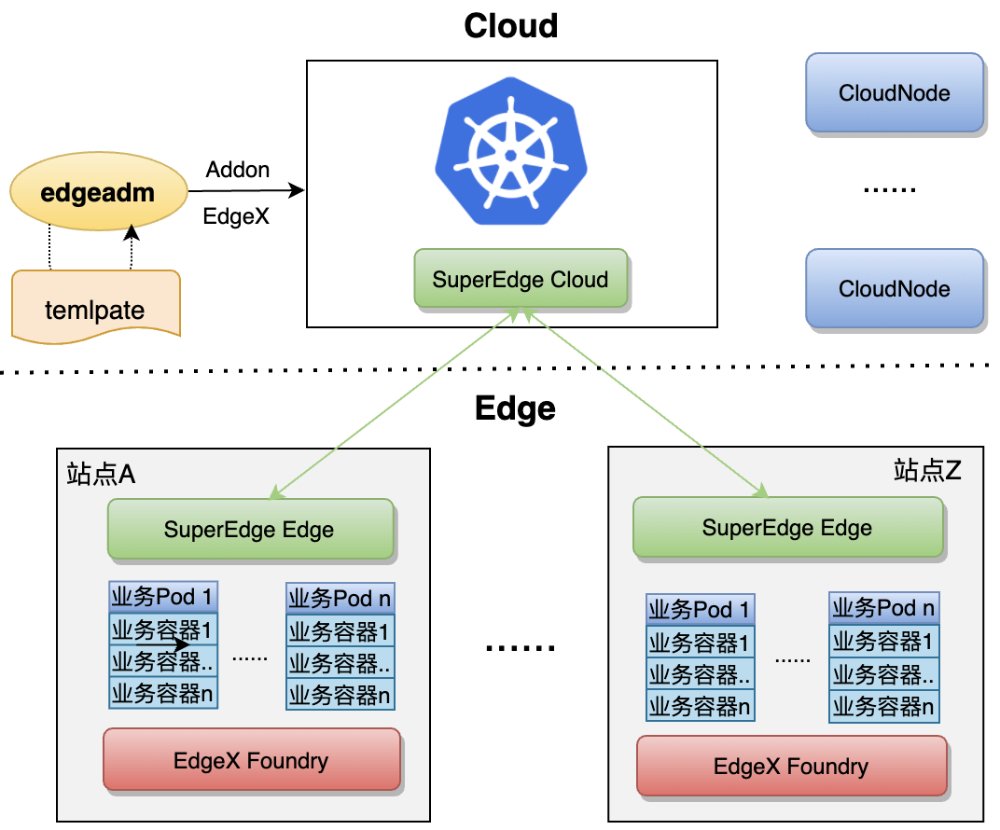

简体中文 | [English](./addon_edgex.md)

# 一键部署EdgeX Foundry到边缘集群  

* [一键部署EdgeX Foundry到边缘集群](#一键部署edgex-foundry到边缘集群)
  * [1\. 背景](#1-背景)
  * [2\. 方案设计](#2-方案设计)
  * [3\. EdgeX Foundry组件的安装](#3-edgex-foundry组件的安装)
    * [&lt;1&gt; 准备条件](#1-准备条件)
    * [&lt;2&gt; 安装EdgeX Foundry的组件](#2-安装edgex-foundry的组件)
  * [4\. EdgeX Foundry的界面](#4-edgex-foundry的界面)
    * [&lt;1&gt; 访问CONSUL](#1-访问consul)
    * [&lt;2&gt; 访问UI](#2-访问ui)
  * [5\. EdgeX Foundry 的验证](#5-edgex-foundry-的验证)
    * [&lt;1&gt; 连接设备](#1-连接设备)
    * [&lt;2&gt; 数据访问](#2-数据访问)
    * [&lt;3&gt; 设备控制](#3-设备控制)
      * [(1) 查看可用命令](#1-查看可用命令)
      * [(2) Put指令](#2-put指令)
      * [(3) Get指令](#3-get指令)
    * [&lt;4&gt; 数据导出](#4-数据导出)
  * [6\. EdgeX Foundry的卸载](#6-edgex-foundry的卸载)
  * [7\. 后期计划](#7-后期计划)
  

## 1. 背景

随着物联网的发展，连接云的设备种类和数量越来越多，[2020年全球物联网设备已高达126亿个](https://mp.ofweek.com/iot/a556714409057)，并且还以每年百分之十几的速度在增长。对众多的设备进行统一管控和众多设备产生的数据进行处理是无法回避的难题。

EdgeX Foundry 是一个开源的边缘设备管理平台，可以部署在网络边缘连接各设备和上层组件进行交互，对设备管理和控制有一套成熟的解决方案。部署 EdgeX Foundry 在边缘集群，可以进一步增强边缘集群的功能，同相比将 EdgeX Foundry 部署在中心云集群，可以利用边缘集群的优势，更大发挥 EdgeX Foundry 的功能。

-   EdgeX Foundry 运行在边缘需要一个边缘计算平台作为支撑，在中间起到承上启下的作用，上可连接到中心云，下可管控设备；
-   边缘计算平台需要 EdgeX Foundry 通用的设备管理能力，打通云边端，形成云边端一体化。二者相辅相成，互相补足，为云边端赋能。

## 2. 方案设计

为了能让用户快速在边缘集群使用 EdgeX Foundry 的功能，我们提供了 EdgeX Foundry 在边缘集群的一键部署。通过配置相关文件，按层级分类，将命令集成到 edgeadm 的 addon 命令下，并进行了相应测试，减少可能的错误。使用户只需简单几步，就可以轻松的在边缘集群上部署和使用 EdgeX Foundry 的功能。

<div align="center">
  
</div>

本方案的优点：

-   **完全原生**

    我们对 EdgeX Foundry 没有任何修改，也没有任何封装，只是原生的部署。下一期我们会提供新的组件与SuperEdge及 Kubernetes 和 EdgeX Foundry 的对接，但是我们依然会保持所有组件及能力可选，以插件方式集成，不会强绑定用户使用任何额外的功能。

-   **组件可选**

    我们对 EdgeX Foundry 集成目前支持到层级可选，后面我们还会继续细化，细化到组件可选，让用户完全按自己的意愿和业务需要去部署需要的组件。层级可选见 EdgeX Foundry 的架构图：

    <div align="center">
      
    </div>

-   **所有参数可自定义**

    我们是以yaml模板方式集成的 EdgeX Foundry， 用户可修改yaml模板的任何参数，实现自己业务自定义的需求。

## 3. EdgeX Foundry组件的安装

### <1> 准备条件

执行以下命令下载 edgeadm 静态安装包，注意修改"arch=amd64"参数，目前支持[amd64, arm64]，下载自己机器对应的体系结构，其他参数不变  

```shell
arch=amd64 version=v0.7.0-beta.0 && rm -rf edgeadm-linux-* && wget https://superedge-1253687700.cos.ap-guangzhou.myqcloud.com/$version/$arch/edgeadm-linux-$arch-$version.tar.gz && tar -xzvf edgeadm-linux-* && cd edgeadm-linux-$arch-$version && ./edgeadm
```

安装一个边缘集群可参考：[一键安装边缘独立Kubernetes 集群。](https://github.com/superedge/superedge/blob/main/docs/installation/install_edge_kubernetes_CN.md) 


### <2> 安装EdgeX Foundry的组件
执行以下命令，即可一键安装EdgeX Foundry的所有组件  

```shell
./edgeadm addon edgex
```


如果得到以下成功提示，说明部署成功 

```shell
Start install edgex-application-services.yml to your cluster
Deploy edgex-application-services.yml success!
Start install edgex-core-services.yml to your cluster
Deploy edgex-core-services.yml success!
Start install edgex-device-services.yml to your cluster
Deploy edgex-device-services.yml success!
Start install edgex-support-services.yml to your cluster
Deploy edgex-support-services.yml success!
Start install edgex-system-management.yml to your cluster
Deploy edgex-system-management.yml success!
Start install edgex-ui.yml to your cluster
Deploy edgex-ui.yml success!
```

也可以通过以下命令添加所需组件到集群  

```shell
./edgeadm addon edgex [flag]
```
可以通过`./edgeadm addon edgex --help`命令查看可以使用的flag：

```shell
--app           Addon the edgex application-services to cluster.
--core          Addon the edgex core-services to cluster.
--device        Addon the edgex device-services to cluster.
--support       Addon the edgex supporting-services to cluster.
--sysmgmt       Addon the edgex system management to cluster
--ui            Addon the edgex ui to cluster.
```
例如只安装core服务层的相关组件，可运行  

```shell
./edgeadm addon edgex --core
```
其他组件同上安装，替换flag即可。如需同时安装多个层级组件，可以同时添加多个flag。  

>   以上提供的安装版本为EdgeX Foundry 1.3版本，如需安装其他版本的组件，请拉取仓库源码，并在`/pkg/edgeadm/constant/manifests/edgex`目录下修改对应组件的相关细节。

>   以上安装不包含security的相关组件和配置，后期版本可能添加相关功能，也可在项目源文件中自行配置。

部署成功后，可以通过以下命令查看svc和pod的启动情况  

```shell
kubectl get svc,pods -n edgex
```

>   **注意**： 如果出现同一层级的组件部分安装成功，部分安装失败，可直接重新执行安装命令进行更新和安装。如果已安装的组件出现异常无法运行，可以使用`./edgeadm detach edgex [flag]`对特定层级的组件进行卸载重装。卸载操作具体参考 [6\. EdgeX Foundry的卸载](#6-edgex-foundry的卸载)

## 4. EdgeX Foundry的界面

### <1> 访问CONSUL

从网页访问core-consul的服务的端口可以查看各组件的部署情况，其中`30850`是core-consul服务暴露的端口号  
```shell
curl http://localhost:30850/ui/dc1/services
```
<div align="center">
  
</div>

 如果显示红色叉号，说明组件安装失败，如果刷新仍然无效，可查看组件相应日志，排查失败情况，或者重新安装相应组件。

### <2> 访问UI

从网页通过访问UI服务的端口同样可以查看各组件是否正常部署，其中`30040`是UI服务暴露的端口号  

```shell
curl http://localhost:30040/
```
<div align="center">
  
</div>  


如果部署成功，则各项会有相应的条目生成

## 5. EdgeX Foundry 的验证

### <1> 连接设备

通过以下命令启动一个虚拟设备  
```shell
kubectl apply -f edgex-device-random.yaml
```
其中`edgex-device-random.yaml`文件的内容为  
```shell 
apiVersion: v1
kind: Service
metadata:
  name: edgex-device-random
  namespace: edgex
spec:
  type: NodePort
  selector:
    app: edgex-device-random
  ports:
  - name: http
    port: 49988
    protocol: TCP
    targetPort: 49988
    nodePort: 30088
---
apiVersion: apps/v1
kind: Deployment
metadata: 
  name: edgex-device-random
  namespace: edgex
spec:
  selector:
    matchLabels: 
      app: edgex-device-random
  template:
    metadata:
      labels: 
        app: edgex-device-random
    spec:
      hostname: edgex-device-random
      containers:
      - name: edgex-device-random
        image: edgexfoundry/docker-device-random-go:1.3.0
        imagePullPolicy: IfNotPresent
        ports:
        - name: http
          protocol: TCP
          containerPort: 49988
        envFrom: 
        - configMapRef:
            name: common-variables
        env:
          - name: Service_Host
            value: "edgex-device-random"
```

该命令会启动一个随机整数生成器的虚拟设备连接到EdgeX Foundry，该设备会向core-data发送随机数，同时接收core-command的命令控制。  
### <2> 数据访问
通过以下命令从网页访问core-data的服务的端口查看上一步启动的随机数设备向core服务发送的最近10条数据，其中`30080`是core-data服务的端口号，`Random-Integer-Generator01`是以上文件安装的虚拟设备  
```shell
curl http://localhost:30080/api/v1/event/device/Random-Integer-Generator01/10
```
<div align="center">
  
</div>  

### <3> 设备控制

#### (1) 查看可用命令

网页访问core-command服务的端口查看可以对虚拟设备进行的指令，包括Put指令和Get指令，其中Put用于下发命令，Get用于获取命令，其中`30082`是core-command服务的端口号，`Random-Integer-Generator01`是以上文件安装的虚拟设备  

```shell
curl http://localhost:30082/api/v1/device/name/Random-Integer-Generator01
```
<div align="center">
  
</div>  

#### (2) Put指令

执行Put命令可以对虚拟设备进行控制，这里以修改其产生的随机数的范围为例，从网页中找到Put命令的url，并执行以下命令：

```shell
curl -X PUT -d '{"Min_Int8": "0", "Max_Int8": "100"}' http://localhost:30082/api/v1/device/2a20be3f-d9e6-4032-aeba-23f602d99a63/command/646fb3c7-f8bc-4b4f-bbad-d566777582d1
```

>   此处仅为例子，具体url由显示的Put命令的url得到，并请记得将`edgex-core-command:48082`字段改为`localhost:30082`，将`{}`内的内容改为可用的参数，该可修改参数由之前查询命令的显示中得到
>
>   其中`30082`是core-command服务的端口号 

这里将虚拟设备的生成数范围改为0到100，执行Put命令无输出，可通过Get命令查看新产生的数据是否在范围0-100内。

#### (3) Get指令

从上面的网页内容中可以看到Get命令的url，使用Get的url可以获取随机数设备发来的数据。

>   此处仅为例子，具体url根据显示获取，并请记得将`edgex-core-command:48082`字段改为`localhost:30082`
>
>   其中`30082`是core-command服务的端口号  

```shell
curl http://localhost:30082/api/v1/device/2a20be3f-d9e6-4032-aeba-23f602d99a63/command/646fb3c7-f8bc-4b4f-bbad-d566777582d1
```
<div align="center">
  
</div>  

### <4> 数据导出  

执行以下命令部署一个将EdgeX Foundry的数据导出至云端的组件  
```shell
kubectl apply -f mqtt.yaml
```
其中`mqtt.yaml`文件的内容为  
```shell
apiVersion: v1
kind: Service
metadata:
  name: edgex-app-service-configurable-mqtt
  namespace: edgex
spec:
  type: NodePort 
  selector:
    app: edgex-app-service-configurable-mqtt
  ports:
  - name: http
    port: 48101
    protocol: TCP
    targetPort: 48101
    nodePort: 30200
---
apiVersion: apps/v1
kind: Deployment
metadata: 
  name: edgex-app-service-configurable-mqtt
  namespace: edgex
spec:
  selector:
    matchLabels: 
      app: edgex-app-service-configurable-mqtt
  template:
    metadata:
      labels: 
        app: edgex-app-service-configurable-mqtt
    spec:
      hostname: edgex-app-service-configurable-mqtt
      containers:
      - name: edgex-app-service-configurable-mqtt
        image: edgexfoundry/docker-app-service-configurable:1.1.0
        imagePullPolicy: IfNotPresent
        ports:
        - name: http
          protocol: TCP
          containerPort: 48101
        envFrom: 
        - configMapRef:
            name: common-variables
        env:
          - name: edgex_profile
            value: "mqtt-export"
          - name: Service_Host
            value: "edgex-app-service-configurable-mqtt"
          - name: Service_Port
            value: "48101"
          - name: MessageBus_SubscribeHost_Host
            value: "edgex-core-data"
          - name: Binding_PublishTopic
            value: "events"
          - name: Writable_Pipeline_Functions_MQTTSend_Addressable_Address
            value: "broker.mqttdashboard.com"
          - name: Writable_Pipeline_Functions_MQTTSend_Addressable_Port
            value: "1883"
          - name: Writable_Pipeline_Functions_MQTTSend_Addressable_Protocol
            value: "tcp"
          - name: Writable_Pipeline_Functions_MQTTSend_Addressable_Publisher
            value: "edgex"
          - name: Writable_Pipeline_Functions_MQTTSend_Addressable_Topic
            value: "EdgeXEvents"
```
启动该组件，该组件可以将core-data中的数据导出到HiveMQ的公开的MQTT Broker上。可以通过网页访问该代理查看数据是否成功导出到云端。访问以下网址进入网页  
```shell
http://www.hivemq.com/demos/websocket-client/
```
<div align="center">
  
</div>  


点击connect进行连接，填写主题为EdgeXEvents  

<div align="center">
  
</div>  


即可看到message一栏出现虚拟设备向EdgeX Foundry发送的数据  

<div align="center">
  
</div>  


但是，由于这是公有的Broker，多方多次上传的数据都会保留并共存在相应的主题下，所以即使message一栏有数据显示，可能是之前导出操作遗留的数据，要想真正验证是否导出成功，可以在connect后尝试创建一个新主题，该主题尚无message显示，再修改mqtt.yaml中`env`下的`Writable_Pipeline_Functions_MQTTSend_Addressable_Topic`的值为该主题，部署后查看Broker网页中是否有数据出现，若有，说明真正导出成功。

>   **注意**：如果上述操作中出现网页无法访问等异常，请重新查看Pod情况，必要时进行卸载重装。

## 6. EdgeX Foundry的卸载
如果是执行`./edgeadm addon edgex`安装了所有组件或者自定义安装了所有层级组件的，可以执行以下命令将所有EdgeX Foundry卸载，同时卸载在主机上产生的挂载数据。如果是只安装了部分层级或者有部分组件缺失的，请根据后文中的通过添加flag的方式逐个层级卸载  

```shell
./edgeadm detach edgex
```
出现以下成功显示，说明卸载完成。  

```shell
Start uninstall edgex-application-services.yml to your cluster
Detach edgex-application-services.yml success!
Start uninstall edgex-application-services.yml from your cluster
Detach edgex-application-services.yml success!
Start uninstall edgex-core-services.yml from your cluster
Detach edgex-core-services.yml success!
Start uninstall edgex-device-services.yml from your cluster
Detach edgex-device-services.yml success!
Start uninstall edgex-support-services.yml from your cluster
Detach edgex-support-services.yml success!
Start uninstall edgex-system-management.yml from your cluster
Detach edgex-system-management.yml success!
Start uninstall edgex-ui.yml from your cluster
Detach edgex-ui.yml success!
Start uninstall edgex-configmap.yml from your cluster
Detach edgex-configmap.yml success!
Start uninstall edgex completely.
Delete edgex completely success!
```
也可执行`./edgeadm detach edgex [flag]`对EdgeX Foundry进行卸载，可以通过`./edgeadm detach edgex --help`命令查看可以使用的flag：
```shell
--app          Detach the edgex application-services from cluster.
--core         Detach the edgex core-services from cluster.
--device       Detach the edgex device-services from cluster.
--support      Detach the edgex supporting-services from cluster.
--sysmgmt      Detach the edgex system management from cluster.
--ui           Detach the ui from cluster.
--completely   Detach the configmap and volumes from cluster.
```


如需卸载core服务的相关组件，可运行  

```shell
./edgeadm detach edgex --core
```

其他组件删除操作同上，替换flag即可，支持多个flag同时删除多个层级的组件。
可以通过以下命令查看所有svc和pod是否已删除。  

```shell
kubectl get svc,pods -n edgex  
```

**注意**：  

-    如果删除中出现错误，导致某一层级的组件部分已删除，部分未删除，则对该层级重新执行删除操作将失败，需要用addon对该层级所有组件重装，再进行删除
如：删除core层级的过程中遇到失败，导致core-data的组件已删除而core-consul的组件未删除，则`./edgeadm detach edgex --core`命令无法再次正常重新执行，需要用`./edgeadm addon edgex --core`补充缺失的core-data组件，再使用`./edgeadm detach edgex --core`删除core层级。
-    `./edgeadm detach edgex`仅适用于所有组件都存在的情况，如仅存在部分组件，请对相应层级进行独立删除。

## 7. 后期计划

目前我们实现了和 EdgeX Foundry 集成的第一步，我们的目标如下面这张图：

<div align="center">
  
</div>

是彻底打通云边端，形成云边端完全的一体化。EdgeX Foundry也不是我们唯一的选择，我们后续还会和更多的边缘设备平台进行集成和抽象，为更通用的**多平台边缘设备无缝接入**而奋斗。

>   如果在使用中遇到相关问题或有改进意见，可以在微信群中联系我们，或者在社区提Issues。

