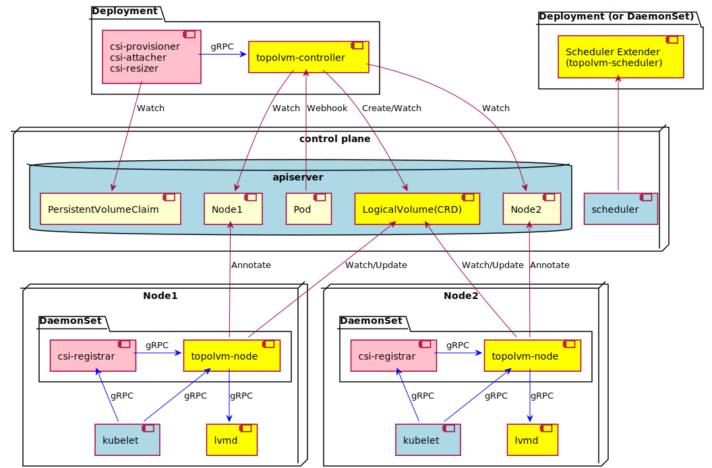

简体中文 | [English](./addon_topolvm.md)

# SuperEdge用Topolvm对本地持久化的支持

* [SuperEdge用Topolvm对本地持久化的支持](#superedge用topolvm对本地持久化的支持)
   * [1. 背景](#1-背景)
   * [2. 方案](#2-方案)
   * [3. 部署Topolvm](#3-部署topolvm)
      * [&lt;1&gt; 准备条件](#1-准备条件)
      * [&lt;2&gt;. 安装Topolvm](#2-安装topolvm)
   * [4. 验证](#4-验证)
      * [4.1 本地文件模拟持久化存储](#41-本地文件模拟持久化存储)
      * [4.2 挂载腾讯云云盘](#42-挂载腾讯云云盘)
   * [5.后续](#5后续)

## 1. 背景

边缘节点虽然在边缘，但是边缘集群还是有很多有状态的应用需要部署，比如Statefulset类型的边缘应用。用户为我们提出了以下诉求；

-   希望边缘能支持本地持久化存储，不会因为边缘节点宕机引起边缘有状态应用数据无法访问；
-   本地持久化存储可自动配置Local PV，并且能添加相应的存储资源和动态扩容PVC，以满足数据扩容的需要；
-   能有监控能反馈本地持久化存储资源的状态和读写IO，以便可视化的监控边缘存储状况；
-   能感知本地存储的拓扑进行调度，自动将需要本地存储的Pod调度到合适的边缘节点，并且可以配置存储优先级的调度策略。

## 2. 方案

经过大量的调研和对比，开源项目[Topovlm](https://github.com/topolvm/topolvm)满足我们以上所有的需求，除此之外它还支持将本地Volume作为容器的块设备，还在探索对本地持有化存储快照的支持……Topolvm的架构图如下所示：



整体由四个组件组成：

-   Master节点：
    -   `topolvm-controller`：Topolvm的控制器，Watch PVC创建PV，绑定PV； 
    -   `topolvm-scheduler`：Topolvm的扩展调度器，提供了使用local PV的调度算法;
-   边缘节点
    -   `topolvm-node`：CSI节点服务，调用lvmd真实的分配PV;
    -   `lvmd`： Linux存储系统的虚拟化组件，用于管理 LVM 卷的 gRPC 服务

我们将Topovlm功能已经在SuperEdge的边缘集群验证通过，并且将部署方式集成到了edgeadm的addon子命令中，用户可通过`edgeadm addon topolvm`一键在SuperEdge的边缘部署Topolvm，使用其提供的本地持久化存储功能。

## 3. 部署Topolvm

### <1> 准备条件

执行以下命令下载 edgeadm 静态安装包，注意修改"arch=amd64"参数，目前支持[amd64, arm64]，下载自己机器对应的体系结构，其他参数不变  

```
arch=amd64 version=v0.7.0 kubernetesVersion=1.20.6 && rm -rf edgeadm-linux-* && wget https://superedge-1253687700.cos.ap-guangzhou.myqcloud.com/$version/$arch/edgeadm-linux-$arch-$version-k8s-$kubernetesVersion.tgz && tar -xzvf edgeadm-linux-* && cd edgeadm-linux-$arch-$version-k8s-$kubernetesVersion && ./edgeadm
```

安装一个边缘集群可参考：[一键安装边缘独立Kubernetes 集群。](https://github.com/superedge/superedge/blob/main/docs/installation/install_edge_kubernetes_CN.md) 

>   注意：topolvm的支持是从SuperEdge v0.6.0版本开始的，请下载edgeadm v0.6.0及以后版本；

### <2>. 安装Topolvm

安装可用如下命令：

```powershell
[root@k8s-master-node ~]# ./edgeadm addon topolvm --kubeconfig ~/.kube/config 
I0926 15:23:46.047574   15465 topolvm.go:80] Start install addon apps to your original cluster
...
I0926 15:23:48.065099   15465 csi_plugin.go:63] Deploy topolvm all module success!
```

>   目前SuperEdge默认部署的`Topolvm v0.10.0`版本, 其他版本可自行编辑相应yaml;

卸载可以用如下命令：

```powershell
[root@k8s-master-node ~]# ./edgeadm detach topolvm --kubeconfig ~/.kube/config 
I0926 15:22:01.794347   14364 topolvm.go:85] Start uninstall addon apps from your original cluster
...
I0926 15:22:03.808400   14364 csi_plugin.go:220] Remove topolvm success!
```

## 4. 验证

### 4.1 本地文件模拟持久化存储

<1>. 创建设备并初始化

```powershell
[root@k8s-edge-node ~]# truncate --size=3G /tmp/backing_store
[root@k8s-edge-node ~]# losetup -f /tmp/backing_store
```

<2>. 创建VolumeGroup

```powershell
[root@k8s-edge-node ~]# vgcreate -f -y myvg1 $(losetup -j /tmp/backing_store | cut -d: -f1)
```

>   其中myvg1为VolumeGroup的name，可自定义

查看创建的VolumeGroup

```powershell
[root@k8s-edge-node ~]# vgdisplay myvg1
  --- Volume group ---
  VG Name               myvg1
 ...
  VG Size               <3.00 GiB
  PE Size               4.00 MiB
  VG UUID               Xgeofp-0cbu-tWUX-7eCE-1Wfz-yo97-3NcgrB
```

<3>. 配置lvm VolumeGroup配置</span>

```powershell
[root@k8s-master-node ~]# kubectl -n topolvm-system edit cm topolvm-lvmd
```

配置`lvmd.yaml`并保存

```powershell
# Source: topolvm/templates/lvmd/configmap.yaml
apiVersion: v1
kind: ConfigMap
metadata:
  name: topolvm-lvmd
  namespace: topolvm-system
  lvmd.yaml: |
    socket-name: /run/topolvm/lvmd.sock
    device-classes: 
      - default: true
        name: ssd            ## device-classes的name
        spare-gb: 3          ## 修改成自己创建的VolumeGroupName的大小
        volume-group: myvg1  ## 修改成自己创建的VolumeGroupName
```

<4>. 给有设备的节点添加设备标识

```powershell
[root@k8s-master-node ~]# kubectl label node [nodeName] superedge.io/local.pv=topolvm
```

执行成功后回自动把Topovlm的local PV的两个支持组件`topolvm-lvmd` 和` topolvm-node`调度到相应的设备节点：

```powershell
[root@k8s-master-node ~]# kubectl -n topolvm-system get pod -o wide
NAME                                  READY   STATUS        NODE 
topolvm-controller-86775b6cf9-gx9db   4/4     Running    k8s-master-node
topolvm-scheduler-fd4gs               1/1     Running    k8s-master-node
...
topolvm-lvmd-gzvzb                    1/1     Running    k8s-edge-node ##设备节点
topolvm-node-vkgcf                    3/3     Running    k8s-edge-node ##设备节点
```

<5>. 创建PVC和Pod进行验证

```powershell
[root@k8s-master-node ~]# kubectl apply -f https://raw.githubusercontent.com/topolvm/topolvm/main/example/podpvc.yaml
```

提交成功后查看PVC和Pod状态

```powershell
[root@k8s-master-node ~]# kubectl get pvc
NAME          STATUS   VOLUME       CAPACITY   ACCESS   STORAGECLASS         AGE
topolvm-pvc   Bound    pvc-46cdd5f0   1Gi        RWO   topolvm-provisioner    6s
[root@k8s-master-node ~]# kubectl get pod 
NAME     READY   STATUS    RESTARTS   AGE
my-pod   1/1     Running   0          119s
```

可进入Pod对其挂载文件写入内容，将PVC挂入其他Pod，写入内容不变。

<6>. 扩容PVC

```powershell
[root@k8s-master-node ~]# kubectl get pvc topolvm-pvc  -o yaml | sed  "s/1Gi/2Gi/" | kubectl apply -f -
persistentvolumeclaim/topolvm-pvc configured
[root@k8s-master-node ~]# kubectl get pvc
NAME          STATUS   VOLUME       CAPACITY   ACCESS   STORAGECLASS         AGE
topolvm-pvc   Bound    pvc-46cdd5f0   2Gi        RWO   topolvm-provisioner    5s
```

>    注意：
>
>   -   PVC不支持缩容，扩容值必须比前一个值大，且尽可能为整数；
>   -   PVC扩容不能超出VolumeGroup总量，既实际物理盘存储大小，可先扩容VolumeGroup；

<7>. 自定义调度调度策略

Topolvm对Local PV的调度策略文件默认在Master节点`/etc/kubernetes/kube-scheduler/kube-scheduler-policy.cfg`位置，其内容如下；

```json
[root@k8s-master-node ~]# cat /etc/kubernetes/kube-scheduler/kube-scheduler-policy.cfg
{
  "kind" : "Policy",
  "apiVersion" : "v1",
  "extenders" :
    [{
      "urlPrefix": "http://127.0.0.1:9251",
      "filterVerb": "predicate",
      "prioritizeVerb": "prioritize",
      "nodeCacheCapable": false,
      "weight": 100,
      "managedResources":
      [{
        "name": "topolvm.cybozu.com/capacity",
        "ignoredByScheduler": true
      }]
    }]
}
```

需要自定义调度策略可进行编辑，并重启`Kube-scheduler`可生效，更多设置可参考[Topolvm社区扩展调度策略](https://github.com/kubernetes/community/blob/master/contributors/design-proposals/scheduling/scheduler_extender.md)。

### 4.2 挂载腾讯云云盘

<1>. 申请腾讯云云盘

申请腾讯云云盘并挂载到节点上，可参考[创建腾讯云云硬盘](https://cloud.tencent.com/document/product/362/32401)。


<2>.腾讯云云盘格式化

-   执行以下命令，查看连接到云盘的名称

    ```powershell
    [root@k8s-edge-node ~]# fdisk -l
    ...
    Disk /dev/vdb: 21.5 GB, 21474836480 bytes, 41943040 sectors
    Units = sectors of 1 * 512 = 512 bytes
    Sector size (logical/physical): 512 bytes / 512 bytes
    I/O size (minimum/optimal): 512 bytes / 512 bytes
    ```

    这里新挂载的腾讯云云盘名称是：`/dev/vdb`

-   格式化云盘`/dev/vdb`

    ```powershell
    [root@k8s-edge-node ~]# mkfs.ext4 /dev/vdb
    ```

    >   格式的格式按自己需求进行，这里是ext4；

    关于腾讯云云盘开机自动挂载可参考：[腾讯云云盘自动挂载](https://cloud.tencent.com/document/product/362/32403)，扩容腾讯云云盘可参考：[腾讯云云盘扩容](https://cloud.tencent.com/document/product/362/54728)。

<3>. 创建VolumeGroup

```powershell
vgcreate test /dev/vdb /dev/sdb
```

>   这里除了`/dev/vdb`还加入的`/dev/sdb`盘，可以把多个云盘加入VolumeGroup。还可有用[vgextend](https://man.linuxde.net/vgextend)命令进行已存在的VolumeGroup扩容。

后续验证逻辑完全同[4.1 本地文件模拟持久化存储的<3>、<4>……<7>](#VolumeGroupConfig)，这里不在重述。

## 5.后续

后续我们有两个计划：

第一：我们会将Topolvm集成到SuperEdge的商业版本TKE Edge中去，以便支持本地持有化存储；

第二：我们会和Topolvm社区合作，将我们用户的一些需求反馈给Topolvm，推动Topolvm功能的健全，为我们的用户提供更简单、更实用的本地持久化存储。

