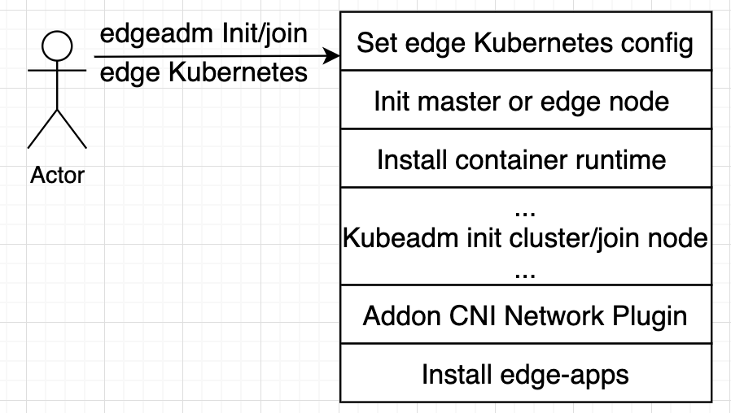

English | [简体中文](./install_edge_kubernetes_CN.md)
# One-click install of edge Kubernetes cluster

* [One-click install of edge Kubernetes cluster](#one-click-install-of-edge-kubernetes-cluster)
   * [1. Background](#1-background)
   * [2. Architecture Design](#2-architecture-design)
      * [2.1 Original intention](#21-original-intention)
      * [2.2 Goal](#22-goal)
      * [2.3 Principle](#23-principle)
      * [2.4 Design and implementation](#24-design-and-implementation)
   * [3. Install edge Kubernetes cluster with edgeadm](#3-install-edge-kubernetes-cluster-with-edgeadm)
        * [&lt;1&gt;. Installation conditions](#1-installation-conditions)
        * [&lt;2&gt;. Download the edgeadm static installation package and copy it to all master &amp;&amp; node nodes](#2-download-the-edgeadm-static-installation-package-and-copy-it-to-all-master--node-nodes)
        * [&lt;3&gt;. Install edge Kubernetes master node](#3-install-edge-kubernetes-master-node)
        * [&lt;4&gt;. Set the master kube-config file](#4-set-the-master-kube-config-file)
        * [&lt;5&gt;. Join edge nodes](#5-join-edge-nodes)
   * [4. Use edgeadm to install edge high-availability Kubernetes cluster](#4-use-edgeadm-to-install-edge-high-availability-kubernetes-cluster)
        * [&lt;1&gt;. Installation prerequisites](#1-installation-prerequisites)
        * [&lt;2&gt;. Install Haproxy](#2-install-haproxy)
        * [&lt;3&gt;. Install Keepalived](#3-install-keepalived)
        * [&lt;4&gt;. Install high-availability edge Kubernetes master](#4-install-high-availability-edge-kubernetes-master)
        * [&lt;5&gt;. Join master node](#5-join-master-node)
        * [&lt;6&gt;. join node edge node](#6-join-node-edge-node)
   * [5. Customize the Kubernetes static installation package](#5-customize-the-kubernetes-static-installation-package)
      * [&lt;1&gt;. Customize other Kubernetes versions](#1-customize-other-kubernetes-versions)
      * [&lt;2&gt;. Customize other system Kubernetes static installation packages](#2-customize-other-system-kubernetes-static-installation-packages)

## 1. Background

At present, many edge computing container open source projects have a default prerequisite for use: users need to prepare a standard or specific tool to build a Kubernetes cluster in advance, and then use specific tools or other methods to deploy in the cluster deployment corresponding components to experience edge capabilities. This undoubtedly raises the threshold of user experience edge capabilities, and there are many restrictions on use, making it difficult for users to get started. Simply organize, there will probably be the following problems:

-   The threshold is too high
    -   Users need to prepare a Kubernetes cluster in advance. For many users, the threshold is too high, the construction process is more complicated and easy to fail, and many people who want to use edge capabilities are shut out;
-   Too restrictive
    -   Often require specific tools to build a specific version of Kubernetes cluster, the versatility is too poor, users want to use too restrictive in the actual production environment;

-   Adding edge nodes is more troublesome
    -   Adding edge nodes needs to rely on the tools to build the Kubernetes cluster itself to add Kubernetes native nodes and then convert, which is highly dependent on third-party tools, and the operation process is more troublesome and error-prone;
-   Poor automation
    -   Regardless of the establishment of a Kubernetes cluster or the addition of edge nodes, it is difficult to automate in the production environment. The related processes also require secondary development by their own team, which is difficult to integrate;

## 2. Architecture Design

In response to the above problems, in order to lower the threshold for users to use the edge Kubernetes cluster and make the edge Kubernetes cluster capable of production, we designed a one-click solution to deploy an edge Kubernetes cluster, completely shielding the installation details, so that users can have a zero-threshold experience Edge capacity.

### 2.1 Original intention

- It is very simple for users to use edge Kubernetes clusters without barriers, and can truly use edge capabilities in the production environment;

### 2.2 Goal

- One-click

     - Able to build an edge Kubernetes cluster with one click;
     - It is very simple and flexible to add edge nodes with one key;
- Two kinds of installation creation
     -   Support online installation；
     -   Support offline installation, so that the privatization environment can also be very simple;
- Support online installation；
     - Support offline installation, so that the privatization environment can also be very simple;
- Can be used in production

     - Don't encapsulate too much, so that teams who want to use the edge Kubernetes cluster can perform simple integration in the internal system, and then it is available for production;
- Zero learning cost

     - Try to be consistent with the use of kubeadm as much as possible, so that users will use kubeadm and edgeadm without additional learning costs;

### 2.3 Principle

- Don't modify kubeadm source code
  - Try to quote and reuse the source code of kubeadm, and try not to modify the source code of kubeadm to avoid hidden dangers of subsequent upgrades;
  - Based on kubeadm but higher than kubeadm, it does not have to be limited by the design of kubeadm, it can be allowed as long as it makes it easier for users to use;
- Allow users to choose whether to deploy edge capability components;
- Allow users to customize the configuration of edge capability components;

### 2.4 Design and implementation

---

We studied the source code of Kubeadm and found that we can borrow Kubeadm to create native Kubernetes clusters, join nodes, and workflow ideas to deploy edge Kubernetes clusters with one click, and perform the installation steps step by step. This is exactly what we want for a simple, flexible, and low learning cost deployment solution. So we stood on the shoulders of giants, used Kubedam's ideas, reused Kubeadm's source code, and designed the following solution.

<div align="center">
  
</div>

>   Among them, the part of `Kubeadm init cluster/join node` completely reuses the source code of kubadm, and all the logic is exactly the same as Kubeadm.

This program has the following advantages:

-   Fully compatible with Kubeadm

    We just stand on the shoulders of Kubeadm, set some configuration parameters required by the edge cluster before Kubeadm init/join, initialize the Master or Node nodes automatically, and install the container runtime. After the completion of Kubeadm init/join, the CNI network plug-in was installed and the corresponding edge capability components were deployed.

    We quoted the Kubeadm source code in the way of Go Mod. During the whole process, we did not modify the source code of Kubeadm one line. It is completely native and ready to upgrade to a higher version of Kubeadm in the future.

-   One-click, easy to use, flexible and automated

    The edgeadm init cluster and join node completely retain the original parameters and process of Kubeadm init/join, but automatically initialize the node and install the container when running, you can use the `edgeadm --enable-edge=fasle` parameter to install the native one-click For Kubernetes clusters, you can also use the `edgeadm --enable-edge=true` parameter to install an edge Kubernetes cluster with one click.

    You can join any node as long as you can access the node where the Kube-apiserver is located, or you can join the master. Join master also continues the Kubeadm approach. To build highly available nodes, you can directly use join master to expand Master nodes when needed to achieve high availability.

-   No learning cost, exactly the same as using kubeadm

    Because the `Kubeadm init cluster/join node` part completely reuses the source code of kubadm, all logic is exactly the same as Kubeadm, completely retaining the usage habits of kubeadm and all flag parameters, and the usage is exactly the same as that of kubeadm, without any new learning cost , The user can customize the edge Kubernetes cluster according to the parameters of Kubeadm or use kubeadm.config.
    
-   Edge node security enhancement

    With the help of Kubernetes [Node Authentication](https://kubernetes.io/docs/reference/access-authn-authz/node/) mechanism, we have enabled [NodeRestriction](https://kubernetes.io/docs/reference/access-authn-authz/admission-controllers/#noderestriction) access plugin to ensure that each node has a unique identity and only has a minimal set of permissions. Even if an edge node is compromised, other edge nodes cannot be operated.

    For Kubelet, we also enable the [Kubelet configuration certificate rotation](https://kubernetes.io/docs/tasks/tls/certificate-rotation/) mechanism by default. When the Kubelet certificate is about to expire, a new secret key will be automatically generated , And apply for a new certificate from the Kubernetes API. Once the new certificate is available, it will be used to authenticate the connection with the Kubernetes API.

## 3. Install edge Kubernetes cluster with edgeadm

#### <1>. Installation conditions

-   Follow [kubeadm's minimum requirements](https://kubernetes.io/zh/docs/setup/production-environment/tools/kubeadm/install-kubeadm/#before-you-begin), master && node minimum 2C2G, disk space Not less than 1G;

    >   Warning: Provide clean machines as much as possible to avoid installation errors caused by other factors. `If there is a container service on the machine, it may be cleaned up during the installation process, please confirm carefully before executing it`
-   Currently supports amd64 and arm64 two systems;

    >   Other systems can compile edgeadm and make corresponding system installation packages by themselves, please refer to **5. Customize Kubernetes static installation package**

-   Supported Kubernetes version: greater than or equal to v1.18, the provided installation package only provides Kubernetes v1.18.2 version;

    >   For other Kubernetes versions, please refer to **5. Customize the Kubernetes static installation package** and make it yourself.

-   hostname of node should meet following requirements;
    > not contain `localhost` and  not all numbers

#### <2>. Download the edgeadm static installation package and copy it to all master && node nodes

>   Choose installation package according to your installation node CPU architecture [amd64, arm64]

```shell
arch=amd64 version=v0.5.0 && rm -rf edgeadm-linux-* && wget https://superedge-1253687700.cos.ap-guangzhou.myqcloud.com/$version/$arch/edgeadm-linux-$arch-$version.tgz && tar -xzvf edgeadm-linux-* && cd edgeadm-linux-$arch-$version && ./edgeadm
```
The installation package is about 200M. For detailed information about the installation package, please refer to **5. Custom Kubernetes static installation package**.

>   If downloading the installation package is slow, you can directly check the corresponding [SuperEdge version](https://github.com/superedge/superedge/tags), download `edgeadm-linux-amd64/arm64-*.0.tgz`, and Decompression is the same.
>
>   One-click installation of the edge independent Kubernetes cluster function is supported starting from SuperEdge-v0.3.0-beta.0, pay attention to 
#### <3>. Install edge Kubernetes master node

```shell
./edgeadm init --kubernetes-version=1.18.2 --image-repository superedge.tencentcloudcr.com/superedge --service-cidr=10.96.0.0/12 --pod-network-cidr=192.168.0.0/16 --install-pkg-path ./kube-linux-*.tar.gz --apiserver-cert-extra-sans=<Master public IP> --apiserver-advertise-address=<master Intranet IP> --enable-edge=true -v=6
```
On：

-   --enable-edge=true: Whether to deploy edge capability components, the default is true

    >   --enable-edge=false means to install a native Kubernetes cluster, which is exactly the same as the cluster built by kubeadm;

-   --install-pkg-path: The address of the Kubernetes static installation package

    >   The value of --install-pkg-path can be the path on the machine or the network address (for example: http://xxx/xxx/kube-linux-arm64/amd64-*.tar.gz, which can be encrypted without wget You can), pay attention to use the Kubernetes static installation package that matches the machine system;

-   --apiserver-cert-extra-sans: kube-apiserver certificate extension address

    -   It is recommended to sign the master node’s external network IP or domain name, as long as the signed Master node’s IP or domain name can be accessed by the edge node**. Of course, the internal network IP is also allowed, provided that the edge node can access kube-apiserver through this IP. If you customize the domain name, you can configure hosts on all Matser and Node nodes by yourself;
    -   Sign the public network IP and domain name, because the edge node and the Master node are generally not in the same local area network, and need to join and access the Master through the public network;

-   --image-repository: image repository address

    >   If superedge.tencentcloudcr.com/superedge is slower, you can switch to other accelerated mirror warehouses, as long as you can pull down kube-apiserver, kube-controller-manager, kube-scheduler, kube-proxy, etcd, pause, etc. mirrors.

Other parameters have the same meaning as Kubeadm and can be configured according to kubeadm's requirements.

>   You can also use kubeadm.config to configure the original parameters of kubeadm, and create an edge Kubernetes cluster through `edgeadm init --config kubeadm.config --install-pkg-path ./kube-linux-*.tar.gz `.


If there is no problem during execution and the cluster is successfully initialized, the following content will be output:
```shell
Your Kubernetes control-plane has initialized successfully!

To start using your cluster, you need to run the following as a regular user:

  mkdir -p $HOME/.kube
  sudo cp -i /etc/kubernetes/admin.conf $HOME/.kube/config
  sudo chown $(id -u):$(id -g) $HOME/.kube/config

You should now deploy a pod network to the cluster.
Run "kubectl apply -f [podnetwork].yaml" with one of the options listed at:
  https://kubernetes.io/docs/concepts/cluster-administration/addons/

Then you can join any number of worker nodes by running the following on each as root:

edgeadm join xxx.xxx.xxx.xxx:xxx --token xxxx \
    --discovery-token-ca-cert-hash sha256:xxxxxxxxxx
    --install-pkg-path <Path of edgeadm kube-* install package>
```
If there is a problem during the execution, the corresponding error message will be returned directly and the initialization of the cluster will be interrupted. You can use the `./edgeadm reset` command to roll back the initialization operation of the cluster.

#### <4>. Set the master kube-config file

To enable non-root users to run kubectl, run the following commands, which are also part of the edgeadm init output:
```shell
mkdir -p $HOME/.kube
sudo cp -i /etc/kubernetes/admin.conf $HOME/.kube/config
sudo chown $(id -u):$(id -g) $HOME/.kube/config
```

If you are the root user, you can run:
```shell
export KUBECONFIG=/etc/kubernetes/admin.conf
```
Note that the `./edgeadm join` command that saves the output of `./edgeadm init` will be used when adding node nodes later.

The validity period of the token is the same as kubeadm `24h`, after expiration, you can use `./edgeadm token create` to create a new token.

The value generation of --discovery-token-ca-cert-hash is also the same as kubeadm, which can be generated by executing the following command on the master node.

```shell
openssl x509 -pubkey -in /etc/kubernetes/pki/ca.crt | openssl rsa -pubin -outform der 2>/dev/null | openssl dgst -sha256 -hex | sed 's/^.* //'
```

#### <5>. Join edge nodes

Execute `<2>. Download the edgeadm static installation package` on the edge node, or upload the edgeadm static installation package to the edge node by other means, and then execute the following command:

```bash
./edgeadm join <Master public/Intranet IP or domain>:Port --token xxxx \
     --discovery-token-ca-cert-hash sha256:xxxxxxxxxx 
     --install-pkg-path <edgeadm Kube-*Static installation package address/FTP path> 
     --enable-edge=true
```
On:

-   <Master public/Intranet IP or domain>:  the address where the node accesses the Kube-apiserver service.

    >   You can change the address of the Kube-apiserver service prompted by the `edgeadm init` to the node to be replaced by `Master node public network IP/Master node internal network IP/domain name` depending on the situation, depending on whether you want the node to access Kube through the external network or the internal network -apiserver service.

-   --enable-edge=true: Whether the added node is used as an edge node (whether to deploy edge capability components), the default is true

    >   --enable-edge=false means join the native Kubernetes cluster node, which is exactly the same as the node joined by kubeadm;

If there are no exceptions in the execution process,  the new node successfully joins the cluster, and the following will be output:

```shell
This node has joined the cluster:
* Certificate signing request was sent to apiserver and a response was received.
* The Kubelet was informed of the new secure connection details.

Run 'kubectl get nodes' on the control-plane to see this node join the cluster.
```
If there is a problem during the execution, the corresponding error message will be returned directly, and the addition of the node will be interrupted. You can use the `./edgeadm reset` command to roll back the operation of joining the node and rejoin.

> Tip: If the edge node is joined, after the edge node joins successfully, the edge node will be labeled with a label: `superedge.io/edge-node=enable`, which is convenient for subsequent applications to use nodeSelector to select the application and schedule to the edge node;
>
> Native Kubernetes nodes, like kubeadm's join, do not do anything.

## 4. Use edgeadm to install edge high-availability Kubernetes cluster

#### <1>. Installation prerequisites

-   Prepare a Master VIP as a unified entrance for available load balancing;
-   3 machines that meet [kubeadm's minimum requirements](https://kubernetes.io/zh/docs/setup/production-environment/tools/kubeadm/install-kubeadm/#before-you-begin) serve as master nodes;
-   3 machines that meet [kubeadm's minimum requirements](https://kubernetes.io/zh/docs/setup/production-environment/tools/kubeadm/install-kubeadm/#before-you-begin) serve as worker nodes;

#### <2>. Configure Master VIP and network interface

```shell
INTERFACE=eth0
VIP=<Master VIP>
```

#### <3>. Install high-availability edge Kubernetes master

Perform cluster initialization operations in one of the masters
```shell
./edgeadm init --control-plane-endpoint ${VIP} --interface ${INTERFACE}  --default-ha=kube-vip --upload-certs --kubernetes-version=1.18.2 --image-repository superedge.tencentcloudcr.com/superedge --service-cidr=10.96.0.0/12 --pod-network-cidr=192.168.0.0/16 --apiserver-cert-extra-sans=<Domain or Public/Intranet IP of Master node> --install-pkg-path <edgeadm Kube-*Static installation package address/FTP path> -v=6
```

On：

-   --interface: the network interface to bind VIP, default value is eth0.
-   --default-ha: high-availability component to be installed. For now, it only supports kube-vip. The high-availability component won't be installed if this option is not being set up.

>   The meaning of the parameters is the same as `3. Use edgeadm to install edge Kubernetes cluster`, and others are the same as kubeadm, so I won't explain it here;

If there are no exceptions during execution and the cluster is successfully initialized, the following content will be output:

```shell
Your Kubernetes control-plane has initialized successfully!

To start using your cluster, you need to run the following as a regular user:

  mkdir -p $HOME/.kube
  sudo cp -i /etc/kubernetes/admin.conf $HOME/.kube/config
  sudo chown $(id -u):$(id -g) $HOME/.kube/config

You should now deploy a pod network to the cluster.
Run "kubectl apply -f [podnetwork].yaml" with one of the options listed at:
  https://kubernetes.io/docs/concepts/cluster-administration/addons/

You can now join any number of the control-plane node running the following command on each as root:

  edgeadm join xxx.xxx.xxx.xxx:xxx --token xxxx \
    --discovery-token-ca-cert-hash sha256:xxxxxxxxxx \
    --control-plane --certificate-key xxxxxxxxxx
    --install-pkg-path <Path of edgeadm kube-* install package>

Please note that the certificate-key gives access to cluster sensitive data, keep it secret!
As a safeguard, uploaded-certs will be deleted in two hours; If necessary, you can use
"edgeadm init phase upload-certs --upload-certs" to reload certs afterward.

Then you can join any number of worker nodes by running the following on each as root:

edgeadm join xxx.xxx.xxx.xxx:xxxx --token xxxx \
    --discovery-token-ca-cert-hash sha256:xxxxxxxxxx  
    --install-pkg-path <Path of edgeadm kube-* install package>
```
If there is a problem during the execution, the corresponding error message will be directly returned, and the initialization of the cluster will be interrupted. Use the `rm /etc/kubernetes/admin.conf ; ./edgeadm reset` command to roll back the initialization operation of the cluster.

To enable non-root users to run kubectl, run the following commands, which are also part of the edgeadm init output:
```shell
mkdir -p $HOME/.kube
sudo cp -i /etc/kubernetes/admin.conf $HOME/.kube/config
sudo chown $(id -u):$(id -g) $HOME/.kube/config
```

If you are the root user, you can run:
```shell
export KUBECONFIG=/etc/kubernetes/admin.conf
```
Pay attention to the `./edgeadm join` command that saves the output of `./edgeadm init`, which is needed to add Master node and edge node later.

Record the `./edgeadm join` command output by `./edgeadm init`. You need this command to add the Master node and the edge node.

#### <4>. Join master node

Configure Master VIP and network interface on another master
```shell
INTERFACE=eth0
VIP=<Master VIP>
```
Execute the `./edgeadm join` command
```shell
./edgeadm join ${VIP}:xxx --interface ${INTERFACE} --default-ha=kube-vip --token xxxx    \
    --discovery-token-ca-cert-hash sha256:xxxxxxxxxx \
    --control-plane --certificate-key xxxxxxxxxx     \
    --install-pkg-path <Path of edgeadm kube-* install package> 
```
If there are no exceptions in the execution process, the new master successfully joins the cluster, and the following content will be output:
```shell
This node has joined the cluster and a new control plane instance was created:

* Certificate signing request was sent to apiserver and approval was received.
* The Kubelet was informed of the new secure connection details.
* Control plane (master) label and taint were applied to the new node.
* The Kubernetes control plane instances scaled up.
* A new etcd member was added to the local/stacked etcd cluster.

To start administering your cluster from this node, you need to run the following as a regular user:

        mkdir -p $HOME/.kube
        sudo cp -i /etc/kubernetes/admin.conf $HOME/.kube/config
        sudo chown $(id -u):$(id -g) $HOME/.kube/config

Run 'kubectl get nodes' to see this node join the cluster.
```
If there is a problem during the execution, the corresponding error message will be directly returned, and the addition of the node will be interrupted. Use the `rm /etc/kubernetes/admin.conf ; ./edgeadm reset` command to roll back the initialization of the cluster.

#### <5>. Join edge node

```shell
./edgeadm join xxx.xxx.xxx.xxx:xxxx --token xxxx \
    --discovery-token-ca-cert-hash sha256:xxxxxxxxxx 
    --install-pkg-path <Path of edgeadm kube-* install package> 
```
If there are no exceptions in the execution process, the new master successfully joins the cluster, and the following content will be output:

```shell
This node has joined the cluster:
* Certificate signing request was sent to apiserver and a response was received.
* The Kubelet was informed of the new secure connection details.

Run 'kubectl get nodes' on the control-plane to see this node join the cluster.
```
If there are exceptions during execution, the corresponding error message will be directly returned, and the initialization of the cluster will be interrupted. Use the `./edgeadm reset` command to roll back the initialization operation of the cluster.

## 5. Customize the Kubernetes static installation package

```shell
kube-linux-arm64-v1.18.2.tar.gz ## Kubernetes static installation package for kube-v1.18.2
├── bin                         ## Binary directory
│   ├── conntrack               ## Binary file for connection tracking
│   ├── kubectl                 ## kubectl for kube-v1.18.2
│   ├── kubelet                 ## kubelet for kube-v1.18.2
│   └── lite-apiserver          ## The corresponding version of lite-apiserver
├── cni                         ## cni configuration
│   └── cni-plugins-linux-v0.8.3.tar.gz ## CNI plug-in binary compression package of v0.8.3
└── container                   ## Container runtime directory
    └── docker-19.03-linux-arm64.tar.gz ## Docker 19.03 arm64 system installation script and installation package
```

### <1>. Customize other Kubernetes versions

There are two things you need to do to customize other Kubernetes versions:

-   Replace the kubectl and kubelet files in the `binary directory`, the version needs to be greater than or equal to Kubernetes v1.18.0;
-   Ensure that there is a basic image of the corresponding Kubernetes version in the mirror warehouse used by init;

### <2>. Customize other system Kubernetes static installation packages

To customize the Kubernetes static installation package and other systems, three things need to be done:

-   Replace all the binaries of the Kubernetes static installation package with the target system, including the binaries in the corresponding installation packages of cni and container;
-   Make sure that the mirror warehouse used by init has the basic image of the Kubernetes version of the corresponding system. It is recommended to use [Multi-System Mirror](https://docs.docker.com/buildx/working-with-buildx/);
-   Fully test to ensure that there are no compatibility issues. If there are related problems, you can also mention Issues in the SuperEdge community to fix them.

#### <3>. Custom node initialization script

`script/init-node.sh` is the initialization script of the node, but the system we tested is limited and cannot be fully compatible. If the default init-node.sh cannot initialize your node, or you need to add other initialization scripts, you can edit Use `script/init-node.sh` to customize the script and type out the kube-linux-arm64-v1.18.2.tar.gz package for your own use.
