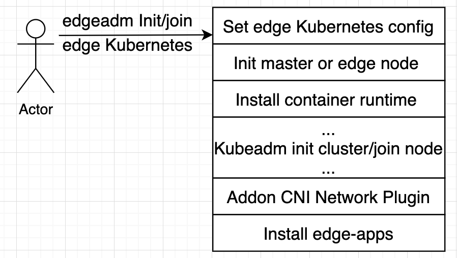
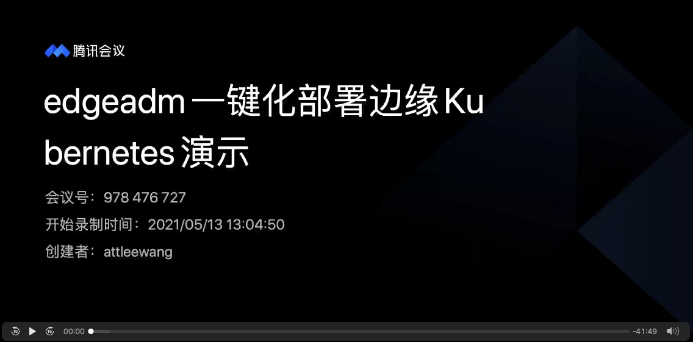

简体中文 | [English](./install_edge_kubernetes.md)
# 一键安装边缘独立Kubernetes 集群

* [一键安装边缘独立Kubernetes 集群](#一键安装边缘独立kubernetes-集群)
   * [1. 背景](#1-背景)
   * [2. 架构设计](#2-架构设计)
      * [2.1 初衷](#21-初衷)
      * [2.2 目标](#22-目标)
      * [2.3 原则](#23-原则)
      * [2.4 设计与实现](#24-设计与实现)
   * [3. 用 edgeadm 安装边缘 Kubernetes 集群](#3-用-edgeadm-安装边缘-kubernetes-集群)
        * [&lt;1&gt;. 安装条件](#1-安装条件)
        * [&lt;2&gt;.下载edgeadm静态安装包，并拷贝到所有Master &amp;&amp; node节点](#2下载edgeadm静态安装包并拷贝到所有Master--node节点)
        * [&lt;3&gt;.安装边缘 Kubernetes Master 节点](#3安装边缘-kubernetes-Master-节点)
        * [&lt;4&gt;.设置Master kube-config 文件](#4设置Master-kube-config-文件)
        * [&lt;5&gt;. Join 边缘节点](#5-join-边缘节点)
   * [4.用 edgeadm 安装边缘高可用 Kubernetes 集群](#4用-edgeadm-安装边缘高可用-kubernetes-集群)
        * [&lt;1&gt;. 安装前提](#1-安装前提)
        * [&lt;2&gt;.安装 Haproxy](#2安装-haproxy)
        * [&lt;3&gt;.安装 Keepalived](#3安装-keepalived)
        * [&lt;4&gt;.安装高可用边缘 Kubernetes Master](#4安装高可用边缘-kubernetes-Master)
        * [&lt;5&gt;.Join Master 节点](#5join-Master-节点)
        * [&lt;6&gt;.Join node 边缘节点](#6join-node-边缘节点)
   * [5. 自定义Kubernetes静态安装包](#5-自定义kubernetes静态安装包)
        * [&lt;1&gt;. 自定义其他Kubernetes 版本](#1-自定义其他kubernetes-版本)
        * [&lt;2&gt;. 自定义其他体系Kubernetes静态安装包](#2-自定义其他体系kubernetes静态安装包)

## 1. 背景

目前，很多边缘计算容器开源项目在使用上均存在一个默认的前提：用户需要提前准备一个标准的或者特定工具搭建的Kubernetes集群，然后再通过特定工具或者其他方式在集群中部署相应组件来体验边缘能力。这无疑提高了用户体验边缘能力的门槛，而且使用上有众多的限制，让用户很难上手。 简单整理，大概会有如下问题：

-   门槛太高
    -   用户需要提前准备一个Kubernetes集群，对于很多用户来说门槛太高，搭建的流程比较复杂，容易失败，把很多想使用边缘能力的人群拒之门外；
-   限制性太大
    -   往往要求特定工具搭建的特定版本的Kubernetes集群，通用性太差，用户在想在实际生产环境上使用限制性太大；
-   添加边缘节点比较麻烦
    -   添加边缘节点需要依靠搭建Kubernetes集群本身的工具添加Kubernetes原生的节点再进行转化，对第三方工具依赖性较强，并且操作流程比较麻烦，容易出错；
-   自动化能力较差
    -   无论Kubernetes集群的搭建，还是添加边缘节点都很难在生产环境自动化起来，相关流程还需要自己的团队进行二次开发，集成难度较大；

为了降低用户体验边缘能力的门槛，云原生社区的同学打算开发一个可以一键部署边缘Kubernetes集群的方法，让用户可以更容易、更简单的体验边缘Kubernetes集群。

---

## 2. 架构设计

针对上述问题，为了降低用户使用边缘 Kubernetes 集群的门槛，让边缘 Kubernetes 集群具备生产能力，我们设计了一键就可以部署出来一个边缘 Kubernetes 集群的方案，完全屏蔽安装细节，让用户可以零门槛的体验边缘能力。

### 2.1 初衷

-   让用户很简单，无门槛的使用边缘 Kubernetes 集群，并能在生产环境真正把边缘能力用起来；

### 2.2 目标

-   一键化使用

    -   能够一键搭建起一个边缘 Kubernetes 集群；
    -   能够一键很简单、很灵活的添加边缘节点；

-   两种安装创景

    -   支持在线安装；
    -   支持离线安装，让私有化环境也能很简单；

-   可生产使用

    -   不要封装太多，可以让想使用边缘 Kubernetes 集群的团队能在内部系统进行简单的集成，就生产可用；

-   零学习成本

    -   尽可能的和 kubeadm 的使用方式保持一致，让用户无额外的学习成本，会用kubeadm就会用edgeadm；

### 2.3 原则

-   不修改 kubeadm 源码
    -   尽量引用和复用 kubeadm 的源码，尽量不修改 kubeadm 的源码，避免后面升级的隐患；
    -   基于kubeadm但又高于 kubeadm，不必被 kubeadm 的设计所局限，只要能让用户使用起来更简单就可以被允许；
-   允许用户选择是否部署边缘能力组件;
    
- 允许用户自定义边缘能力组件的配置；

### 2.4 设计与实现

---

我们研究了kubeadm的源码，发现可以借用kubeadm创建原生Kubernetes集群、join节点、workflow思想来一键部署边缘 Kubernetes集群，并且可以分步去执行安装步骤。这正是我们想要的简单、灵活、低学习成本的部署方案。于是我们站在巨人的肩膀上，利用Kubedam的思想，复用kubeadm的源码，设计出了如下的解决方案。

<div align="center">
  
</div>

>   其中 `kubeadm init cluster/join node`部分完全复用了kubadm的源码，所有逻辑和kubeadm完全相同。

这个方案有如下几个优点：

-   完全兼容kubeadm

    我们只是站在kubeadm的肩膀上，在kubeadm init/join之前设置了一些边缘集群需要的配置参数，将初始化Master或Node节点自动化，安装了容器运行时。在kubeadm init/join完成之后，安装了CNI网络插件和部署了相应的边缘能力组件。

    我们以Go Mod方式引用了kubeadm源码，整个过程中并未对kubeadm的源码修改过一行，完全的原生，为后面升级更高版本的kubeadm做好了准备。

-   一键化，用起来简单、灵活、自动化

    edgeadm init集群和join节点完全保留了kubeadm init/join原有的参数和流程，只是自动了初始化节点和安装容器运行时，可以用`edgeadm --enable-edge=fasle`参数来一键化安装原生Kubernetes集群， 也可以用`edgeadm --enable-edge=true`参数一键化来安装边缘Kubernetes集群。

    可以Join任何只要能够访问到Kube-apiserver位于任何位置的节点, 也可以join master。join master也延续了kubeadm的的方式，搭建高可用的节点可以在需要的时候，直接用join master去扩容Master节点，实现高可用。

-   无学习成本，和kubeadm的使用完全相同

    因为`kubeadm init cluster/join node`部分完全复用了kubadm的源码，所有逻辑和kubeadm完全相同，完全保留了kubeadm的使用习惯和所有flag参数，用法和kubeadm使用完全一样，没有任何新的学习成本，用户可以按kubeadm的参数或者使用kubeadm.config去自定义边缘 Kubernetes 集群。
    
-   边缘节点安全增强

    借助Kubernetes [Node鉴权](https://kubernetes.io/zh/docs/reference/access-authn-authz/node/)机制，我们默认开启了[NodeRestriction](https://kubernetes.io/zh/docs/reference/access-authn-authz/admission-controllers#NodeRestriction)准入插件，确保每个节点身份都唯一，只具有最小权限集，即使某个边缘节点被攻破也无法操作其他边缘节点。

    Kubelet我们也默认开启了[Kubelet配置证书轮换](https://kubernetes.io/zh/docs/tasks/tls/certificate-rotation/)机制，在Kubelet证书即将过期时， 将自动生成新的秘钥，并从 Kubernetes API 申请新的证书。 一旦新的证书可用，它将被用于与 Kubernetes API 间的连接认证。

## 3. 用 edgeadm 安装边缘 Kubernetes 集群

以下流程社区已经录制了详细教程视频，可结合文档进行安装：

[](https://www.bilibili.com/video/BV1kA411G73i)

#### <1>. 安装条件

-   遵循 [kubeadm的最低要求](https://kubernetes.io/zh/docs/setup/production-environment/tools/kubeadm/install-kubeadm/#before-you-begin) ，Master && Node 最低2C2G，磁盘空间不小于1G；

    > ⚠️注意：尽可能提供干净的机器，避免其他因素引起安装错误。`要有机器上有容器服务在安装过程中可能会被清理，请在执行之前细心确认`。
                                                                                                                                                                                                                                                                                                                                            
-   目前支持amd64、arm64两个体系；

    >    其他体系可自行编译edgeadm和制作相应体系安装包，可参考 **5. 自定义Kubernetes静态安装包**

-   支持的Kubernetes版本：大于等于v1.18，提供的安装包仅提供Kubernetes v1.18.2版本；

    >   其他Kubernetes 版本可参考 **5. 自定义Kubernetes静态安装包**，自行制作。

-   节点hostname应该满足以下要求；

    >   不能包含`localhost` 且不能全是数字

#### <2>.下载edgeadm静态安装包，并拷贝到所有Master && Node节点

>   注意修改"arch=amd64"参数，目前支持[amd64, arm64], 下载自己机器对应的体系结构，其他参数不变

```shell
arch=amd64 version=v0.5.0 && rm -rf edgeadm-linux-* && wget https://superedge-1253687700.cos.ap-guangzhou.myqcloud.com/$version/$arch/edgeadm-linux-$arch-$version.tgz && tar -xzvf edgeadm-linux-* && cd edgeadm-linux-$arch-$version && ./edgeadm
```
安装包大约200M，关于安装包的详细信息可查看 **5. 自定义Kubernetes静态安装包**。
>   要是下载安装包比较慢，可直接查看相应[SuperEdge相应版本](https://github.com/superedge/superedge/tags), 下载`edgeadm-linux-amd64/arm64-*.0.tgz`，并解压也是一样的。
>
>   一键安装边缘独立Kubernetes 集群功能从SuperEdge-v0.3.0-beta.0开始支持，注意下载v0.3.0-beta.0及以后版本。
#### <3>.安装边缘 Kubernetes Master 节点

```shell
./edgeadm init --kubernetes-version=1.18.2 --image-repository superedge.tencentcloudcr.com/superedge --service-cidr=10.96.0.0/12 --pod-network-cidr=192.168.0.0/16 --install-pkg-path ./kube-linux-*.tar.gz --apiserver-cert-extra-sans=<Master节点外网IP> --apiserver-advertise-address=<Master节点内网IP> --enable-edge=true -v=6
```
其中：

-   --enable-edge=true: 是否部署边缘能力组件，默认true

    >   --enable-edge=false 表示安装原生Kubernetes集群，和kubeadm搭建的集群完全一样；

-   --install-pkg-path: Kubernetes静态安装包的地址

>   --install-pkg-path的值可以为机器上的路径，也可以为网络地址（比如：http://xxx/xxx/kube-linux-arm64/amd64-*.tar.gz, 能免密wget到就可以），注意用和机器体系匹配的Kubernetes静态安装包；

-   --apiserver-cert-extra-sans： kube-apiserver的证书扩展地址

    -   推荐签订Master节点外网IP或者域名，只要**签订的Master节点的IP或者域名能被边缘节点访问到**就可以，当然内网IP也被允许，前提是边缘节点可以通过此IP访问Kube-apiserver。自定义域名的话可自行在所有Matser和Node节点配置hosts；

    -   签订外网IP和域名，是因为边缘节点一般和Master节点不在同一局域网，需要通过外网来加入和访问Master;

-   --image-repository：镜像仓库地址

    >   要是superedge.tencentcloudcr.com/superedge 比较慢，可换成其他加速镜像仓库，只要能Pull下来kube-apiserver，kube-controller-manager，kube-scheduler，kube-proxy，etcd， pause……镜像就可以。

其他参数和kubeadm含义完全相同，可按kubeadm的要求进行配置。

>    也可用kubeadm.config配置kubeadm的原参数，通过`edgeadm init --config kubeadm.config --install-pkg-path ./kube-linux-*.tar.gz `来创建边缘Kubernetes集群。

要是执行过程中没有问题，集群成功初始化，会输出如下内容：

```shell
Your Kubernetes control-plane has initialized successfully!

To start using your cluster, you need to run the following as a regular user:

  mkdir -p $HOME/.kube
  sudo cp -i /etc/kubernetes/admin.conf $HOME/.kube/config
  sudo chown $(id -u):$(id -g) $HOME/.kube/config

You should now deploy a pod network to the cluster.
Run "kubectl apply -f [podnetwork].yaml" with one of the options listed at:
  https://kubernetes.io/docs/concepts/cluster-administration/addons/

Then you can join any number of worker nodes by running the following on each as root:

edgeadm join xxx.xxx.xxx.xxx:xxx --token xxxx \
    --discovery-token-ca-cert-hash sha256:xxxxxxxxxx
    --install-pkg-path <Path of edgeadm kube-* install package>
```
执行过程中如果出现问题会直接返回相应的错误信息，并中断集群的初始化，可使用`./edgeadm reset`命令回滚集群的初始化操作。

#### <4>.设置Master kube-config 文件

要使非 root 用户可以运行 kubectl，请运行以下命令，它们也是 edgeadm init 输出的一部分：

```shell
mkdir -p $HOME/.kube
sudo cp -i /etc/kubernetes/admin.conf $HOME/.kube/config
sudo chown $(id -u):$(id -g) $HOME/.kube/config
```

或者，如果你是 root 用户，则可以运行：
```shell
export KUBECONFIG=/etc/kubernetes/admin.conf
```

注意保存`./edgeadm init`输出的`./edgeadm join`命令，后面添加Node节点时会用到。

其中token的有效期和kubeadm一样`24h`，过期之后可以用`./edgeadm token create`创建新的token。

 --discovery-token-ca-cert-hash的值生成也同kubeadm，可在Master节点执行下面命令生成。

```shell
openssl x509 -pubkey -in /etc/kubernetes/pki/ca.crt | openssl rsa -pubin -outform der 2>/dev/null | openssl dgst -sha256 -hex | sed 's/^.* //'
```

#### <5>. Join 边缘节点

在边缘节点上执行 `<2>.下载edgeadm静态安装包`，或者通过其他方式把edgeadm静态安装包上传到边缘节点，然后执行如下命令：

```shell
./edgeadm join <Master节点外网IP/Master节点内网IP/域名>:Port --token xxxx \
     --discovery-token-ca-cert-hash sha256:xxxxxxxxxx 
     --install-pkg-path <edgeadm Kube-*静态安装包地址/FTP路径> --enable-edge=true
```
其中：

-   <Master节点外网IP/Master节点内网IP/域名>:Port 是节点访问Kube-apiserver服务的地址

>   可以把`edgeadm init`加入节点提示的Kube-apiserver服务的地址视情况换成`Master节点外网IP/Master节点内网IP/域名`，主要取决于想让节点通过外网还是内网访问Kube-apiserver服务。

-   --enable-edge=true:  加入的节点是否作为边缘节点（是否部署边缘能力组件），默认true

>   --enable-edge=false 表示join原生Kubernetes集群节点，和kubeadm join的节点完全一样；

要是执行过程中没有问题，新的Node 成功加入集群，会输出如下内容：

```shell
This node has joined the cluster:
* Certificate signing request was sent to apiserver and a response was received.
* The Kubelet was informed of the new secure connection details.

Run 'kubectl get nodes' on the control-plane to see this node join the cluster.
```
执行过程中如果出现问题会直接返回相应的错误信息，并中断节点的添加，可使用`./edgeadm reset`命令回滚加入节点的操作，重新join。

>    提示：要是join的边缘节点，边缘节点join成功后都会给边缘节点打一个label: `superedge.io/edge-node=enable`，方便后续应用用nodeSelector选择应用调度到边缘节点；
>
>   原生Kubernetes节点和kubeadm的join一样，不会做任何操作。

## 4.用 edgeadm 安装边缘高可用 Kubernetes 集群

#### <1>. 安装前提

-   准备一个Master VIP，做为可用负载均衡统一入口；
-   3台满足 [kubeadm 的最低要求](https://kubernetes.io/zh/docs/setup/production-environment/tools/kubeadm/install-kubeadm/#before-you-begin) 的机器作为Master节点；
-   3台满足 [kubeadm 的最低要求](https://kubernetes.io/zh/docs/setup/production-environment/tools/kubeadm/install-kubeadm/#before-you-begin) 的机器做worker节点；

#### <2>.指定 Master VIP 和其绑定的网卡

```shell
INTERFACE=eth0
VIP=<Master VIP>
```

#### <3>.安装高可用边缘 Kubernetes Master

在其中一台 Master中执行集群初始化操作
```shell
./edgeadm init --control-plane-endpoint ${VIP} --interface ${INTERFACE}  --default-ha=kube-vip --upload-certs --kubernetes-version=1.18.2 --image-repository superedge.tencentcloudcr.com/superedge --service-cidr=10.96.0.0/12 --pod-network-cidr=192.168.0.0/16 --apiserver-cert-extra-sans=<Master节点外网IP/Master节点内网IP/域名/> --install-pkg-path <edegadm Kube-*静态安装包地址/FTP路径> -v=6
```

其中：

-   --interface: 绑定高可用 VIP 的网卡设备名，默认为 eth0
-   --default-ha: 需要安装的高可用组件，当前只支持 kube-vip，如果不指定该参数，则默认用户已经安装了高可用组件，不会为集群安装高可用组件。

>   其它参数含义同 `3. 用 edgeadm 安装边缘 Kubernetes 集群`，其他和kubeadm一致，这里不在解释；

要是执行过程中没有问题，集群成功初始化，会输出如下内容：

```shell
Your Kubernetes control-plane has initialized successfully!

To start using your cluster, you need to run the following as a regular user:

  mkdir -p $HOME/.kube
  sudo cp -i /etc/kubernetes/admin.conf $HOME/.kube/config
  sudo chown $(id -u):$(id -g) $HOME/.kube/config

You should now deploy a pod network to the cluster.
Run "kubectl apply -f [podnetwork].yaml" with one of the options listed at:
  https://kubernetes.io/docs/concepts/cluster-administration/addons/

You can now join any number of the control-plane node running the following command on each as root:

  edgeadm join xxx.xxx.xxx.xxx:xxx --token xxxx \
    --discovery-token-ca-cert-hash sha256:xxxxxxxxxx \
    --control-plane --certificate-key xxxxxxxxxx
    --install-pkg-path <Path of edgeadm kube-* install package>

Please note that the certificate-key gives access to cluster sensitive data, keep it secret!
As a safeguard, uploaded-certs will be deleted in two hours; If necessary, you can use
"edgeadm init phase upload-certs --upload-certs" to reload certs afterward.

Then you can join any number of worker nodes by running the following on each as root:

edgeadm join xxx.xxx.xxx.xxx:xxxx --token xxxx \
    --discovery-token-ca-cert-hash sha256:xxxxxxxxxx  
    --install-pkg-path <Path of edgeadm kube-* install package>
```
执行过程中如果出现问题会直接返回相应的错误信息，并中断集群的初始化，使用`rm /etc/kubernetes/admin.conf ; ./edgeadm reset`命令回滚集群的初始化操作。

要使非 root 用户可以运行 kubectl，请运行以下命令，它们也是 edgeadm init 输出的一部分：
```shell
mkdir -p $HOME/.kube
sudo cp -i /etc/kubernetes/admin.conf $HOME/.kube/config
sudo chown $(id -u):$(id -g) $HOME/.kube/config
```

或者，如果你是root 用户，则可以运行：
```shell
export KUBECONFIG=/etc/kubernetes/admin.conf
```
注意保存`./edgeadm init`输出的`./edgeadm join`命令，后面添加Master节点和边缘节点需要用到。

#### <4>. Join Master 节点
在另一台 Master 指定 Master VIP 和其绑定的网卡
```shell
INTERFACE=eth0
VIP=<Master VIP>
```
执行`./edgeadm join`命令
```shell
./edgeadm join ${VIP}:xxx --interface ${INTERFACE} --default-ha=kube-vip --token xxxx    \
    --discovery-token-ca-cert-hash sha256:xxxxxxxxxx \
    --control-plane --certificate-key xxxxxxxxxx     \
    --install-pkg-path <edgeadm Kube-*静态安装包地址/FTP路径> 
```
要是执行过程中没有问题，新的 Master 成功加入集群，会输出如下内容：
```shell
This node has joined the cluster and a new control plane instance was created:

* Certificate signing request was sent to apiserver and approval was received.
* The Kubelet was informed of the new secure connection details.
* Control plane (master) label and taint were applied to the new node.
* The Kubernetes control plane instances scaled up.
* A new etcd member was added to the local/stacked etcd cluster.

To start administering your cluster from this node, you need to run the following as a regular user:

        mkdir -p $HOME/.kube
        sudo cp -i /etc/kubernetes/admin.conf $HOME/.kube/config
        sudo chown $(id -u):$(id -g) $HOME/.kube/config

Run 'kubectl get nodes' to see this node join the cluster.
```
执行过程中如果出现问题会直接返回相应的错误信息，并中断节点的添加，使用`rm /etc/kubernetes/admin.conf ; ./edgeadm reset`命令回滚集群的初始化操作。

#### <5>. Join node 边缘节点

```shell
./edgeadm join xxx.xxx.xxx.xxx:xxxx --token xxxx \
    --discovery-token-ca-cert-hash sha256:xxxxxxxxxx 
    --install-pkg-path <edgeadm Kube-*静态安装包地址/FTP路径>
```
要是执行过程中没有问题，新的 node 成功加入集群，会输出如下内容：
```shell
This node has joined the cluster:
* Certificate signing request was sent to apiserver and a response was received.
* The Kubelet was informed of the new secure connection details.

Run 'kubectl get nodes' on the control-plane to see this node join the cluster.
```
执行过程中如果出现问题会直接返回相应的错误信息，并中断节点的添加，使用`./edgeadm reset`命令回滚集群的初始化操作。

## 5. 自定义Kubernetes静态安装包

Kubernetes静态安装包的目录结构如下：

```bash
kube-linux-arm64-v1.18.2.tar.gz ## kube-v1.18.2 arm64的Kubernetes静态安装包
├── bin                         ## 二进制目录
│   ├── conntrack               ## 连接跟踪的二进制文件
│   ├── kubectl                 ## kube-v1.18.2的kubectl
│   ├── kubelet                 ## kube-v1.18.2的kubelet
│   └── lite-apiserver          ## 相应版本的lite-apiserver，可编译SuperEdge的lite-apiserver生成
├── cni                         ## cni的配置
│   └── cni-plugins-linux-v0.8.3.tar.gz ## v0.8.3的CNI插件二进制压缩包
└── container                   ## 容器运行时目录
│   └── docker-19.03-linux-arm64.tar.gz ## docker 19.03 arm64体系的安装脚本和安装包
└── script                      ## 脚本存放目录
    └── init-node.sh            ## 初始化节点shell脚本
```

#### <1>. 自定义其他Kubernetes 版本

自定义其他Kubernetes版本需要做的有两件事：

-   替换`二进制目录`中的kubectl和kubelet文件，版本需要大于等于Kubernetes v1.18.0；
-   确保init使用的镜像仓库中有相应Kubernetes版本的基础镜像；

#### <2>. 自定义其他体系Kubernetes静态安装包

自定义Kubernetes静态安装包其他体系需要做三件事：

-   将Kubernetes静态安装包的所有二进制换成目标体系，包括cni和container相应安装包中的二进制；
-   确保init使用的镜像仓库中有相应体系的Kubernetes版本的基础镜像，推荐使用[多体系镜像](https://docs.docker.com/buildx/working-with-buildx/)；
-   充分测试，确保没有什么兼容问题。要有相关问题，也可以在SuperEdge社区提Issues一块来修复。

#### <3>. 自定义节点初始化脚本

`script/init-node.sh`为节点的初始化脚本，但是我们测试的系统有限，无法全部兼容，要是默认的init-node.sh无法初始化您的节点，或者您需要添加其他初始化脚本，可编辑`script/init-node.sh`进行自定义脚本，在把kube-linux-arm64-v1.18.2.tar.gz包打出来，供自己使用。
