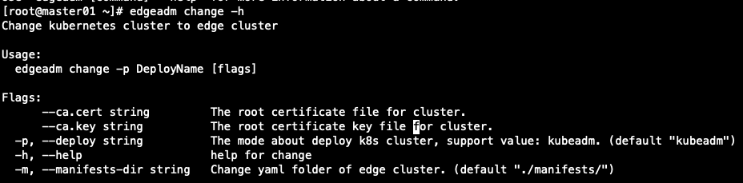
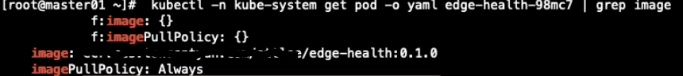

# Install SuperEdge by edgeadm tool

- [Prerequisite](#prerequisite)
- [edgeadm Introduction](#edgeadm-introduction)
  - [1. what is edgeadm ?](#1-what-is-edgeadm-)
  - [2. What can edgeadm do ?](#2-what-can-edgeadm-do-)
  - [3. How to get edgeadm tool](#3-how-to-get-edgeadm-tool)
  - [4. Transform a native kubernestes into edge Kubernestes cluster](#4-transform-a-native-kubernestes-into-edge-kubernestes-cluster)
- [edgeadm commands Introduction](#edgeadm-commands-introduction)
  - [1. change](#1-change)
  - [2. revert](#2-revert)
  - [3. mainfests](#3-mainfests)

## Prerequisite

1. Use kubeadm build a kubernestes cluster, no less than one master node and one worker node, Hardware >= 2C2G every node（required by kubeadm）。
2. Kubernetes version >= 1.18 is recommended(We did detailed testing for version 1.18.2)。
3. Make sure that kube-api-server and kubelet have privilege containers enabled. You can set --allow-privileged=true for kube-api-server and kubelet, and restart them two to enable privilege.
4. Make sure that Kubernetes cluster and nodes working normally.

> In order to avoid installation failure, it is recommended to use kubeadm to build the cluster. [how to use kubeadm to build a Kubernetes cluster](https://kubernetes.io/docs/setup/production-environment/tools/kubeadm/install-kubeadm/)

## edgeadm Introduction
### 1. what is edgeadm ?

> Edgeadm is a command-line tool for edge cluster management, desiged by superedge team

### 2. What can edgeadm do ?

- It can transform the native Kubernestes cluster into edge Kubernestes cluster seamlessly
- It can revert edge Kubernretes into a native Kubernestes cluster

### 3. How to get edgeadm tool

- Download binary [download](https://github.com/superedge/superedge/releases)
- Building binary [how to building](docs/installation/tutorial.md)

### 4. Transform a native kubernestes into edge Kubernestes cluster

1. use kubeadm to build a native Kubernestes cluster.[how to use kubeadm to build a Kubernetes cluster](https://kubernetes.io/docs/setup/production-environment/tools/kubeadm/install-kubeadm/)
2. use edgeadm to transform this native Kubernetes
```
sudo chmod +x edgeadm && ./edgeadm change
```
> Notice: edgeadm should run at *Master Node* when have no kubeconfig

## edgeadm commands Introduction

### 1. change

<div align="left">
  
</div>

- meaning
> transform a native Kubernestes cluster into edge Kubernetes cluster

- Simplest operation
```
 [root@master01 ~]# edgeadm change
```
 edgeadm will read kubeconfig from ${home}/.kube/config and read certificate from /etc/kubernetes/pki/ca.*.


- Parameters supported
```
[root@master01 ~]# edgeadm change --kubeconfig  [kubeconfig file] --ca.cert [cluster ca certificate file] --ca.key [cluster ca key file]
```

after run successfully，you will get this message:
```
[root@master01 ~]# edgeadm change
Create tunnel-coredns.yaml success!
...
Deploy helper-job-master* success!
Kubeadm Cluster Change To Edge cluster Success!
```

-   Notice:

    <1>. edgeadm will pull images of SuperEdge from docker hub, amd64 and arm64 are supported.
    If you need to deploy your own compiled images, please step to "mainfests".

    <2>. The order of priority is: --kubeconfig > Env KUBECONFIG > ~/.kube/config

---
### 2. revert

- meaning
>  revert a edge Kubernetes cluster to native Kubernestes cluster

- Simplest operation

```
[root@master01 ~]# edgeadm revert
```

edgeadm will read kubeconfig from ${home}/.kube/config and read certificate from /etc/kubernetes/pki/ca.*.

- Parameters supported
```
[root@master01 ~]# edgeadm revert -p kubeadm --kubeconfig  [kubeconfig file] --ca.cert [cluster ca certificate file] --ca.key [cluster ca key file]
```

after run successfully，you will get this message:
```
[root@master01 ~]# edgeadm revert
Deploy helper-job-node* success!
...
Deploy helper-job-master* success!
Kubeadm Cluster Revert To Edge Cluster Success!
```

---
### 3. mainfests

- meaning
> save default superedge yamls

- Simplest operation
```
[root@master01 ~]# edgeadm manifests
```
All supeeredge default yamls would be output into ./manifests/

- Parameters supported
```
[root@master01 ~]# edgeadm manifests -m  output_dir
```
- Why need save yamls ?
> To facilitate users to modify yaml before deploying superedge. edgeadm's "change" cmd will help you after superedge yamls modified.

for example, you modify edge-health's source code, and then build out it's image and push into your private Repository,
then you want to deploy your image, such as: edge-health:0.1.0, you can do:
1. modify ./manifests/edge-health.yaml, change image to edge-health:0.1.0
<div align="left">
  
</div>

2. and then, use "change" command
```
[root@master01 ~]# edgeadm change -m ./manifests/
```
3. check edge-health pod, you can find it's image change into edge-health:0.1.0
<div align="left">
  
</div>


> **Notice:**
All parameters of yaml template generated under ./manifests/ can be changed and customized, please comply with kubernetes specification.
You can specify a value for the parameter with {{.*}}, and the remaining {{.*}} will be assigned by edgeadm when use change command.
