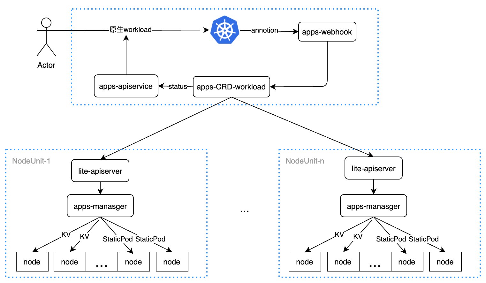

# 边缘应用高可用性方案

* [边缘应用高可用性方案](#边缘应用高可用性方案)
   * [1.背景](#1背景)
   * [2. 计划](#2-计划)
   * [3. 方案](#3-方案)
   * [4. 部署](#4-部署)
   * [5. 边缘Deployment Static Pod的实现](#5-边缘deployment-static-pod的实现)
   * [6. 进度表](#6-进度表)

## 1.背景

在云边断连的情况下，用户提出如下几个诉求：

-   可以更新已经调度到Node节点或者NodeUnit的Pod属性，特别是已经在边缘节点运行Pod的镜像；
-   边缘节点宕机后，在一个NodeUnit内的其他节点能把宕机节点的Pod在其他节点进行启动，进行同NodeUnit的应用容灾；
-   云边网络恢复的情况下，能把边缘Pod的分布情况反馈给云端，让云边Pod的拓扑和边缘一致；

## 2. 计划

以上需求大概分为三期来完成：

-   第一期

    -   支持云边断连Pod的属性更新，包括Pod启动的相关资源，比如Configmap, Secert;

-   第二期

    -   能支持边缘节点宕机，Pod的再调度，进行断网容灾的支持；

-   第三期

    -   支持云边网络恢复的情况下把边缘Workload的状态拓扑反馈给云端

以下只进行第一期需求的设计，解决第一期相关问题，但是在设计的时候要为第二期和第三期进行架构考虑，以便后期的持续支持。


## 3. 方案

<div align="center">
  
</div>
**大致的流程：**

-   用户提交一个K8s 原生的workload，并添加一个标记annotation标记，这是边缘应用；

-   云端apps-wehooks阻止这个原生的workload的被kube-scheduler调度，并生成边缘维护的workload CRD对象;

-   每个NodeUnit中的apps-manager会watch 边缘workload CRD，当调用符合自己NodeUnit或者Node时，创建原生workload CRD的Pod，和相应的份数到不同的节点。

    >   也可以把这个对象在边缘节点多个KV中进行存储，以便相应Pod进行更新

-   当某个边缘节点宕机之后，apps-manager 监控到之后，就把宕机node的边缘应用在其他节点重新拉起；

    >   中间可以做适当的node选择和调度策略；

-   云边断网网络恢复后，云端apps-apiservice，把边缘workload CRD的相关状态同步给原生K8s workload；

    >   apps-apiservice是一个扩展API

-   原生K8s workload有改变时，云端apps-apiservice也会更新边缘workload CRD，边缘apps-manager watch到之后根据用户配置的策略决定更新不更新边缘workload；

    >   边缘应用同步策略支持用户配置，默认可以云端为准，可配置边缘覆盖云端等其他策略

**本方案的优点：**

-   完全兼容原生的workload，**用户云和边看到的完全是原生的workload**，对用户使用习惯和原生workload没有任何改变；

-   和SuperEdge原本的架构完全兼容，lite-apiserver的黑盒缓存完全可用，用户自定义的CRD也完全支持；

-   原生的K8s对象未被apps-manager实现的，比如Configmap, Secert等对象，也可以继续使用lite-apiserver缓存的数据，很好的避免了未被apps-manager实现对象的依赖问题，可让我们对K8s原生对象可有选择的进行替换；

-   通过内部自定义CRD去做内部业务处理，用户完全不用理解内部CRD，也不用管内部实现逻辑，实现业务内部完全闭环；

-   边缘应用借助边缘worklaod可按照边缘的场景去定义CRD的具体动作和行为，比如边缘应用高可用、workload属性更改等逻辑，比原生的worklaod更加适合边缘场景；


## 4. 部署

-   部署CRD

    ```powershell
    kubectl apply -f https://raw.githubusercontent.com/superedge/superedge/main/pkg/apps-manager/crd/apps.superedge.io_edeployments.yaml
    ```

-   部署manager

    ```powershell
    kubectl apply -f https://raw.githubusercontent.com/superedge/superedge/main/deployment/apps-manager.yaml
    ```

## 5. 边缘Deployment Static Pod的实现

-   Edeployment CRD

    ```go
    // EDeployment is the Schema for the edeployments API
    type EDeployment struct {
    	metav1.TypeMeta   `json:",inline"`
    	metav1.ObjectMeta `json:"metadata,omitempty"`
    
    	Spec   appsv1.DeploymentSpec   `json:"spec,omitempty"`   ## 原生deployment Spec
    	Status appsv1.DeploymentStatus `json:"status,omitempty"` ## 原生deployment Status
    }
    ```

-   Edeployment Static Pod 实例

    ```yaml
    apiVersion: apps.superedge.io/v1
    kind: EDeployment      # 除group和Kind和原生deploy完全相同
    metadata:
      name: edeployment-sample
      namespace: edge-system
      labels:
        app: site-manager
      annotations:
        type.apps.superedge.io: static-pod   ## static-pod 标识
    spec:
      replicas: 1
      selector:
        matchLabels:
          app: site-manager
          ...
    ```

-   实现效果

    ```powershell
    attlee➜ kubectl -n edge-system  get edeploy
    NAME                 READY   UP-TO-DATE   AVAILABLE   AGE
    edeployment-sample                                    19h
    ```

-   Static Pod

    ```powershell
    attlee➜ kubectl -n edge-system get pod
    NAMESPACE            NAME                      READY    STATUS      RESTARTS   AGE
    edge-system edeployment-sample-vm-1-4-centos    1/1      Running       0       19h
    ```

## 6. 进度表

|    时间    | 关键结点                                                     |             相关人员             |     进度     |
| :--------: | :----------------------------------------------------------- | :------------------------------: | :----------: |
| 2022-02-12 | xxx电气 提出云边断连Pod的更新需求                            | Xxx电气技术leader && attlee-wang | 需求确认完成 |
| 2022-02-15 | 云边断连Pod的再调度 第一期方案设计                           |           attlee-wang            |   设计完成   |
| 2022-02-16 | 设计edeploy CRD 实现Static Pod属性                           |           attlee-wang            |   方案就绪   |
| 2022-02-18 | edeploy statcic Pod初版测试通过                              |           attlee-wang            |   初版就绪   |
| xxxx-xx-xx | Static Pod 支持xxx电气用户                                   |                                  |              |
| xxxx-xx-xx | 设计实现edeploy单unit多副本及其他原生deploy其他属性          |                                  |              |
| xxxx-xx-xx | 设计实现apps-webhook拦截标记原生worklload                    |                                  |              |
| xxxx-xx-xx | 设计实现其他边缘workload: svc、cm、secert、ds、job等         |                                  |              |
| xxxx-xx-xx | 设计实现apps-sync-mananger原生worklaod转态回写               |                                  |              |
| xxxx-xx-xx | 设计实现边缘worklaod在多个节点上进行多副本存储               |                                  |              |
| xxxx-xx-xx | 设计实现边缘workload的高可用，允许边缘节点宕机，边缘应用实例不变 |                                  |              |