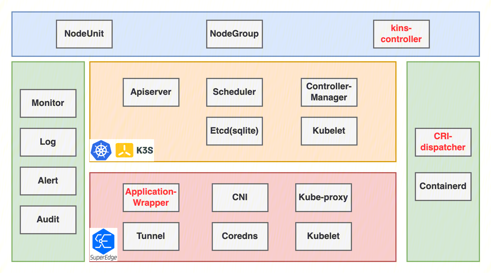
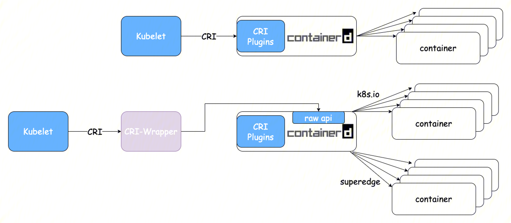
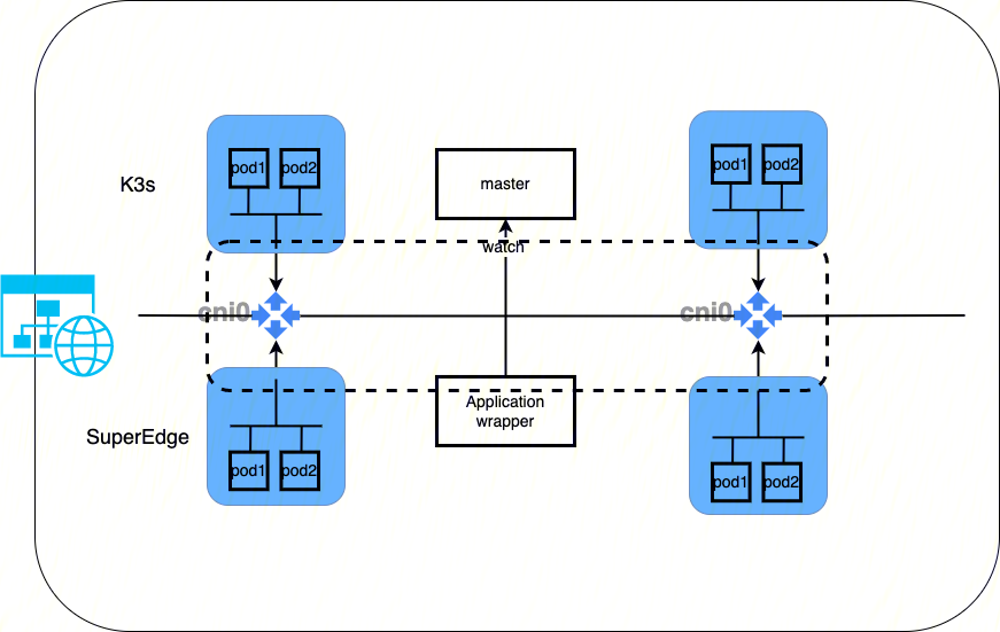
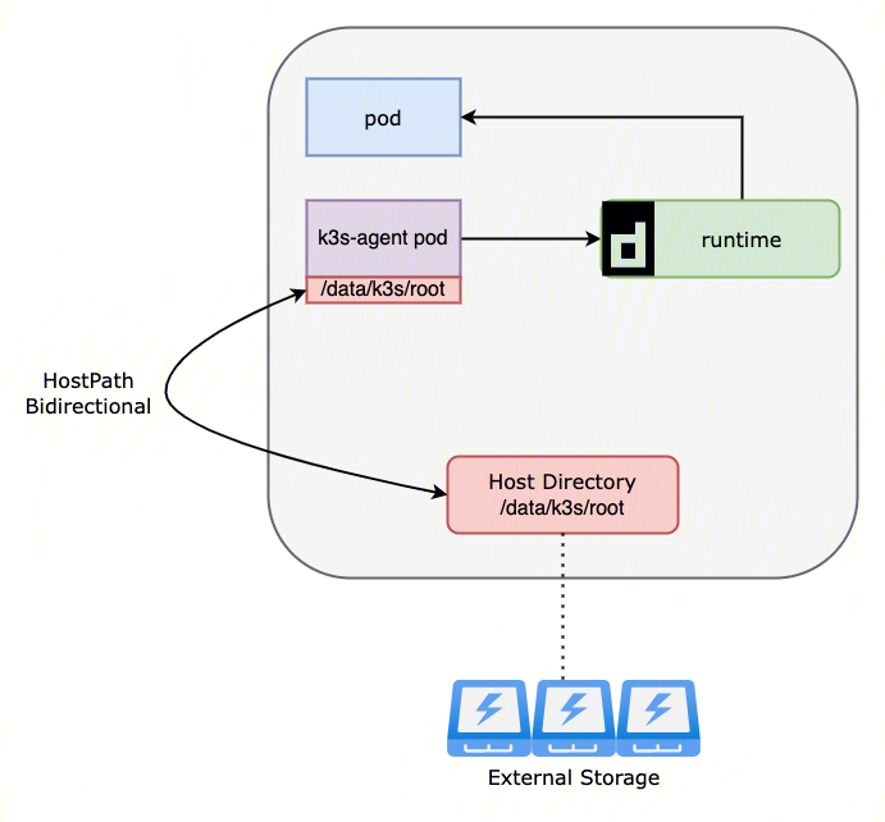

# 动机
[SuperEdge](https://github.com/superedge/superedge)是腾讯推出的Kubernetes-native边缘计算管理框架。相比其他边缘容器项目，SuperEdge除了具备Kubernetes零侵入以及边缘自治特性，还支持独有的分布式健康检查以及边缘服务访问控制等高级特性，极大地消减了云边网络不稳定对服务的影响，同时也很大程度上方便了边缘集群服务的发布与治理。

然而在某些使用场景中，SuperEdge节点级别的自制能力的依然没法满足一些对边缘有超高可用指标的客户的需求，例如完全离线下在单独站点内支持pod failover级别的自治。针对此场景，我们设计了一种具有最高等级的边缘区域(NodeUnit)自治服务我们称之为Kins(k3s in superedge)。

## 目标
- 将边缘节点的自治域从节点级别提升到站点级别，即在断网情况下站点内所有节点间pod可以实现故障转移。
- 在SuperEdge集群内通过类似K8s on K8s机制（这里只是类似，和传统kok有很大区别），可以实现通过crd创建边缘k3s独立集群的能力
- 为了实现上述能力，每个节点上不引入太大的额外开销，只会有cri-server和k3s agent(轻量kubelet)的资源消耗开销，不包含运行时。
## 非目标
- 通过实现Kins，我们提供的一种以SuperEdge为基础底座和交付通道，在边缘节点上一键创建具有独立控制面的轻量化集群，同时依然保留了和云端SuperEdge控制面通信的能力。
- 
# 详细设计
通过在NodeUnit中下发独立控制面，从而达到让在这个Unit中的所有节点达到独立集群级别的自治，而且这个集群还处于SuperEdge的纳管治下，云边访问，甚至是云边控制面数据备份。
## 基本组件

为了实现上述能力，我们需要在SuperEdge中增加或修改三个组件，其功能如下：
- `cri-dispatcher`：支持运行时`kubelet` CRI接口对接`containerd`原生api，使用不同的`containerd`namespace(k8s会使用k8s.io这个namespace)，共享统一containerd运行时。
- `application-wrapper`：在SuperEdge集群中运行，通过watch k3s server，将service信息同步到SuperEdge的`kube-proxy`组件，在节点上写入k3s service转发规则。
- `kins-controller(site-manager)`：上层controller组件，在SuperEdge集群中运行，用以通过NodeUnit对象创建k3s server和agent，并记录认证信息和集群信息到NodeUnit对象。

## 运行时设计
`containerd`基于不同ns隔离来自不同`kubelet`的PLEG（Pod Lifecycle Event Generator），同时通过资源保留隔离一个节点两个kubelet的容器资源分配，因此需要开发能转发不同`containerd`namspace的CRI(Container Runtime Interface) server，从而达到使用最小的资源开销做到共享统一运行时组件。

`docker`运行时这里有天然的优势，`docker`会默认使用containerd后端用且使用的是"moby"的namespace，因此只要开启docker自带的containerd CRI plugin就可以自动隔离来自两个kubelet的容器创建请求。


## 网络设计
Kins在网络上的设计原则是不额外引入单独的网络栈，不增加额外的网络损耗，因此复用了和SuperEdge相同的Flannel cni，也就是说SuperEdge创建的pod和Kins创建的pod都是处于统一的网路平面，因此需要对每个Kins节点计算剩余的可用IP数量从而限制最大的pod创建数量。

在Service和NodePort的处理上，Service cidr和Nodeport端口范围要和SuperEdge的Service cidr区分开，因此需要引入SuperEdge的`application-wrapper`组件，当前这个组件的作用是通过监听SuperEdge的Apiserver然后给SuperEdge的`kube-proxy`下发只在本NodeUnit的Service Endpoint。引入Kins能力后，`application-wrapper`组件会额外监听K3s的Apiserver，将k3s的service信息下发给SuperEdge的`kube-proxy`，从而在同一节点网络栈内实现k3s的Dnat和Snat能力。

## 存储设计
基于双向挂载传播以及不同的kubelet root目录，Kins容器存储能力不需要特别开发，只需要调整对应的挂载目录，这里的实现类似于CSI node plugin。

## NodeUnit对象设计
增加v1alpha2版本，实现自动conversion逻辑兼容v1alpha。在NodeUnit Spec中增加了自治等级和Kins存储配置，通过修改自治等级从而控制是否下发K3s控制面。
在在NodeUnit Status中，增加了边缘Kins集群状态以及必要的集群信息方便通过NodeUnit查看。
```go
// NodeUnitSpec defines the desired state of NodeUnit
type NodeUnitSpec struct {
    // Type of nodeunit， vaule: Cloud、Edge
    // +optional
    //+kubebuilder:default=edge
    Type NodeUnitType `json:"type"`

    // Unschedulable controls nodeUnit schedulability of new workwolads. By default, nodeUnit is schedulable.
    // +optional
    //+kubebuilder:default=false
    Unschedulable bool `json:"unschedulable,omitempty"`

    // If specified, If node exists, join nodeunit directly
    // +optional
    Nodes []string `json:"nodes,omitempty"`

    // If specified, Label selector for nodes.
    // +optional
    Selector *Selector `json:"selector,omitempty"`

    // If specified, set the relevant properties to the node of nodeunit.
    // +optional
    SetNode SetNode `json:"setNode,omitempty"`
    // If specified, allow to set taints to nodeunit for the scheduler to choose
    // +optional
    Taints []corev1.Taint `json:"taints,omitempty"`

    // AutonomyLevel represent the current node unit autonomous capability, L3(default)'s autonomous area is node,
    // L4's autonomous area is unit. If AutonomyLevel larger than L3, it will create a independent control plane in unit.
    // +optional
    //+kubebuilder:default=L3
    AutonomyLevel AutonomyLevelType `json:"autonomyLevel,omitempty"`
    // UnitCredentialConfigMapRef for isolate sensitive NodeUnit credential.
    // site-manager will create one after controller-plane ready
    // +optional
    UnitCredentialConfigMapRef *corev1.SecretReference `json:"unitCredentialConfigMapRef,omitempty"`

    // UnitClusterStorage holds configuration for unit cluster storage information.
    // +optional
    UnitClusterStorage *UnitClusterStorageSpec `json:"unitClusterStorage,omitempty"`
}
type UnitClusterStatus struct {
    // If AutonomyLevel larger than L3, it will create a independent control plane in unit,
    // +optional
    Version string `json:"version"`
    // +optional
    Phase ClusterPhase `json:"phase,omitempty"`
    // +optional
    // +patchMergeKey=type
    // +patchStrategy=merge
    Conditions []ClusterCondition `json:"conditions,omitempty" patchStrategy:"merge" patchMergeKey:"type"`
    // +optional
    Addresses []ClusterAddress `json:"addresses,omitempty" patchStrategy:"merge" patchMergeKey:"type"`
    // +optional
    ClusterResource ClusterResource `json:"resource,omitempty"`
    // +optional
    ServiceCIDR string `json:"serviceCIDR,omitempty"`
}

// NodeUnitStatus defines the observed state of NodeUnit
type NodeUnitStatus struct {
    // Node that is ready in nodeunit
    //+kubebuilder:default='1/1'
    // +optional
    ReadyRate string `json:"readyRate"`
    // Node selected by nodeunit
    // +optional
    ReadyNodes []string `json:"readyNodes,omitempty"`
    // Node that is not ready in nodeunit
    // +optional
    NotReadyNodes []string `json:"notReadyNodes,omitempty"`

    // UnitClusterStatus is not nil, when AutonomyLevel is larger than L3
    // +optional
    UnitCluster UnitClusterStatus `json:"unitClusterStatus,omitempty"`
}
```

## 创建NodeUnit Kins Cluster工作流
1. site-manager检测到NodeUnit的AutonomyLevel自治等级变成L4。
2. 创建cri-dispatcher daemonset到该站点上所有节点。
3. site-manager在站点内选出合适的三个节点做Kins集群master。
4. 计算合适的kins server(k8s控制面) service cidr和NodePort range(这里不能和SuperEdge的有冲突)。
5. 创建三个kins serverdeployment，和service，并将三个server pod所在的SuperEdge节点标记为不可调度，即当前无法支持动态混部，一个NodeUnit一旦被Kins接管，那么他的计算能力就全部转移到Kins。
6. 创建kins agent(k8s节点上组件)到站点内所有节点，并计算节点上已经分配的计算资源和网络资源，然后确定kins agent参数。

