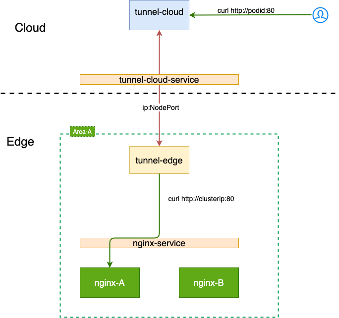

# 访问边缘端Service

单独部署tunnel实现在云端边缘节点的Service，具体实现方式有以下两种：

## TCP转发

在云端通过TCP转发可以访问四层及四层以上协议类型的边缘端的Service，可以在一个区域内部署一个tunnel edge，而不是在每个边缘 每个边缘节点都部署，具体实现方式如下图所示：

  

### TCP隧道的建立

在tunnel-edge的启动文件中配置tunnel cloud的server证书所签的域名(dns = "tunnel.cloud.io")，同时还需要配置tunnel edge 访问tunnel cloud的ip和port(
servername = "10.0.0.9:31673")，其中端口为 tunnel cloud service的NodePort端口。

### TCP转发的实现

在tunnel cloud的启动文件中配置tunnel cloud的80端口到nginx-service的80端口的转发，用户访问使用 tunnnel
cloud的podip发起请求，该请求会被转发到边缘端的nginx-service的80端口。

## HTTPS转发

在云端通过HTTPS转发可以访问HTTPS类型的边缘端的Service
