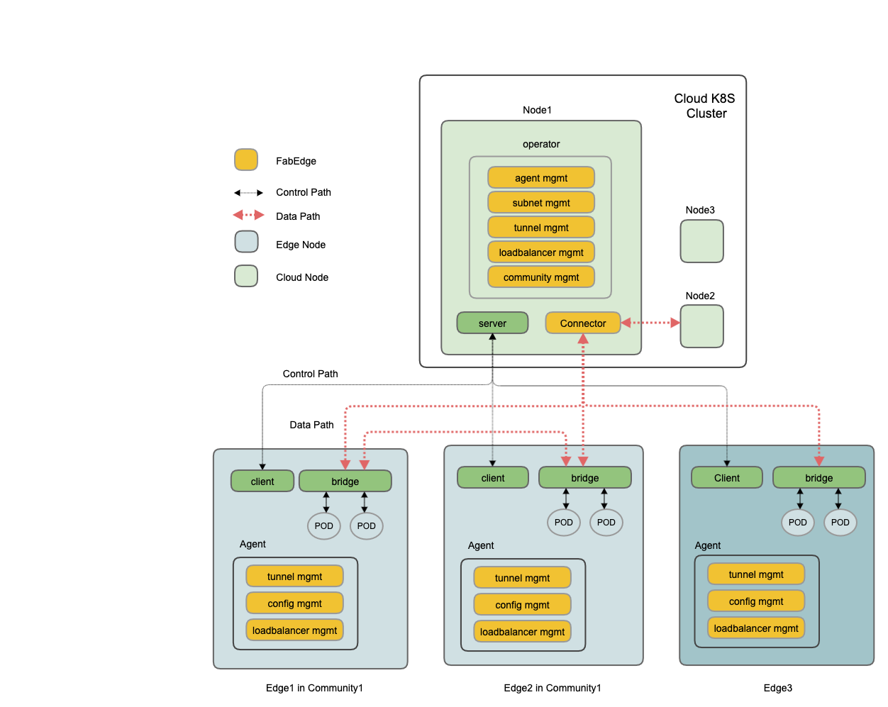
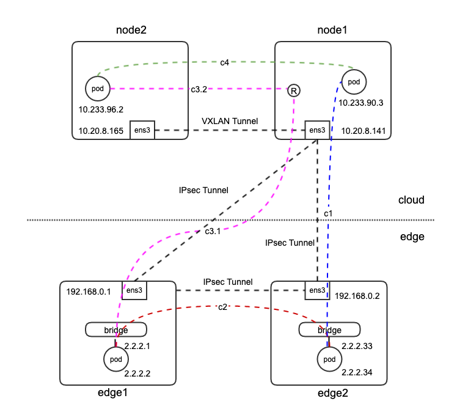
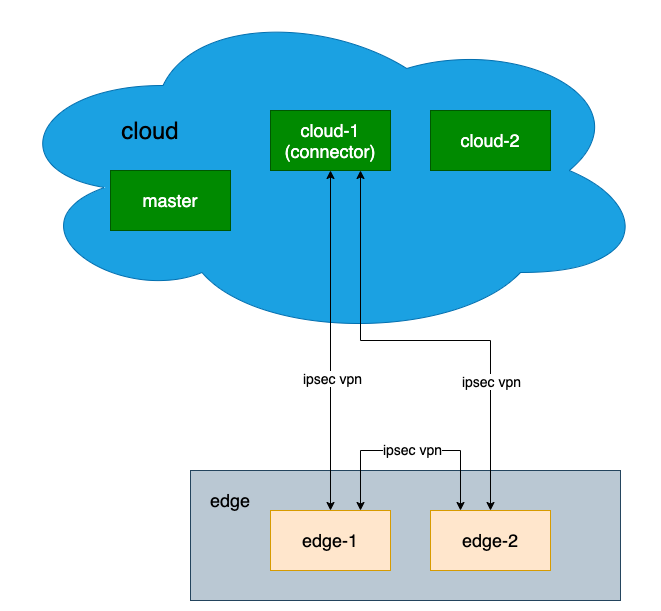
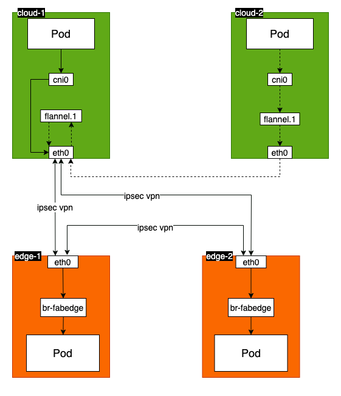

SuperEdge和Fabedge联合在边缘k8s集群支持原生Service互访和PodIP直通
=========================================================

Table of Contents
=================

* [1.背景](#1背景)
* [2. FabEdge介绍](#2-fabedge介绍)
    * [2.1 架构图](#21-架构图)
    * [2.2 原理图](#22-原理图)
* [3. fabedge与SuperEdge结合实现Service互访和podIp直通 方案验证](#3-fabedge与superedge结合实现service互访和podip直通-方案验证)
    * [3.1 验证的环境](#31-验证的环境)
    * [3.2 验证场景](#32-验证场景)
        * [3.2.1云端pod访问边缘端pod](#321云端pod访问边缘端pod)
            * [3.2.1.1 cloud-2上的pod访问边缘端edge-1上的pod](#3211-cloud-2上的pod访问边缘端edge-1上的pod)
            * [3.2.1.2 cloud-1上的pod访问边缘端edge-1上的pod](#3212-cloud-1上的pod访问边缘端edge-1上的pod)
        * [3.2.2 edge-1上的pod访问edge-2上的pod](#322-edge-1上的pod访问edge-2上的pod)
    * [3.3 验证结果](#33-验证结果)
        * [3.3.1 云访边](#331-云访边)
        * [3.3.2 边访云](#332-边访云)
        * [3.3.3 边访边](#333-边访边)
        * [结论](#结论)
* [4. 展望](#4-展望)

# 1.背景

在边缘计算的场景下，边缘节点和云端为单向网络，从云端无法直接方法边缘节点，导致了以下的问题：

- 云端无法访问边缘端的service

- 边访问云端service需要以nodeport的形式

- 云边端podIp无法直通

为了使用户无感知单向网络带来的使用上的差异，我们与FabEdge社区合作，实现在云边podIp直通，来屏蔽单向网络带来的使用上的差异。

# 2. FabEdge介绍
## 2.1 架构图


FabEdge在SuperEdge的基础上，建立了一个基于IPSec隧道的，三层的数据转发面，使能云端和边缘端POD通过IP地址直接进行通讯，包括普通的POD和使用了hostnework的POD，以及通过ClusterIP访问Service，不论Service的Endpoint在云端或边缘端。

FabEdge包括三个主要组件：

- Operator： 运行在云端任何节点，监听Node等资源的变化，为其它FabEdge组件维护证书，隧道等配置，并保存到相应configmap/secret；同时负责Agent的生命周期管理，包括创建/删除等。
- Connector： 运行在云端选定节点，使用Operator生成的配置，负责云端隧道的管理，负责在云端和边缘节点之间转发流量。
- Agent： 运行在边缘节点，使用Operator生成的配置，负责本节点的隧道，路由，iptables规则的管理。
## 2.2 原理图



以上图环境为例，一共4个节点，两个云端的节点：node1， node2， 两个边缘节点：edge1， edge2。 node1和node2运行Flannel，它们之间会有一个flannel管理的VXLAN的隧道。edge1和edge2由FabEdge管理，会建立到运行Connector的节点node1的IPSec的隧道。同时，edge1和edge2加入了同一个FabEdge的Community， 因此它们之间会有一条直连的IPSec隧道。在边缘节点上，POD接入一个Linux的网桥，获取一个全局唯一的IP地址。几种典型的访问场景如下：

- 边缘POD访问云端的POD， 比如c1（蓝色虚线）, 流量从源pod发出，经过网桥，经过路由，iptables规则，xfrm策略，进入IPSec隧道，到达云端Connector节点node1，到达目标pod。
- 边缘POD访问边缘的POD， 比如c2（红色虚线）, 流量从源pod发出，经过网桥，经过路由，iptables规则，xfrm策略，进入IPSec隧道，到达边缘节点edge2，到达目标pod。
- 边缘POD访问云端的POD， 比如c3（紫色虚线）, 流量从pod发出，经过网桥，经过路由，iptables规则，xfrm策略，进入IPSec隧道，到达云端Connector节点，再经过一次路由转发，使用Flannedl的VXLAN隧道，到达目标节点node2，到达目标pod。
- 云端POD访问云端的POD， 比如c4（绿色虚线），仍然有Flannel管理，通过VXLAN到达目标pod，这个过程和FabEdge无关。
- POD访问Service，经过本地kube-proxy管理的iptables NAT后，等同于POD到POD的访问，不再赘述。

# 3. FabEdge与SuperEdge结合实现Service互访和podIp直通方案验证

## 3.1 验证的环境


在SuperEdge边缘独立集群中添加4个节点，2个节点（cloud-1和cloud-2）在云端和master节点在同一内网，2个节点（edge-1和edge-2）在边缘端。将cloud-1节点作为connector节点，将edge-1和edge-2加入community。具体的搭建过程，请参照[FabEdge文档](https://github.com/FabEdge/fabedge/blob/Release-v0.3-beta/docs/integrate-with-superedge.md)。

## 3.2 验证场景

### 3.2.1云端pod访问边缘端pod



#### 3.2.1.1 cloud-2上的pod访问边缘端edge-1上的pod

FabEdge在edge-1节点的node资源写入cloud-1的节点的内网ip和flannnel.1网卡的mac地址，将edge-1伪装成cloud-1节点。

```
metadata:
  annotations:
    flannel.alpha.coreos.com/backend-data: '{"VtepMAC":"cloud-1 flannel.1 mac"}'
    flannel.alpha.coreos.com/backend-type: vxlan
    flannel.alpha.coreos.com/kube-subnet-manager: "true"
    flannel.alpha.coreos.com/public-ip: cloud-1 内网ip
```

cloud-2上的pod访问cloud-1上的pod请求，首先经过cni0网桥，根据路由规则，将请求转发到flannel.1上，由flannel.1对请求信息进行封包，由于FabEdge将edge-1节点伪装成cloud-1节点，因此flannel.1会将封包之后的请求信息发送到cloud-1节点。cloud-1节点在接收到请求包之后，会在本节点的flannel.1对请求包进行解包，然后将请求通过ipsec
vpn隧道将请求转发到edge-1节点。edge-1节点在收到包之后根据路由规则将请求包发送br-fabedge网桥，然后再转发到pod中。
回包路径与请求包路径一样，响应消息到达cloud-1之后，先在flannel.1上进行封包，然后发送到cloud-2上，在flannel.1上进行解包

#### 3.2.1.2 cloud-1上的pod访问边缘端edge-1上的pod

cloud-1上的pod，由于不需要通过flannel的网络将请求转发到cloud-1，因此pod的请求不会经过cloud-1的flannel.1

### 3.2.2 edge-1上的pod访问edge-2上的pod

由于edge-1和edge-2在同一个community，FabEdge会在节点之间建立ipsec vpn隧道，边缘节点pod之间的请求，会通过ipsec vpn隧道进行转发。

## 3.3 验证结果

### 3.3.1 云端访边缘端

| 边缘端pod的部署方式 | 云端pod的部署方式 |         测试项        | 测试结果 |
|:-------------------:|:-----------------:|:---------------------:|:--------:|
|     hostnetwork     |       podIp       | cloud-1 访问edge-1    | 通过     |
|                     |                   | cloud-1 访问edge-2    | 通过     |
|                     |                   | cloud-1 访问clusterIp | 通过     |
|        podIp        |    hostnetwork    | apiserver 访问service | 通过     |
|                     |                   | apiserver 访问edge-1  | 通过     |
|                     |                   | apiserver 访问edge-2  | 通过     |
|                     |       podIp       | cloud-1访问edge-1     | 通过     |
|                     |                   | cloud-1访问edge-2     | 通过     |
|                     |                   | cloud-1访问clusterIp  | 通过     |
|                     |                   | cloud-2 访问edge-1    | 通过     |
|                     |                   | cloud-2访问edge-2     | 通过     |
|                     |                   | cloud-2访问clusterIp  | 通过     |
|                     |    hostnetwork    | cloud-1 访问edge-1    | 通过     |
|                     |                   | cloud-1 访问edge-2    | 通过     |
|                     |                   | cloud-1 访问clusterIp | 通过     |
|                     |                   | cloud-2 访问edge-1    | 通过   |
|                     |                   | cloud-2 访问edge-2    | 通过   |
|                     |                   | cloud-2 访问clusterIp |  通过  |

### 3.3.2 边缘端访云端

| 云端pod的部署方式 | 边缘端pod的部署方式 | 测试项               | 测试结果 |
|-------------------|---------------------|----------------------|----------|
| podIp             | hostnetwork         | edge-1 访问cloud-1   | 通过     |
|                   |                     | edge-1 访问cloud-2   | 通过     |
|                   |                     | edge-1 访问clusterIp | 通过     |
|                   |                     | edge-2 访问cloud-1   | 通过     |
|                   |                     | edge-2 访问cloud-2   | 通过     |
|                   |                     | edge-2 访问clusterIp | 通过     |
|                   | podIp               | edge-1 访问cloud-1   | 通过     |
|                   |                     | edge-1 访问cloud-2   | 通过     |
|                   |                     | edge-1 访问clusterIp | 通过     |
|                   |                     | edge-2 访问cloud-1   | 通过     |
|                   |                     | edge-2 访问cloud-2   | 通过     |
|                   |                     | edge-2 访问clusterIp | 通过     |
| hostNetwork       | podIp               | edge-1 访问cloud-1   | 通过     |
|                   |                     | edge-1 访问cloud-2   | 通过     |
|                   |                     | edge-1 访问clusterIp | 通过     |
|                   |                     | edge-2 访问cloud-1   | 通过     |
|                   |                     | edge-2 访问cloud-2   | 通过     |
|                   |                     | edge-2 访问clusterIp | 通过     |

### 3.3.3 边缘端互访

| 被访问的边缘端pod部署方式 | 发起请求的pod的部署方式 | 测试项               | 测试结果 |
|---------------------------|-------------------------|----------------------|----------|
| hostNetwok                | podIp                   | edge-2 访问edge-1    | 通过     |
|                           |                         | edge-2 访问clusterIp | 通过     |
|                           |                         | edge-1 访问edge-2    | 通过     |
|                           |                         | edge-1 访问clusterIp | 通过     |
| podIp                     | podIp                   | edge-2 访问edge-1    | 通过     |
|                           |                         | edge-2 访问clusterIp | 通过     |
|                           |                         | edge-1 访问edge-2    | 通过     |
|                           |                         | edge-1 访问clusterIp | 通过     |
|                           | hostnetwork             | edge-1 访问edge-2    | 通过     |
|                           |                         | edge-1 访问clusterIp | 通过     |
|                           |                         | edge-2 访问edge-1    | 通过     |
|                           |                         | edge-2 访问clusterIp | 通过     |

### 结论

根据以上的测试结果可以得出以下的结论：

- 使用FabEdge可以实现云边端service互访
- 使用FabEdge可以实现云边podIp直通
- 使用FabEdge不影响边缘节点间pod的通信

# 4. 展望

- 支持更多的CNI，包括calico等
- 自动同步SuperEdge NodeUnit和FabEdge Community标签，简化边边通讯
- 支持FabEdge Connector的HA/HPA
