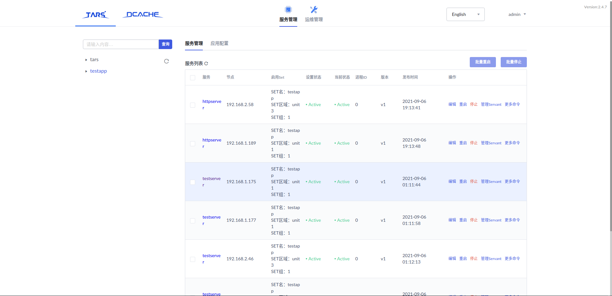
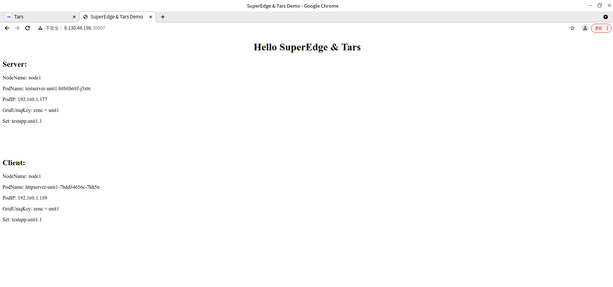

## Superedge Tars

Superedge Tars是便于将Tars服务运行在边缘集群Superedge中的方案

## 特性

1.保持tars原生的开发框架能力

2.支持tars的名字服务自动注册和配置删除

3.无侵入性设计，与运行环境无偶合关系

## 实现原理

1.以[K8STARS](https://github.com/TarsCloud/K8STARS)为基础，将其与[Superedge  ServiceGroup](https://github.com/superedge/superedge/blob/main/docs/components/serviceGroup_CN.md)相结合，将Tars的公共框架部分(名字服务等)部署在同一个Node Unit。

2.将Tars的公共框架服务以NodePort的形式暴露给外部。

3.以ServiceGroup的形式部署Tars服务，并利用[Tars Set](https://github.com/TarsCloud/TarsDocs/blob/master/dev/tars-idc-set.md)让Tars的服务调用局限在Node Unit内部(以Tars应用名作为Set名，以gridUniqKey标签

​    的值作为Set区域名)。

## 部署示例

Tars服务采用 [ServiceGroup](https://github.com/superedge/superedge/blob/main/docs/components/serviceGroup_CN.md)的形式部署，公共框架部分默认采用tars作为gridUniqKey。

部署方法与[K8STARS](https://github.com/TarsCloud/K8STARS/blob/master/baseserver/README.md)的部署方法基本相同。

#### 部署Tars基础服务

###### 1.为节点打上标签(默认采用tars作为gridUniqKey)

###### 2.部署tars db

```shell
// 进入tars/yaml/baseserver目录
cd yaml/baseserver

// 创建tars-system命名空间
kubectl create namespace tars-system

// 设置默认命名空间为tars-system
kubectl config set-context --current --namespace=tars-system

// 部署mysql
kubectl apply -f tarsdb.yaml

// 等待pod状态正常
kubectl get pods

// 进入tars/yaml/baseserver/init_db目录
cd init_db

// 将init.sh中第3行的pod的名称替换为mysql的pod的名称
vim init.sh

// 导入tars表结构
sh init.sh
// 注：此步骤在有些时候会失败，原因是msql root账户的密码没有设置成功，此时需要手动登录pod(使用kubectl exec -it 命令)
   设置msql root密码与远程登录密码，然后再重新执行此步骤(注意密码要设置为pass) 

// 注：为防止数据丢失，mysql的volume默认采用hostPath的方式挂载在node的/root/tars_mysql目录下，若部署框架的Node Unit
   有多个节点，建议采用nodeSelector的方式将mysql运行在同一个节点上，防止pod漂移导致数据丢失
```

###### 3.部署tars registry

```shell
// 进入tars/yaml/baseserver目录
cd ..

// 获取tasrdb的service的cluster ip
kubectl get service

// 将tarsregistry.yaml中的env中的DB_HOST中的ip替换为tarsdb的cluster ip
vim tarsregistry.yaml

//部署tars registry
kubectl apply -f tarsregistry.yaml
```

###### 4.部署tars-configmap

```shell
// 用tarsdb-svc的cluster ip与tarsquery-svc的cluster ip替换掉tars-configmap.yaml中的相应部分
vim tars-configmap.yaml

// 部署tars-configmap
kubectl apply -f tars-configmap.yaml
```

###### 5.部署tars web与tars notify

```shell
// 部署tars web
kubectl apply -f tarsweb.yaml

// 部署tars notify
kubectl apply -f tarsnotify.yaml
```

###### 6. 等待服务正常

```shell
// 等待pod状态正常
kubectl get pods

// 恢复默认的命名空间
kubectl config set-context --current --namespace=default
```

此时可通过http://{部署tarsweb的节点的ip}:30000 访问tarsweb

#### 部署example

###### 1.部署tarsserver-config

```shell
// 进入tars/yaml/example目录
cd ../example

// 用部署tars registry的节点的外网IP替换tarsserver-config.yaml中的TARS_LOCATOR与TARS_REGISTRY的IP,用部署tars notify的节点的外网IP替换TARS_NOTIFY的IP
vim tarsserver-config.yaml

// 部署tarsserver-config
kubectl apply -f tarsserver-config.yaml
```

###### 2.为要部署服务的节点打上标签(默认以zone作为gridUniqKey)

###### 3.部署testserver

```shell
// 部署testserver
kubectl apply -f testserver.yaml
```

###### 4.部署httpserver

```shell
// 部署httpserver
kubectl apply -f httpserver.yaml
```

###### 5.验证

```shell
// 等待pod状态正常
kubectl get pods 
```

此时访问tarsweb，应当看到类似下图的服务情况：



###### 6.访问httpserver

可通过http://{部署httpserver服务的节点的外网IP}:30007访问http服务，应看到类似下图：



