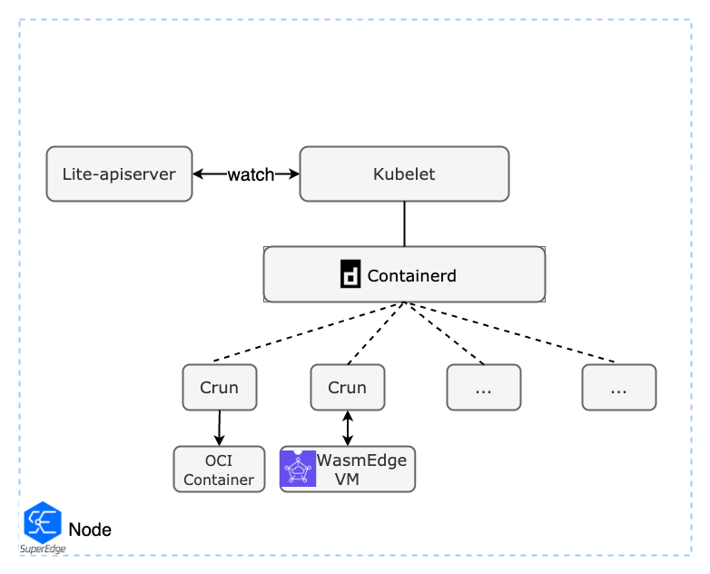

# Install Wasmedge in Superedge


## Background

SuperEdge is an open source **container management system for edge computing** to manage compute resources and container applications in multiple edge regions. These resources and applications, in the current approach, are managed as one single **Kubernetes** cluster. However, in some case, edge devices often require some more lightweight computing runtimes. And container image is often in the GBs, it takes seconds to start with a full CPU. So WebAssembly which is a binary instruction format for a stack-based virtual machine can deal with this scenario better. WasmEdge is a lightweight, high-performance, and extensible WebAssembly runtime for cloud native, edge, and decentralized applications. It is the fastest Wasm runtime today.

## Design



Superedge support containerd recently, and in edge node we will make containerd use crun for oci runtime which already support Wasmedge runtime. That say your edge node can support both oci container and wasm runtime after following the steps. Let’s get started!

## Installation

### Install Superedge

[One-click install of edge Kubernetes cluster](../docs/installation/install_edge_kubernetes.md)

-   Download the installation package
> Choose installation package according to your installation node CPU architecture [amd64, arm64]
```shell
arch=amd64 version=v0.6.0 && rm -rf edgeadm-linux-* && wget https://superedge-1253687700.cos.ap-guangzhou.myqcloud.com/$version/$arch/edgeadm-linux-containerd-$arch-$version.tgz && tar -xzvf edgeadm-linux-* && cd edgeadm-linux-$arch-$version && ./edgeadm
```

-   Install edge Kubernetes master node with containerd runtime
```shell
./edgeadm init --kubernetes-version=1.18.2 --image-repository superedge.tencentcloudcr.com/superedge --service-cidr=10.96.0.0/12 --pod-network-cidr=192.168.0.0/16 --install-pkg-path ./kube-linux-*.tar.gz --apiserver-cert-extra-sans=<Master Public IP> --apiserver-advertise-address=<Master Intranet IP> --enable-edge=true --runtime=containerd
```

-   Join edge node with containerd runtime
```bash
./edgeadm join <Master Public/Intranet IP Or Domain>:Port --token xxxx --discovery-token-ca-cert-hash sha256:xxxxxxxxxx --install-pkg-path <edgeadm kube-* install package address path> --enable-edge=true --runtime=containerd
```

See the detailed process[One-click install of edge Kubernetes cluster](../docs/installation/install_edge_kubernetes.md)

Other installation, deployment, and administration, see our [**Tutorial**](../docs/tutorial.md).

### Install WasmEdge

Use the simple install script to install WasmEdge on your edge node.

```bash
curl -sSf https://raw.githubusercontent.com/WasmEdge/WasmEdge/master/utils/install.sh | bash
```

### Build And install Crun with WasmEdge

The [crun](https://github.com/containers/crun) project has WasmEdge support baked in. For now, the easiest approach is just built it yourself from source. First, let's make sure that crun dependencies are installed on your Ubuntu 20.04. For other Linux distributions, please see [here](https://github.com/containers/crun#readme).

```bash
sudo apt update
sudo apt install -y make git gcc build-essential pkgconf libtool \
    libsystemd-dev libprotobuf-c-dev libcap-dev libseccomp-dev libyajl-dev \
    go-md2man libtool autoconf python3 automake
```

Next, configure, build, and install a crun binary with WasmEdge support.

```bash
git clone https://github.com/containers/crun
cd crun
./autogen.sh
./configure --with-wasmedge
make
sudo make install
```

### Reconfigure containerd with crun runtime

Superedge containerd node has default config, we should modify the configuration file(/etc/containerd/config.toml) according to the following steps.

Firstly, we generate `config.toml.diff` diff file and patch it.
```bash
cat > config.toml.diff << EOF
--- /etc/containerd/config.toml 2022-02-14 15:05:40.061562127 +0800
+++ /etc/containerd/config.toml.crun    2022-02-14 15:03:35.846052853 +0800
@@ -24,17 +24,23 @@
   max_concurrent_downloads = 10

   [plugins.cri.containerd]
-        default_runtime_name = "runc"
-    [plugins.cri.containerd.runtimes.runc]
+        default_runtime_name = "crun"
+    [plugins.cri.containerd.runtimes.crun]
       runtime_type = "io.containerd.runc.v2"
-      pod_annotations = []
+      pod_annotations = ["*.wasm.*", "wasm.*", "module.wasm.image/*", "*.module.wasm.image", "module.wasm.image/variant.*"]
       container_annotations = []
       privileged_without_host_devices = false
-      [plugins.cri.containerd.runtimes.runc.options]
-        BinaryName = "runc"
+      [plugins.cri.containerd.runtimes.crun.options]
+        BinaryName = "crun"
   # cni
   [plugins.cri.cni]
     bin_dir = "/opt/cni/bin"
     conf_dir = "/etc/cni/net.d"
     conf_template = ""

+  [plugins."io.containerd.runtime.v1.linux"]
+    no_shim = false
+    runtime = "crun"
+    runtime_root = ""
+    shim = "containerd-shim"
+    shim_debug = false
EOF
```
```bash
sudo patch -d/ -p0 < config.toml.diff
sudo systemctl restart containerd
```

### Create Wasmedge application in Superedge

We can run a wasm image which has been pushed to [dockerhub](https://hub.docker.com/r/hydai/wasm-wasi-example). If you want to learn how to compile, package, and publish the WebAssembly program as a container image to Docker hub, please refer to [WasmEdge Book](https://wasmedge.org/book/en/kubernetes/demo/wasi.html).

```bash
cat > wasmedge-app.yaml << EOF
apiVersion: v1
kind: Pod
metadata:
  annotations:
    module.wasm.image/variant: compat
  labels:
    run: wasi-demo
  name: wasi-demo
spec:
  containers:
  - args:
    - /wasi_example_main.wasm
    - "50000000"
    image: hydai/wasm-wasi-example:with-wasm-annotation
    imagePullPolicy: IfNotPresent
    name: wasi-demo
  hostNetwork: true
  restartPolicy: Never
EOF

kubectl create -f wasmedge-app.yaml
```

The output will showed by executing `kubectl logs wasi-demo` command.

```
Random number: -1643170076
Random bytes: [15, 223, 242, 238, 69, 114, 217, 106, 80, 214, 44, 225, 20, 182, 2, 189, 226, 184, 97, 40, 154, 6, 56, 202, 45, 89, 184, 80, 5, 89, 73, 222, 143, 132, 17, 79, 145, 64, 33, 17, 250, 102, 91, 94, 26, 200, 28, 161, 46, 93, 123, 36, 100, 167, 43, 159, 82, 112, 255, 165, 37, 232, 17, 139, 97, 14, 28, 169, 225, 156, 147, 22, 174, 148, 209, 57, 82, 213, 19, 215, 11, 18, 32, 217, 188, 142, 54, 127, 237, 237, 230, 137, 86, 162, 185, 66, 88, 95, 226, 53, 174, 76, 226, 25, 151, 186, 156, 16, 62, 63, 230, 148, 133, 102, 33, 138, 20, 83, 31, 60, 246, 90, 167, 189, 103, 238, 106, 51]
Printed from wasi: This is from a main function
This is from a main function
The env vars are as follows.
The args are as follows.
/wasi_example_main.wasm
50000000
File content is This is in a file
```

## Reference

- https://wasmedge.org/book/en/kubernetes/cri/containerd.html
- https://webassembly.github.io/spec/core/binary/index.html